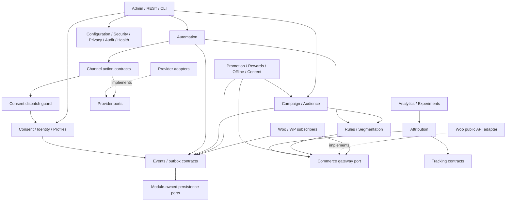

# WooCommerce Marketing Operating System — implementation specification

Design snapshot: **2026-10-04 (Asia/Tehran)**. Working plugin slug/text domain: `woocommerce-marketing-os`. Native WordPress/WooCommerce modular monolith.

This is the reviewed design handoff, with all 21 phases in the requested order. It specifies future implementation and release acceptance; it does not claim an implemented plugin or completed compatibility, performance, security or accessibility tests. Public API verification and implementation gates are distinguished throughout.

Generated from the editable [phase documents](phases/) by [build_specification.py](build_specification.py).

## Contents

1. [Requirements normalization](#phase-1)
2. [Marketing capability matrix](#phase-2)
3. [Domain architecture](#phase-3)
4. [Complete directory structure](#phase-4)
5. [Domain model](#phase-5)
6. [Database schema](#phase-6)
7. [Event catalog](#phase-7)
8. [Automation architecture](#phase-8)
9. [WordPress integration map](#phase-9)
10. [WooCommerce integration map](#phase-10)
11. [Provider framework](#phase-11)
12. [Security](#phase-12)
13. [Privacy](#phase-13)
14. [Administration UX](#phase-14)
15. [Analytics/attribution specification](#phase-15)
16. [Performance strategy](#phase-16)
17. [Test architecture](#phase-17)
18. [Architectural decision records](#phase-18)
19. [Risk register](#phase-19)
20. [Implementation roadmap](#phase-20)
21. [Final architecture audit](#phase-21)

<a id="phase-1"></a>

## Phase 1 — Requirements normalization

### Scope and interpretation

This specification designs **WooCommerce Marketing Operating System (WMOS)**, working plugin slug/text domain `woocommerce-marketing-os`, PHP namespace `Wmos`, REST namespace `wmos/v1`, hook prefix `wmos_`, queue group `wmos`, and per-site table prefix `{$wpdb->prefix}wmos_`. Names are provisional product branding, but the contracts below are normative. This delivery is an architecture and implementation plan; it does not claim that a plugin, compatibility tests, performance benchmarks, or provider integrations have already been implemented.

The unit of installation is one native WordPress plugin. The unit of data isolation is one WordPress site, including per-site activation in multisite. Network-wide activation is disabled in the initial release; a future qualified adapter must initialize sites in batches and provision new sites through the documented site lifecycle. Jobs carry their site context and cannot mix tables or credentials between sites. There is no network-wide identity graph, remote execution service, required paid account, Redis requirement, or AI dependency. The merchant selects enabled features; disabling a feature prevents new execution but preserves its history.

The product has three execution levels: Native Execution for plugin-owned computation and WooCommerce-supported operations; Integrated Execution for actions requiring provider APIs or an installed compatible extension; Management + Tracking for physical activity or API-inaccessible activity. A methodology can use several levels. A campaign is a composition of reusable capabilities, never a subclass for every marketing label.

### Normalized requirement groups

| ID | Requirement and acceptance boundary | Implementing phases |
|---|---|---|
| R01 | One modular, installable plugin with minimal bootstrap, namespaces, Composer, bounded dependencies and optional module gating | 3, 4, 9, 18 |
| R02 | Every marketing family in phase 2 is expressible using campaign/audience/assets/offers/actions/touchpoints/goals; external and physical execution limits visible | 2, 5, 11, 14 |
| R03 | WooCommerce remains canonical for products, customers, orders, coupons and refunds; all retrieval/mutation uses supported APIs | 5, 9, 10, 17 |
| R04 | HPOS, classic checkout, Store API and Cart/Checkout Blocks have explicit supported integration boundaries and tested declarations | 10, 17, 18 |
| R05 | Customer profile, conservative identities, provenance, consent history, merge/unmerge and derived commerce metrics | 5, 6, 13 |
| R06 | Versioned bounded events, durable ingestion, deduplication, correlation and asynchronous fan-out | 6–8, 16 |
| R07 | Immutable campaign/automation versions, explicit state machines, durable waits, concurrency-safe steps and cancellation | 5, 8, 14 |
| R08 | Nested reusable segment/rule criteria, indexed query compilation, materialization and membership entry/exit | 5, 6, 8, 16 |
| R09 | Capability-aware removable providers for email, SMS, push, WhatsApp, Telegram, social, ads, webhooks and optional AI | 11, 12, 13 |
| R10 | Promotions integrate native WooCommerce coupon/pricing/shipping behavior; no private cart manipulation | 10, 11 |
| R11 | Referral, affiliate, influencer and loyalty have explicit ledgers, fraud review, refund reversal and payout boundaries | 5, 6, 11, 15 |
| R12 | Tracking, offline placements, QR and short links respect consent; no fingerprinting or covert cross-site identity | 7, 12, 13, 15 |
| R13 | Deterministic personalization/recommendations and stable experiments work with full-page caching and fallbacks | 8, 11, 14, 15 |
| R14 | Versioned authenticated REST, scoped capabilities, import validation, WP-CLI, audit and structured safe errors | 9, 12, 14 |
| R15 | Defined attribution/KPI formulas, monetary conventions, corrections, cohorts and responsible statistics | 6, 15 |
| R16 | Purpose/channel decisions, suppression, export, erasure, retention, external disclosure and no silent telemetry | 12, 13 |
| R17 | Bounded queue/migration/export/cleanup work, documented scale limits and observable failure handling | 6, 8, 16 |
| R18 | WooCommerce-integrated admin, progressive disclosure, localized accessible builders and actionable health | 9, 14, 17 |
| R19 | Unit/integration/compatibility/E2E/security/accessibility/migration/performance tests and static quality gates | 17, 20 |
| R20 | Reviewed decisions, risk owners and dependency-correct milestones with measurable acceptance criteria | 18–21 |

### Conservative decisions for ambiguities

1. **Design versus implementation:** deliver all 21 design phases with actionable contracts and release gates. Directory trees describe the future implementation; empty classes and fake provider implementations are not generated.
2. **Version floor:** choose PHP 8.3, WordPress 6.9, WooCommerce 10.8, MySQL 8.0 or MariaDB 10.11, InnoDB, HTTPS, 64-bit PHP and UTF-8 as the initial plugin target. These are plugin design choices, stricter than some platform minima, and are not assertions about the latest release. WordPress's current recommended environment and WooCommerce's documented 10.8/6.9 pairing support this starting point. Pin current stable and supported release combinations from official release data at milestone M0; raise or widen the floor only through a documented compatibility decision and passing tests. [WordPress requirements](https://wordpress.org/about/requirements/), [WooCommerce version requirements](https://woocommerce.com/document/update-php-wordpress/).
3. **Compatibility claims:** neither `WC tested up to` nor HPOS/Blocks compatibility is asserted from architectural intent. Release-generated metadata and compatibility declarations refer only to passing matrix evidence. Optional APIs are capability-detected; missing dependencies disable the corresponding feature without breaking purchases. [WooCommerce compatibility guidance](https://developer.woocommerce.com/docs/extensions/best-practices-extensions/compatibility).
4. **Jurisdiction:** merchant configuration selects applicable purposes, lawful bases, evidence/retention requirements and messaging restrictions. Default promotional communication requires affirmative channel/purpose opt-in; operational WooCommerce transaction messages remain WooCommerce's responsibility. “Transaction-adjacent” marketing passes the same marketing guard. This architecture does not invent jurisdiction-independent legal rules.
5. **Identity:** verified ownership or authorized administrative review permits strong links; guest billing email, matching IP, household, browser attributes and similar names alone do not permit irreversible profile merges. Preserve order/contact reference provenance and allow correction.
6. **History:** financial facts are plugin analytics projections referencing canonical orders, not a second order system. Immutable definition versions and ledger adjustments preserve traceability. Erasure removes personal associations while retaining only justified, non-identifying financial aggregates.
7. **Money/time:** store signed integer minor units plus ISO currency and exponent; use UTC instants and named IANA timezones for calendar intent. Do not aggregate currencies without a disclosed dated rate source. The site timezone governs report boundaries; saved campaign timezones govern schedules.
8. **Provider delivery:** accept at-least-once local queue execution, not universal exactly-once external delivery. A timeout after a possible send is an ambiguous outcome; reconcile using provider lookup/idempotency before retry, or stop for review when the provider cannot make retry safe.
9. **Cost and statistics:** missing costs/margins/rates yield unavailable CAC/ROI/normalized currency, never fabricated zero. Attribution explains allocation rather than causation. Experiment conclusions require a predeclared method and data quality gates.
10. **Scale:** Small and Medium are mandatory benchmark profiles; Large is a capacity qualification project with retention and operational prerequisites. High-volume sites may need real cron/CLI workers or optional external reporting adapters, but base execution stays in WordPress.
11. **Physical execution:** the plugin plans deliverables, budgets, placements, QR links and measured outcomes. Printing, events, sponsorships and street activity remain outside software execution.
12. **Marketing data quality:** browser events, opens and anonymous sessions are fallible. Reports distinguish observed, provider-reported, estimated and unavailable values. A tracking outage cannot block checkout.

### Product-wide constraints

Public supported WordPress/WooCommerce APIs override generic architectural purity. Domain classes contain no `add_action()` calls; subscribers translate platform state to application commands. Direct order SQL, `Automattic\WooCommerce\Internal`, `@internal` dependencies, arbitrary executable merchant code, `eval()`, `extract()`, unserialized imported objects, silent telemetry, inline provider secrets, synchronous bulk work and unbounded customer scans are prohibited. API review and static checks enforce these rules; documentation alone is insufficient.

Phase 21 records a twelve-viewpoint design review and cross-role correction log. The product, lifecycle marketing, architecture, platform, security/privacy, data/attribution, operations, UX/accessibility and QA perspectives are applied to each decision; differences are resolved in ADR consequences and acceptance gates.

---

<a id="phase-2"></a>

## Phase 2 — Marketing capability matrix

Abbreviations: **N** Native Execution; **I** Integrated Execution; **M** Management + Tracking. Each row names its primary delivery mode; reuse of another row's channel/action is allowed. Native means plugin orchestration and supported WooCommerce operations, not a claim that WordPress supplies an outbound carrier.

| Methodology | Primary support | Reusable capabilities | External execution/dependency boundary |
|---|---|---|---|
| Email marketing | I | Audience, Message, Template, Automation, Consent, Delivery, Suppression | Marketing email provider with sender authentication and verified callbacks |
| SMS marketing | I | Phone Identity, Consent, Message, QuietHours, Cost, Delivery | Carrier-capable SMS provider; country rules and pricing |
| Web push | I | Subscription Identity, Push Message, Consent, Delivery | Browser permission, HTTPS, service worker and push/VAPID adapter; permission alone is not marketing consent |
| Mobile/push integrations | I | Provider Identity, Channel, Campaign, Delivery | Existing mobile app/SDK and push provider; plugin does not create an app |
| WhatsApp | I | Approved Template, Provider Policy, Consent, Window, Delivery | Authorized messaging API with actual template/window capabilities |
| Telegram | I | Bot/channel destination, Asset, Scheduled Action | Bot API credentials and recipient/channel authorization; no scraping users |
| Social publishing | I | Asset, Variant, Calendar, Channel, Provider | Platform publishing permissions and media constraints |
| Social campaigns | I | Campaign, Audience, Content, Links, Imported Metrics | Publishing/analytics adapters where platform API permits; otherwise M |
| Advertising integrations | I | Consented audience export, Provider, Budget, Cost Import | Ad account permissions, lawful audience sharing, asynchronous API sync |
| Content marketing | N | CampaignAsset, Editorial Calendar, WordPress content references, Goals | Native WordPress posts/pages/media; syndication uses I |
| SEO-assisted marketing | I | Content briefs, LandingPage reference, CampaignGoal, Metrics | Registered adapter to installed SEO/search-console tooling; no duplicate SEO engine |
| Affiliate marketing | N | Affiliate, Program, TrackingLink, CouponRef, Commission Ledger | Payout export native; payment execution through optional provider |
| Referral marketing | N | Referral, Code, Conversion, Reward, FraudReview | Native coupon/points reward; external reward delivery uses I |
| Loyalty marketing | N | Immutable Ledger, Tier, Offer, Redemption, Expiry | Supported WooCommerce coupon/cart flow; gift/payment providers optional |
| Influencer marketing | M | Influencer, Assignment, Deliverable, Link, Coupon, Cost, Commission | Creator work and contracting external; optional publishing/payout integrations |
| Viral marketing | N | Referral ladder, Share links, Milestones, Rewards, Experiments | User-initiated share destinations; network actions only through authorized APIs |
| Buzz marketing | M | Campaign, Content, Partners, Placements, Goals, Attribution | Human/partner activity external; observed engagement imported with provenance |
| Relationship marketing | N | CustomerProfile, Lifecycle, Consent, History, Automation | Message transport I; human relationship work M |
| Lifecycle marketing | N | Stages, Segments, Triggers, Delay, Goal, Message | Transport I; lifecycle calculations native |
| Retention marketing | N | Cohorts, Repeat-purchase rules, Loyalty, Campaigns | Delivery channels I |
| Reactivation / win-back | N | Lapsed Segment, Suppression, Incentive, Automation | Delivery I; consent checked at dispatch |
| Behavioral marketing | N | Consented Event, Segment, Trigger, Personalization | First-party browser tracking subject to consent; transport I |
| Personalized marketing | N | Rules, Segment, Surface, Variant, Recommendation | Safe client fetch/native blocks; optional external personalization I |
| Product marketing | N | ProductRef, Asset, Offer, Audience, Release/stock triggers | Canonical product reads via WooCommerce |
| Growth marketing | N | Experiment, Goal, Funnel, Referral, Segments | Channels I; hypothesis management native |
| Performance marketing | I | CampaignCost, Conversion, Attribution, ROAS, Experiment | Ad/provider cost import; no causal claims from attribution |
| Direct marketing | I | Audience snapshot, Channel, Message, Opt-out | Electronic delivery provider or physical print workflow M |
| Community marketing | M | Partner/community destination, Event, Content, Campaign | Community platform integrations I where available; moderation/human work M |
| Partnership / co-marketing | M | Partner entity, Campaign assignment, Asset, TrackingLink | External partner execution; no cross-store contact transfer by default |
| Account-based concepts | N | Organization attribute, Contact group, Segment, Campaign | Optional merchant-supplied organization records; no probabilistic company matching |
| Event marketing | M | MarketingEvent, RegistrationRef, Attendance, QR, Follow-up | Venue activity external; ticket/registration system adapter I |
| Offline marketing | M | Placement, Creative, Cost, Link, Coupon, Conversion | Physical production/delivery external |
| Print campaigns | M | Print Asset, Fulfillment export, Placement, QR | Printer/postal vendor optional I; export separately permissioned |
| QR campaigns | N | QRAsset, TrackingLink, Placement, Scan Event, Goal | QR generation native; physical display external |
| Out-of-home | M | Location-specific Placement, Budget, QR, Attribution | Media buying and physical placement external |
| Street marketing | M | Assignment, Placement, Deliverable, QR, Leads | Human execution; opt-in lead capture uses native consent |
| Ambient marketing | M | Creative, Placement, Exposure estimate, Goal | Exposure estimates labeled supplied, not measured conversions |
| Experiential marketing | M | Event, Attendance, Offer, Follow-up, QR | Experience/venue execution external |
| Guerrilla marketing | M | Campaign, Placement, Cost, Assets, Tracking | Human activity outside plugin; permission/legal planning recorded as metadata |
| Sponsorship campaigns | M | Partner, Sponsorship assignment, Cost, Deliverables, QR | Contract/venue external; measurement native |
| Promotion marketing | N | Offer, Promotion, CouponRef, Eligibility rule, Goal | Native Woo coupons; advanced rule adapter only with public tested APIs |
| Cross-selling | N | Recommendation strategy, Purchase signals, Offer, Surface | Woo product APIs; message transport I |
| Upselling | N | Product/variant rules, Recommendation, Cart offer, Experiment | Server-validated Woo cart/coupon mechanics |
| Remarketing | I | Consent, Segment, Audience sync, Campaign | Provider policy/capability; first-party recontact uses native orchestration |
| Retargeting | I | Advertising purpose decision, Touchpoint, Audience sync | Authorized ad API; no covert pixel/fingerprint fallback |
| Future methodologies | N / I / M | Register additional criterion, action, strategy, channel, metric or campaign template | New providers/capabilities extend versioned contracts; no core rewrite |

### Composition examples and catalog rules

**Post-purchase cross-sell:** `commerce.order.paid` → deduplicated automation entry → delay → fresh consent/eligibility decision → recommendation of available compatible products → immutable email variant → provider delivery → click touchpoint → subsequent order conversion. Cancellation/refund can exit the run; suppression wins over audience inclusion.

**Street campaign:** campaign version → one OfflinePlacement per location → separate QRAsset/TrackingLink per placement → allowlisted same-site landing page → recorded consent-permitted scan/touchpoint → native Woo coupon → canonical purchase conversion → configured attribution result → cost comparison. Scans are observed requests, not guaranteed unique humans or causal lift.

**Referral ladder:** verified referral token → referee binding after appropriate evidence → qualified paid order → refund hold → idempotent reward ledger → milestone calculation → native points/coupon or provider reward. Self-referral and velocity flags route to review without invasive fingerprinting.

**Co-marketing:** partner and deliverables → shared campaign assets/links → partner traffic measured per identifier → consented landing-page opt-in → lifecycle journey. Partner contact sharing is a separately configured external transfer, not implied by campaign membership.

A `CampaignTemplate` is a JSON definition with declared required capabilities, suggested nodes, asset slots, goal definitions and metrics. Templates cover the full email use-case list (welcome, onboarding, drip, post-purchase, cross/upsell, cart/browse abandonment, stock/price alerts, birthday/anniversary, newsletter, broadcast, win-back and recommendations). A template never bundles a hidden permission, provider subscription, or additional consent. Unsupported provider capabilities are visible before publication.

---

<a id="phase-3"></a>

## Phase 3 — Domain architecture

### Dependency rules

Use a modular monolith with explicit constructors and a composition root. Each bounded context has `Domain`, `Application`, `Infrastructure` and, only if necessary, `Presentation`. Domain depends on its own types and the small SharedKernel. Application depends on domain and declared ports. Infrastructure implements ports using `$wpdb`, WordPress, WooCommerce, Action Scheduler and provider APIs. Presentation maps validated requests to application commands/queries. Module dependency direction refers to imports/contracts; asynchronous event flow can travel in either business direction without a circular PHP dependency.

Only the module owning a table can mutate it. Read models may join documented plugin-owned projections through their query interfaces; no cross-module arbitrary writes. Cross-context commands go through a narrow versioned application contract, or an event handler with its own inbox key. Do not build a generic service locator, global event-history replay system, or universal “Manager” class. Repositories exist where aggregates need transactions, locking or multiple query shapes; a simple option reader remains a simple adapter.

The SharedKernel contains IDs, Money, Clock, timezone intent, typed pagination, correlation context, safe error envelopes and no marketing policy. A module manifest declares module ID, required contract versions, lazy routes/subscribers, migrations, owned tables, assets, capabilities and health probes. Dependency sorting fails closed with an admin error if a cycle or unavailable prerequisite exists. Migrations and history readers remain available for installed optional modules even when their execution hooks are disabled.

| Module / bounded owner | Load class | Responsibility and explicit boundary |
|---|---|---|
| Core | Required | Composition root, manifests, contract registry and lifecycle; no campaign/consent/provider logic |
| Configuration | Required | Typed per-site settings and revisioned policy; credentials belong to Security |
| Security | Required | Capabilities, secret store, request guards, signature/SSRF primitives; does not decide lawful marketing eligibility |
| Privacy | Required | Data inventory, retention/export/erasure orchestration and external disclosures; invokes module-owned data handlers |
| Audit | Required | Safe privileged-action record; separate from raw events and diagnostic logs |
| Logging | Required | Redacted structured operational diagnostics, levels and correlation; not marketing analytics |
| Health | Required | Aggregates registered probes; never makes storefront requests run probes |
| Migration | Required | Version/checkpoint/lease/expand-contract orchestration; table owners supply steps |
| Feature Flags | Required | Local module enablement and staged-release flags, revisioned/audited; no mandatory remote flag service |
| Customer Profile / CDP | Required | Profile attributes/tags, lifecycle and read projections; no replacement WC customer or order |
| Identity Resolution | Required | Verified links, provenance, merge/unmerge mapping; does not infer consent |
| Consent | Required | Purpose/channel/legal-basis evidence, suppression and dispatch decision; only authorization path for marketing effects |
| Event Tracking | Required | Schema registry, capture, event store/outbox/inboxes; browser collector loads only when eligible |
| Campaign | Required | Campaign aggregate, versions, goals, assets/offer references and launch fan-out; no provider SDK |
| Audience | Required | Include/exclude sources, snapshots, frequency/contact eligibility; not channel transport |
| Segmentation | Required | Rule compilation, indexed read projections, membership generations and entry/exit; no synchronous full-store scan |
| Automation | Required | Versioned graph, durable run/step state and transition orchestration; actions resolved through registered ports |
| Rules | Required | Typed criterion AST, validation, deterministic evaluation/query compilation; no merchant PHP execution |
| Personalization | Optional | Eligible surface decisions and variants; cache-safe response, no private HTML in shared page cache |
| Recommendation | Optional | Deterministic strategies, available product filtering and fallback; no independent catalog |
| Promotion | Optional | Offers/coupon references, eligibility/rule adapter; WooCommerce owns price/tax totals |
| Attribution | Required | Touchpoint eligibility, model versions and credit allocations; no delivery status or causal lift calculation |
| Experimentation | Optional | Eligibility, stable assignments, exposures and fixed protocol; publication requires capability checks |
| Analytics | Required | Incremental projections, definitions, currency-separated reports and drill-down; dashboard reads aggregates |
| Email Channel | Optional | Email address/rendering/unsubscribe/sender policy and send action; providers transport |
| SMS Channel | Optional | Phone/template/quiet-hours/region preparation; provider owns carrier delivery |
| Push Channel | Optional | Browser/mobile endpoint types, service-worker integration and permission lifecycle; consent separate |
| WhatsApp Channel | Optional | Approved-template variables and messaging-window constraints; actual provider API permission remains external |
| Telegram Channel | Optional | Bot/channel destination permissions and format constraints; no unsolicited contact discovery |
| Social Channel | Optional | Public post variants, media and calendar; personal outbound messages need separate consent contract |
| Advertising Integration | Optional | Consented audience exports, account campaigns/costs/report imports; no background data transfer when disabled |
| Webhook Channel | Optional | Allowlisted outbound integration actions and signed inbound trigger normalization; no arbitrary destination execution |
| Affiliate | Optional | Programs, affiliates, commission rules/hold/approval/reversals/payout references; no second payment ledger for Woo orders |
| Referral | Optional | Referrer/referee binding, qualification/fraud review and reward requests; Rewards supplies settlement primitives |
| Loyalty | Optional | Points ledger, reservation/redemption/expiry/tier rules; balances derivable, coupons through Promotion |
| Influencer | Optional | Creator assignments, deliverables, costs/links and performance; shared commission contract where payable |
| Offline Campaigns | Optional | Placement/location/creative/schedule/cost and tracked identifiers; no claim of physical execution |
| Guerrilla / Experiential Campaigns | Optional | Offline planning templates and experience-specific deliverables; reuses Offline, Campaign and Event Marketing |
| Event Marketing | Optional | Marketing event/registration/attendance references, QR and follow-up; does not own ticket fulfillment |
| QR | Optional | Deterministic QRAsset for a public tracking URL; no personal tokens embedded in downloadable artwork |
| Short Links | Optional | TrackingLink routing, immutable destination history and abuse-safe redirects; Attribution owns measured touchpoint policy |
| Content Marketing | Optional | Editorial calendar/asset briefs, WordPress post/media references and campaign relation; WordPress owns content |
| SEO Integration | Optional | Capability contracts for installed SEO/search providers and briefs; no duplicate SEO metadata authority |
| Growth | Optional | Hypothesis/templates/funnel goals using Experiments, Campaign and Analytics; no separate automation engine |
| Provider Integrations | Optional adapters | Provider connection registry/capability discovery, normalized results and credential references; channels own message policy |
| WordPress Integration | Required | Dedicated platform subscribers, menu/privacy/Site Health hooks and content adapter; no domain state inside hooks |
| WooCommerce Integration | Required | Canonical commerce gateway, order/customer/product/cart/checkout subscribers and reconciliation; all supported public APIs |
| REST API | Required | Versioned schema/validation/authorization/pagination, commands and queries; no direct table writes from routes |
| Admin UI | Required | Woo submenu application; assets only on plugin screens, modules show permitted enabled areas |
| WooCommerce Blocks | Conditional core adapter | Loads only on applicable editor/cart/checkout surfaces, registered supported extensions and server validation; no duplicated core cart store |
| CLI | Conditional operator adapter | Registers only under WP-CLI; bounded operations invoke same application services and capability/site checks |
| Import / Export | Conditional required tooling | Versioned JSON definitions/mapping/preflight and privacy export jobs; no secrets/arbitrary PHP objects |

“Required” means shipped and available to preserve core invariants, not that every subsystem runs on every request. Frontend bootstrap registers only cheap relevant capture/consent integration. Automations with no published triggers register no fan-out subscriptions. Disabled channels/providers attach no send hooks, webhooks, cron probes, SDK autoloads or screen assets. Provider callback routes for unresolved deliveries remain explicitly in restricted drain mode until resolution or documented termination; a settings toggle must not lose in-flight status updates.

### Module graph



Dashed arrows mean adapter implementation, not reversed domain dependencies. Events subscribe through handlers registered at the composition root. Campaign accepts generic typed contribution references from optional modules instead of importing every optional owner. Offline/Rewards therefore depend on Campaign's stable association port; Campaign does not depend on Offline/Rewards classes. Rules asks a narrow CommerceFacts query port; a Woo adapter answers through WC APIs or documented plugin projections.

### Explicit prohibited dependencies

Domain → WordPress/Woo globals, `$wpdb`, Action Scheduler, SDKs, REST request objects or React is prohibited. Required core → optional concrete implementation is prohibited. Provider → Campaign aggregate mutations is prohibited; callbacks emit normalized events. Analytics → writes to canonical commerce is prohibited. Identity → automatic consent grants is prohibited. UI → credential values and raw provider diagnostics is prohibited. Module → another module's table write is prohibited. No order queries against `posts`, `postmeta`, `wc_orders` or HPOS metadata tables, including seemingly convenient segmentation optimizations. No Woo `Internal` namespace or marked `@internal` symbol is imported. [Official public/internal boundary](https://developer.woocommerce.com/docs/extensions/getting-started-extensions/).

### Contract and extension ownership

Public PHP contracts live under `src/Contracts/V1`, while internal ports live with their owning application. Registration hooks are `wmos_register_trigger_types`, `wmos_register_condition_types`, `wmos_register_action_types`, `wmos_register_channels`, `wmos_register_providers`, `wmos_register_segment_criteria`, `wmos_register_attribution_models`, `wmos_register_recommendation_strategies`, `wmos_register_metrics` and `wmos_register_campaign_templates`. Each receives a registration interface, not a container. Definitions declare stable namespaced ID, schema version, dependencies/capabilities, admin presentation schema, evaluation side-effect class, query support and privacy purposes. Duplicate IDs fail with a visible registration error. Untrusted imported JSON can reference installed registrations but cannot load code or arbitrary classes.

Actions `wmos_event_recorded` and `wmos_campaign_state_changed` expose safe immutable DTOs after durable commit, with no provider secret/complete profile. Filter `wmos_allowed_tracking_destination` may further restrict a safe destination; it cannot bypass baseline SSRF/open-redirect validation. Extenders cannot receive a switch to bypass consent, idempotency, audit or credential guards. Breaking public contract changes require a V2 namespace, migration guidance and deprecation period; internal classes are explicitly unsupported extension surfaces.

---

<a id="phase-4"></a>

## Phase 4 — Complete directory structure

The following is the implementation target, not generated placeholder code. Each context contains only needed layers; naming one directory does not require speculative empty classes. PSR-4 maps `Wmos\\` to `src/`. All table-owning repositories and migration steps belong to their context.

```text
woocommerce-marketing-os/
├── woocommerce-marketing-os.php       # metadata, requirements, loader, lifecycle hooks
├── uninstall.php                     # guarded entry to scoped Uninstaller
├── composer.json / composer.lock
├── package.json / package-lock.json
├── readme.txt / README.md / LICENSE / CHANGELOG.md / SECURITY.md
├── phpcs.xml.dist / phpstan.neon.dist / phpunit.xml.dist
├── eslint.config.js / stylelint.config.js / playwright.config.ts
├── .wp-env.json / .distignore
├── config/
│   ├── modules.php                    # IDs, requirements, routes, migrations
│   ├── capabilities.php
│   └── defaults.php                   # non-secret typed settings
├── schemas/
│   ├── events/v1/                     # closed JSON envelopes and per-event properties
│   ├── automation/v1/                 # graph, criterion AST, action definitions
│   ├── campaigns/v1/
│   ├── imports/v1/
│   ├── rest/v1/
│   └── metrics/v1/                    # definitions, units, denominators
├── src/
│   ├── Bootstrap/
│   │   ├── Plugin.php / Requirements.php / ModuleManifest.php / ModuleRegistry.php
│   │   ├── CompositionRoot.php / CompatibilityDeclarations.php
│   │   └── Lifecycle/Activator.php / Deactivator.php / Uninstaller.php
│   ├── SharedKernel/
│   │   ├── Identity/ / Money/ / Time/ / Pagination/ / Error/ / Correlation/
│   ├── Contracts/V1/
│   │   ├── TriggerType.php / ConditionType.php / ActionType.php
│   │   ├── Channel.php / Provider.php / Registration.php
│   │   ├── Provider/                  # channel-specific provider ports and typed DTOs
│   │   ├── AttributionModel.php / RecommendationStrategy.php / MetricDefinition.php
│   │   └── CampaignContribution.php / CampaignTemplate.php
│   ├── Platform/
│   │   ├── Configuration/ / Security/ / Privacy/ / Audit/ / Logging/
│   │   ├── Health/ / Migration/ / FeatureFlags/
│   │   └── Queue/                     # AS adapter, leases, outbox pump, retry policy
│   ├── Customer/
│   │   ├── Profile/ / IdentityResolution/ / Consent/
│   ├── Events/
│   │   ├── Domain/                    # envelope, event names, dedup values
│   │   ├── Application/               # ingestion, dispatch, schema registry
│   │   └── Infrastructure/            # event/outbox/inbox repositories
│   ├── Campaign/ / Audience/ / Segmentation/ / Rules/ / Automation/
│   ├── Experience/
│   │   ├── Personalization/ / Recommendation/ / Promotion/ / Experimentation/
│   ├── Measurement/
│   │   ├── Tracking/ / Attribution/ / Analytics/
│   ├── Channels/
│   │   ├── Shared/                    # guarded dispatch, message/delivery types
│   │   ├── Email/ / Sms/ / Push/ / WhatsApp/ / Telegram/ / Social/ / Webhook/
│   ├── Partners/
│   │   ├── Affiliate/ / Referral/ / Loyalty/ / Influencer/
│   │   └── Rewards/                   # shared reward issue/reverse contract
│   ├── Marketing/
│   │   ├── Offline/ / Experiential/ / Events/ / Qr/ / ShortLinks/
│   │   ├── Content/ / Seo/ / Growth/ / Advertising/
│   ├── Providers/
│   │   ├── Application/ProviderRegistry.php / ConnectionService.php
│   │   ├── Domain/Capabilities.php / ProviderError.php
│   │   └── Adapters/                  # one independently enabled provider adapter
│   ├── Integration/
│   │   ├── WordPress/
│   │   │   ├── PrivacySubscriber.php / AdminSubscriber.php / SiteHealthSubscriber.php
│   │   │   ├── ContentGateway.php / UserSubscriber.php / SiteLifecycleSubscriber.php
│   │   └── WooCommerce/
│   │       ├── OrderGateway.php / ProductGateway.php / CustomerGateway.php / CouponGateway.php
│   │       ├── OrderSubscriber.php / CustomerSubscriber.php
│   │       ├── ProductSubscriber.php / CartSubscriber.php / CheckoutSubscriber.php
│   │       ├── ReconciliationWorker.php / CouponAdapter.php
│   │       ├── StoreApi/ / Blocks/ / ClassicCheckout/
│   └── Presentation/
│       ├── Rest/V1/                  # route/controller/schema/DTO, permission callbacks
│       ├── Admin/                    # submenu registration, assets, boot safe DTO
│       ├── Cli/                      # per-site bounded WP-CLI commands
│       └── ImportExport/             # preflight, reference mapping, async execution
├── assets/
│   ├── admin/src/
│   │   ├── app/ / navigation/ / components/ / accessibility/ / i18n/
│   │   ├── screens/overview/ / campaigns/ / automations/ / customers/ / segments/
│   │   ├── screens/channels/ / promotions/ / loyalty/ / referrals/ / affiliates/
│   │   ├── screens/influencers/ / experiments/ / offline/ / attribution/ / analytics/
│   │   ├── screens/integrations/ / logs/ / health/ / settings/
│   │   ├── builders/workflow/ / campaign/ / segment/
│   │   ├── stores/                   # supported WP data stores, no secret configuration
│   │   └── styles/
│   ├── storefront/src/collector.ts / consent.ts / personalization.ts
│   ├── blocks/src/checkout-opt-in/ / offer-surface/ / editor/
│   ├── push/src/service-worker.ts
│   └── build/                        # generated bundles and *.asset.php dependencies
├── templates/
│   ├── emails/ / unsubscribe/ / preference-center/ / personalization/
│   └── campaign-definitions/         # validated versioned JSON presets
├── languages/woocommerce-marketing-os.pot
├── tests/
│   ├── Unit/ / Integration/ / Contracts/ / Compatibility/ / Migration/
│   ├── Fixtures/ / Security/ / Performance/ / JavaScript/ / E2E/ / Accessibility/
│   └── Support/                     # platform bootstraps, factories, fake provider servers
├── tools/
│   ├── build-release.php / scope-dependencies.php / validate-schemas.php
│   ├── check-public-api-boundary.php / seed-performance.php
│   └── benchmark/ / release-matrix/
├── docs/
│   ├── architecture/ / adr/ / public-contracts/ / events/ / rest/
│   ├── operations/ / privacy/ / provider-adapters/ / compatibility/
│   └── merchant-guides/ / release-evidence/
├── .github/workflows/quality.yml / compatibility.yml / release.yml
└── vendor/                           # release-only production Composer autoload/dependencies
```

Within, for example, `Automation/`, concrete structure is `Domain/Definition/`, `Domain/Run/`, `Domain/Node/`, `Application/Command/`, `Application/Query/`, `Application/Port/`, `Infrastructure/Persistence/`, `Infrastructure/Migration/` and `Infrastructure/Queue/`. `Customer/Consent/` contains the decision engine and evidence repository; `Channels/Shared/` invokes it rather than copying consent logic into each channel. Woo adapters implement narrow product, customer, order and coupon query/command ports; a composite commerce registration helper contains no mixed business logic. UI builders share an accessible rule AST editor and typed REST client; they do not duplicate PHP evaluation semantics.

The main PHP file does no domain work. It reads plugin headers, defines bounded paths/version, checks PHP before loading syntax requiring the floor, loads Composer, registers lifecycle hooks and the tested feature declaration callback at its documented lifecycle, then starts the composition root after dependencies are available. Requirements failure shows an escaped authorized admin notice and prevents marketing execution. Activation creates only small prerequisite tables/configuration and queues resumable work; bulk backfill never occurs in activation or an ordinary admin page.

Use Composer primarily for autoloading and development tools. Production provider adapters prefer WordPress HTTP APIs and documented runtime-provided APIs. Introduce SDKs only when their benefit outweighs collision and maintenance cost; scope third-party symbols into `WmosVendor` during release builds, including generated autoload metadata, and contract-test scoped artifacts. Do not scope WP/Woo or public extension interfaces. Build JS against supported WordPress/WooCommerce packages with dependency extraction; externalize React/ReactDOM to platform handles, never bundle a second runtime. Lockfiles, a software bill of materials, dependency license review, reproducible ZIP contents and integrity checks are release outputs.

No provider key or store-specific customer fixture appears in the distributable. Build output includes production vendor/bundles/translations and excludes test data, source maps with sensitive paths, caches, development dependencies and `.env`. Marketplace/distribution-specific packaging rules are validated separately. Deployment does not require Composer or Node on the merchant's server.

---

<a id="phase-5"></a>

## Phase 5 — Domain model

### Identity, ownership and consistency conventions

PHP types live below `Wmos\<Context>\Domain`; application commands and adapters own orchestration. This is a modular monolith: a table has exactly one writing context, while other contexts use query ports or consume committed events. Public identifiers are UUIDs, internal table keys are unsigned BIGINTs, and a typed reference carries both the entity type and its UUID. A REST `contact_id` and event `contact_id` mean the UUID of **CustomerProfile**, not a WordPress user ID or `WC_Customer` ID. Repository implementations translate UUIDs to private integer keys.

WooCommerce orders, products, coupons and customers remain canonical commerce entities. `CommerceReference` carries site/blog ID, public object type and WooCommerce numeric ID; obtaining current commerce state always uses documented CRUD/query APIs. CDP and conversion facts are dated projections, never alternative editable orders/customers/products. A profile can exist without a WooCommerce customer. No profile merge merges WordPress users or commerce orders.

Every mutable aggregate has `row_version`, compared during writes, and a durable audit event for sensitive administrative changes. Append-only facts can be corrected by a linked compensating fact; publication freezes definitions. All transitions and their outbox events commit in the same plugin-database transaction. Plugin transactions never pretend to cover a WooCommerce write or provider API call. Referential checks belong in repositories and deletion jobs; a periodic integrity sweep detects dangling references. Multisite keeps separate blog-prefixed tables and does not implicitly combine identities across blogs.

Value objects: `Uuid`, `UtcInstant`, `LocalSchedule` (IANA zone, local date/time and DST policy), `Money` (signed integer minor units, ISO currency, explicit exponent), `Percentage` (bounded basis points), `Points` (integer), `CommerceReference`, `IdentityKey` (kind, namespace, canonicalization version, keyed HMAC), `ConsentScope`, `ConsentRevision`, `IdempotencyKey`, `EventEnvelope`, `RuleSpecification`, `DefinitionDigest`, `RecipientAddress`, `ProviderCapabilities`, `DeliveryOutcome`, `AttributionWeight`, `RetentionClass`. Arithmetic checks overflow; currency/exponent disagreement fails instead of coercing. Amounts must remain integer-exact through PHP/JSON; REST transmits large integers as decimal strings. The design floor requires 64-bit PHP 8.3; overflow must fail before any committed financial effect.

The entity catalog below gives owner, invariant/state, lifecycle and references; persistence is the identically named table family in Phase 6. `A` means append-only, `V` version-pinned, and `M` mutable with optimistic concurrency. Privacy classes: `N` non-personal, `I` potentially identifying, `P` personal, `S` credentials/security. Every personal record supports purpose-based retention, access/export and erase/anonymize policy; financial/audit exceptions must be configured with a recorded lawful reason, not an unbounded retention default.

### Customer, identity, consent and behavior

| Entity / owner | Identity, invariants, states and lifecycle | Audit/privacy/concurrency |
|---|---|---|
| CustomerProfile / CDP | UUID; active → merge_pending → merged; active → erasing → erased. Stores marketing attributes and derived projections, not commerce master data. `merged_into` is acyclic; profile may be guest, registered or anonymous. | M/P. Merge, unmerge, erasure audited; all writes use revision and erasure epoch. |
| CustomerIdentity / Identity | UUID; kind+namespace+HMAC of normalized identifier is unique while active. pending → verified → retired; linked with proof, source and canonicalization version. Email, phone, session, user, customer and provider IDs have different proof strengths. | M/P/S. Encrypt resolvable values; HMAC equality index; verified identities cannot move through a generic profile edit. |
| IdentityAssociation / Identity | A link records identity/profile, confidence class, proof reference and validity interval. Only deterministic verified proof authorizes automatic linking. | A/P. Serialize on unique identity and both profile locks. |
| ProfileMerge / Identity | UUID; planned → applying → completed → reversing → reversed or failed. Exact before/after ownership journal allows unmerge. | M/P. Require merge permission, reason and review; reject concurrent erasure; child records remain attributed to original provenance. |
| ProfileAttribute, ProfileTag, ProfileMetric / CDP | Definition-backed typed attributes, tag links and dated metric projections with source revision. Attributes cannot contain arbitrary unclassified JSON. Metric includes as-of time, currency and freshness. | M/P. Bounded values, per-definition lawful purpose, provenance, retention; CAS projection revision. |
| ConsentRecord / Consent | UUID; immutable grant, pending, denial, withdrawal or expiration for profile/identity, purpose, channel, controller/policy scope. Records provenance, method, evidence and effective time. | A/P/S. Unique request key; withdrawal and administrative override audited; evidential payloads stored separately and minimized. |
| ConsentHead / Consent | Current revision per scope; unknown is a decision state, never implicit grant. An identity-specific withdrawal and applicable broader suppression take precedence. Resubscription needs a fresh permitted proof. | M/P. Lock/CAS scope revision; out-of-order grants cannot overwrite newer withdrawal. |
| ConsentDecision / Consent | Immutable `allowed`, reason, policy version, referenced scope revisions, evaluation time and expiry for a concrete intended purpose/channel/recipient. | A/P. Queue-time decisions are informational; dispatch evaluates again. |
| Suppression / Consent | Active → lifted with evidence; global, channel, identity or profile scope, reason bounce/complaint/manual/withdrawal/provider. | M/P. Unique scope key; direct admin deletion is disallowed; erasure tombstones use narrowly scoped HMAC if lawful. |
| BehaviorEvent / Events | UUID envelope; immutable validated event with typed properties; accepted → routed/failed pertains to processing, not rewriting the event. | A/I/P. Unique source idempotency key, purpose and capture consent reference; no secrets, raw addresses or full carts. |
| EventProcessingReceipt / Events | Event+consumer+consumer version → pending, leased, succeeded, retry_wait or dead_letter. | M/I. Lease token and atomic completion; one consumer failure does not replay successful consumers. |
| CartObservation / Commerce integration | Consented pseudonymous cart/session observation and stable generation, expiry, revision and recovery reference. An abandonment claim applies only to the observed generation. | M/P/S. No payment details; encrypted restore state if necessary; public commerce cart adapter resolves current state. |

Automatic linking accepts authenticated user association, verified recipient challenge, or explicitly trusted checkout proof under configured rules. A matching unverified email on an order is a candidate, not proof of permission to merge histories or contact the customer. Account/customer references are unique associations within the blog; guest order email does not create a WordPress account. Email normalization does not remove dots or plus suffixes globally; telephone uses region-aware E.164 validation with recorded normalization version. Anonymous session identifiers are random first-party identifiers where permitted, never fingerprints.

Merge is a bounded resumable job: fence both profiles, reserve identity ownership, journal membership/source changes, build replacement projections, switch canonical pointer, then unfreeze. Existing immutable events remain tied to the origin profile, resolved through an authorized mapping in queries. Consent conflicts resolve to the more restrictive state until fresh consent is established; merge does not invent consent. Unmerge restores provable source ownership and recomputes projections; records collected after the merge without separable provenance stay quarantined for explicit review. In-flight messages/runs are cancelled or re-evaluated, not silently redirected to a different identity.

### Campaign, composition and audience

| Entity / owner | Identity, invariants, states and lifecycle | Audit/privacy/concurrency |
|---|---|---|
| Campaign / Campaign | UUID; draft → scheduled/running; scheduled → running/draft/cancelled; running → paused/completed/cancelled; paused → running/cancelled/completed; completed/cancelled → archived. Archive is terminal; duplication creates a new campaign. | M/N/I. Publish, schedule, cancel and budget edits audited; CAS transition; execution pins version. |
| CampaignVersion / Campaign | Campaign+monotonic version; draft → validated → published; published is immutable. Binds assets, audiences, goals, channel policies, offers, attribution settings and budget policy. | V/N. Semantic digest prevents unintended drift; drafts editable by revision. |
| CampaignAsset / Campaign | UUID; immutable version attachment to Asset plus channel role and variant. | A/N/I. Referenced asset revisions cannot be overwritten. |
| Asset / Content | UUID; draft → approved → retired. Media uses WordPress attachment ID; text/templates have revisioned structured content with safe markup. | M/N/P. Rights/approval recorded; no embedded secrets; approved revision frozen. |
| CampaignGoal / Campaign | UUID; definition identifies metric/version, comparison, threshold, window and currency; activation freezes goal semantics. | V/N. Changes create a new goal/version; achievement is a fact with evidence. |
| Audience / Audience | UUID; rule-defined dynamic or frozen snapshot. References segment versions and exclusion policies; per-channel recipient eligibility is independent. | M/P. Snapshot member identity records do not grant consent; generation swap is atomic. |
| Segment / Segmentation | UUID; draft → active → rebuilding → active/failed; archived prevents new use. Materialized membership points to a complete generation. | M/P. Draft rule edits produce immutable active rule revisions; no half-built generation is exposed. |
| SegmentRule / Rules | Typed nested AND/OR/NOT AST, allowlisted operators/fields, explicit null semantics and temporal bounds. Versioned schema/digest. | V/P. Compiler budgets depth/cost; no SQL/PHP expressions from merchants. |
| SegmentMembership / Segmentation | Segment+generation+profile unique; enter/exit diff computed against prior complete generation. | M/P. Never emit membership changes during partial rebuild; event idempotency includes generation. |
| Channel / Channels | Stable registered channel key and schema/capabilities; enabled/disabled configuration. | M/N. Code registry definitions immutable per plugin version; configuration edits audited. |
| Provider / Integrations | UUID connection; disconnected → configuring → active → degraded/revoked. Provider type has capability matrix; connection holds secret references only. | M/S. Credential rotation audit; health/circuit state cannot mutate campaign definitions. |
| SenderProfile, MessageTemplate / Channels | Verified sender identity and provider template/content revision, approved/rejected/retired state. Channel/provider limitations checked at publish and dispatch. | M/P/S. Sender credentials stay in secret vault; publication does not guarantee provider approval remains valid. |
| Offer / Promotion | UUID immutable offer version describes marketed terms and placement; it can point to a Promotion or be a management-only offer. | V/N. It does not calculate WooCommerce cart totals. |
| Promotion / Promotion | UUID; draft → scheduled/active → expired/suspended/retired. Native coupon reference or documented supported rule adapter with frozen eligibility/redemption policy. | M/N/P. Public `WC_Coupon` CRUD for coupons; unique redemption reservation prevents race; Woo validates final eligibility. |
| RecommendationPolicy, PersonalizationRule / Personalization | Versioned strategy/rule, allowed surface, freshness and deterministic fallback; active/disabled. | V/P. Consented purpose required; inputs minimized; shared cache never stores personalized response. |

Campaign scheduling pauses creation of new jobs while existing provider submissions remain traceable. Completion means the configured completion policy has finished and all jobs have terminal disposition, not every provider receipt has arrived. Public social/Telegram publishing can use an organization audience with no individual profile; provider/account publication policy and permission checks still apply. Account-based marketing is composed through an organization grouping and explicitly authorized contacts, never a parallel B2B CRM.

### Automation and communication

| Entity / owner | Identity, invariants, states and lifecycle | Audit/privacy/concurrency |
|---|---|---|
| Automation / Automation | UUID; draft → enabled ↔ paused → archived; publication selects a pinned version for new runs. Archive cancels new intake, separate from running-run policy. | M/N. Publish/pause/cancel audited; CAS pointer switch. |
| AutomationVersion / Automation | Monotonic version; draft → validated → published → retired. Immutable graph, trigger/rules, node action schema versions and allowed provider capabilities. | V/N/P. Node/edge refer to same version; archived plugin handlers retained for supported active versions. |
| AutomationNode, AutomationEdge / Automation | UUID local to version; typed configuration, keyed edge outcomes, max one successor per deterministic outcome unless explicit split. No implicit loops. | V/N/P. Import/schema validation; authorization bounds for actions. |
| AutomationRun / Automation | UUID; pending → running → waiting/paused → running → completed/exited/cancelled/failed; terminal cannot resume. Pins version, trigger event, profile, entry key and cancellation epoch. | M/P. Lease/CAS, entry uniqueness and erasure fence; no authoritative state in transients. |
| AutomationStepRun / Automation | UUID; one activation of a node on a run token. ready → leased → waiting/retry_wait/succeeded/skipped/failed/cancelled/ambiguous. | M/P. Node+token+activation unique; external ambiguity needs reconciliation, not fresh action identity. |
| RunToken, WaitRegistration / Automation | Branch token with lineage and single owner; durable waiter tied to indexed event key/deadline/cursor. Explicit join waits for fixed input set. | M/P. Duplicate arrivals cannot advance a join twice; cancellation revokes wait and leases. |
| Message / Messaging | UUID; planned → queued → held/dispatching → submitted/blocked/cancelled/failed/ambiguous. Logical communication identity never changes during retry. | M/P. Content revision and recipient chosen once; dispatch checks live policy, consent and suppression. |
| Delivery / Messaging | UUID attempt under Message/provider connection; prepared → attempting → accepted/rejected/ambiguous; accepted may receive delivered/bounced/complained/expired/failed (failed only on confirmed permanent postaccept failure). Retries sharing provider acceptance alias the canonical delivery. | M/P. Attempt is traceable; provider events append receipts; out-of-order status reconciliation prevents regressing accepted/delivered. |
| DispatchAuthorization / Consent | UUID short-lived lease for message+recipient+scope revisions+policy version and cancellation epoch. authorized → consumed/revoked/expired. | M/P. Recheck revocation barrier at attempt start; already transmitted requests cannot be recalled atomically. |
| WebhookSubscription, WebhookDelivery / Integrations | Signed outbound integration subscription and delivery operation. Message-independent because synchronization is not marketing communication. | M/S/P. Purpose-based destination allowlist/SSRF validation; stable operation key and bounded retry. |

Automation services: `PublicationValidator`, `TriggerRouter`, `EntryPolicy`, `RuleEvaluator`, `RunCoordinator`, `NodeExecutorRegistry`, `WaitService`, `TimePolicy`, `ActionPlanner`, `DispatchGate`, `RetryPolicy`, `ReconciliationService`. Each node executor declares side effects, retry class, input/output schema, timeout, compatible semantic versions and cancellation behavior. The rule evaluator has three outcomes (true/false/unknown); unknown follows explicit policy rather than silently treating missing commerce data as zero. See Phase 8 for algorithms and state transition guards.

### Measurement, incentives and field activity

| Entity / owner | Identity, invariants, states and lifecycle | Audit/privacy/concurrency |
|---|---|---|
| TrackingLink / Tracking | UUID and random unique public slug; active → disabled/expired. Validated destination revision, campaign/placement/source dimensions, allowlisted UTM. | M/I. Public IDs contain no PII; open redirects prohibited; redirect works if tracking fails. |
| Touchpoint / Attribution | UUID immutable lawful observation with event, source dimensions, time and profile/session association if permitted. | A/I/P. Origin retained through merge; window-limited indexes; known bot/proxy flags retained without inventing a person. |
| Conversion / Analytics | UUID representing commerce order conversion or configured noncommerce goal; revisioned snapshot of eligible net item/shipping/tax amounts under metric policy. One canonical order conversion per type, with correction revisions. | M/P. Woo API supplies current fact; refund IDs dedupe corrections; no editing commerce status here. |
| ConversionLine, ConversionAdjustment / Analytics | Immutable line allocation and signed refund/cancellation correction; includes order item/product refs, currency/exponent and source revision. | A/I/P. Exact minor-unit allocation; sum reconciles to revision amount; tombstones prevent erased data reimport. |
| AttributionResult / Attribution | Immutable result set: conversion revision+model version+window+input fingerprint; attribution credit rows total exactly 100% or explicit unattributed bucket. | A/P. Credits sum to eligible amount per currency; rounding residual assigned deterministically. |
| Experiment / Experimentation | UUID; draft → running → paused/completed → archived. Protocol freezes eligibility, unit, variants/weights, allocation seed, primary/guardrail metric and stop policy. | M/N/P. Allocation changes require new version; stopping audited. |
| ExperimentVariant, ExperimentAssignment, ExperimentExposure / Experimentation | Versioned variant; unique version+unit hash assignment; recorded exposure precedes credited conversion. | V/A/P. Deterministic keyed assignment, erasure/merge policy prevents reassignment contamination. |
| MetricDefinition, MetricBucket / Analytics | Versioned formula/timezone/refund/currency policy; bucket identity includes all allowlisted dimensions, currency and exponent. | V/M/I/P. Incremental fact application ledger ensures exactly-once local effect; correction/rebuild generation. |
| CostEntry / Analytics | Immutable money cost/reversal with campaign/channel/placement/partner reference, source revision and effective period. | A/N/P. Provider cost import idempotency; overhead policy explicit; currencies remain separate. |
| Affiliate, AffiliateProgram, Commission / Affiliate | UUID partner and immutable program policy; commission pending → held → approved → included_in_payout → paid, or rejected before payment; approvals can enter held on disputed evidence. Paid is irreversible; adjustments use linked reversal/receivable. | M/P. Order+partner+rule revision+allocation uniqueness; explicit refund eligibility; never delete paid liability. |
| Referral / Referral | UUID; created → qualified → converted → reward_pending → rewarded; created/qualified → rejected/expired; converted/rewarded can become reversed by compensation. | M/P. Self-referral/velocity evidence minimized; one qualifying order per frozen eligibility policy; unique referee/qualifier policy. |
| Influencer, PartnerAssignment, PartnerDeliverable / Partnerships | UUID partner, version-pinned campaign assignment, deliverable approval and signed cost/commission references. | M/P. Assignment/cost edits audited; performance derives from same touchpoints/conversions. |
| Reward / Incentives | UUID; pending → reserved → issued → redeemed/expired/reversed; issuance failure → failed. Links referral/loyalty/promotion benefit policy revision. | M/P. Source+beneficiary+policy+milestone unique; reserve before coupon issuance, reconcile CRUD ambiguity. |
| LoyaltyAccount, LoyaltyHold, LoyaltyLedgerEntry / Loyalty | One account per profile/program; durable holds reduce spendable balance. Immutable signed earn/redeem/expire/adjust/reverse ledger; balances derive from entries and are cached by revision. | M/A/P. Serialize account; source entry+operation unique; spendable=max(0,balance−holds); new redemption cannot cause debt, while refund clawback follows published debt policy. |
| LoyaltyLot / Loyalty | Earn lot with expiry and remaining allocation, consumed through deterministic oldest-expiring allocation rows. | M/P. Expire only unspent/unheld balance; no balance-only shortcut. |
| OfflinePlacement / Offline | UUID; planned → active → finished/cancelled. Location descriptor, period, creative/offer/cost references; no claim software installs physical media. | M/N/P. Avoid exact person location; one tracked identifier per measurable placement. |
| QRAsset / QR | UUID immutable encoding of TrackingLink UUID/revision plus design, checksum and WordPress asset ref. | A/N. Scans are lawful touchpoints; QR does not confer identity or count distinct people. |
| MarketingEvent, EventRegistration / Event Marketing | Planned physical/virtual event and optional consented registration; registration confirmed/cancelled/attended. | M/P. RSVP permission separated from marketing consent; guest export/erase supported. |

### Infrastructure entities and contracts

`Operation` is the idempotency ledger for one application side effect, with stable key, request fingerprint, result pointer, lease and terminal/ambiguous state. `OutboxEntry` commits intent with state changes and is pumped to namespaced Action Scheduler wakeups. `InboxReceipt`/`WebhookReceipt` deduplicate inbound source facts. `ConsumerReceipt` deduplicates event consumer application. `AuditEntry` is append-only actor/action/object/reason/safe diff, excluding payload copies. `MigrationRun` is a leased checkpointed schema/backfill job; `PrivacyJob` plus steps is a fenced resumable operation covering local and external systems. `ErasureTombstone` prevents delayed provider/order imports from reconstructing erased identities where retention of that narrow key is justified. `RateBucket` and `CircuitState` coordinate workers. `ProjectionCheckpoint` records cursor/source revision; it is not merely a last timestamp. `ImportJob` validates JSON, stages definitions, maps UUIDs and tracks row errors; neither import nor export includes secrets.

Repositories are aggregate-specific: profile, identity, consent, campaign, audience, automation definition/run, messaging operation, incentive ledger and metric projection. Read models expose bounded queries rather than exporting generic SQL access. Complex writes use an explicit plugin `UnitOfWork`; simple read-only catalog code needs no repository ceremony. Ports include `CommerceReader`, `CommercePromotionWriter`, `QueueWakeup`, `ProviderDispatch`, `SecretStore`, `Clock`, `Transaction`, `IdentityProof`, `PolicyEvaluator`, `AuditWriter`, `PrivacyProcessor`, `PublicUrlValidator`. WordPress hooks are translated at adapters, never called from entities.

Major domain facts include profile linked/merged/unmerged/erased; consent changed/suppression changed; campaign started/paused/completed; segment entered/exited; automation entered/transitioned/exited; message queued/submitted/delivered/failed/blocked; conversion recorded/corrected; attribution calculated; experiment assigned/exposed/converted; reward issued/reversed; referral converted/reversed; commission approved/reversed; loyalty earned/redeemed/expired/reversed. The event catalog defines versioned external names; local domain events never expose unrestricted entity serialization.

### Corrected domain-review findings

The data review rejected a single consent boolean and identity merge by shared email: revisions/scopes and evidence-backed associations replace them. The incentives review found mutable points balances permit simultaneous overspend: accounts serialize immutable ledger entries and holds. The marketing review found one `Campaign` JSON blob obscures ownership: assets, goals, offers, assignments and placements are explicit relations. The automation review found workflow migration could alter historical meaning: existing runs pin definitions and migration is an audited cancel-and-reenter operation. The privacy review found erase followed by late webhook could recreate a profile: erasure epochs and scoped tombstones gate import. These are design corrections, not claims that implementation has passed tests.

---

<a id="phase-6"></a>

## Phase 6 — Database schema

### Storage contract and notation

Names below expand to **`{$wpdb->prefix}wmos_<name>`**, using the active blog prefix. No plugin table is an order/customer/product master; WooCommerce references are read/written through public APIs. Tables use InnoDB, the site's supported UTF-8 charset/collation, and no hardcoded `wp_` prefix. Require transactional tables; if health detects nontransactional plugin storage, disable side-effecting execution and display remediation rather than pretending guarantees remain valid. Do not wrap WooCommerce hooks and third-party requests in plugin SQL transactions.

This is an exhaustive logical schema contract, not executable `dbDelta()` DDL. The implementation generates explicit DDL with valid WordPress spacing/key syntax. There are no formal foreign keys in the default package; owning repositories validate references and integrity sweeps detect violations. Index names are plugin-generated and short enough for MySQL limits. Referenced immutable rows cannot be physically removed while retained runs/messages/results need them; archive/pseudonymize first. No destructive cascades operate across contexts.

Notation: `B` = BIGINT UNSIGNED; `I` = signed BIGINT; `U` = CHAR(36) ASCII binary UUID; `Vn` = VARCHAR(n); `An` = VARCHAR(n) ASCII binary; `H` = BINARY(32) SHA-256/HMAC/digest; `T` = DATETIME(6), always UTC; `J` = LONGTEXT UTF-8 containing application-validated canonical JSON; `X` = LONGBLOB encrypted bytes; `F` = TINYINT UNSIGNED boolean; `S` = SMALLINT UNSIGNED; `D` = DECIMAL(20,10); `?` marks nullable. Every other column is NOT NULL. Enumerated state fields are `A32` with an application allowlist, not MySQL ENUM. Integers larger than JavaScript's exact range serialize as decimal strings. `J` never receives arbitrary objects, PHP serialization or raw SQL. Per-schema maximum lengths apply before insert.

Every table has **C**: `id B AUTO_INCREMENT PRIMARY KEY`, `uuid U`, `created_at T`, with `UNIQUE(uuid)`. **M** adds `updated_at T,row_version B` to C for mutable tables. All entity references are `B` internal IDs unless specifically described as Woo/WordPress numeric references; public JSON exposes corresponding UUIDs. `UQ(...)` is a unique index; `IX(...)` is a nonunique index, ordered exactly as listed. The primary key/UUID key need not be repeated below. Index text supplies its query justification. Every `*_id?` can become null only through documented erasure or optional association, not arbitrary reassignment. `currency A3,exponent S` describe a ISO currency and an explicitly validated exponent (normally 0–3, reject unsupported values). Monetary columns use signed `I`, never DOUBLE. Money tuples are repeated explicitly when needed.

JSON schema limits: definition/config ≤256 KiB per version, node config ≤16 KiB, **entire serialized trusted event including envelope/properties/context ≤32 KiB**, public browser event ≤8 KiB/batch≤20 events and≤32 KiB total, audit safe metadata ≤4 KiB, diagnostics ≤4 KiB, attribute value ≤4 KiB, metric dimensions ≤2 KiB. Binary encrypted content is separately bounded (message content ≤1 MiB, credential ≤16 KiB). Oversized content/assets belong in controlled WordPress media references, not events or queue arguments. No index requires a full LONGTEXT key. All externally supplied keys are hashed or validated ASCII; binary equality indexes avoid collation-dependent identity uniqueness.

Retention classes used in every row below:

| Code | Default and deletion rule |
|---|---|
| DEF | Business definition retained until merchant archive/removal; referenced published revisions retained with execution history. Personal annotations separately minimized. |
| PRO | Profile/identity retained while declared customer purpose remains active; anonymous identifiers expire after 30 days inactivity; erasure workflow overrides ordinary retention. |
| CON | Active decision evidence retained for its lawful purpose; after withdrawal a policy-set evidential period is mandatory at setup. No universal legal duration is invented; expired evidence becomes minimal suppression/proof if justified. |
| RAW | Behavior/touchpoints 90 days; anonymous session data ≤30 days inactivity; shorter purpose-specific expiry wins. |
| RUN | Completed/cancelled run and recipient headers 365 days; rendered message content 90 days; active unresolved side effects retained until resolution with operational review, not silently expired. |
| OPS | Resolved queue/inbox/receipt diagnostics 30 days; idempotency tombstones follow the replay horizon below. Active operations cannot expire. |
| AUD | Redacted application logs 30 days; audit entries 365 days, configurable documented evidential exception. |
| FIN | Merchant-configured accounting policy. Seven years is an optional setup preset requiring explicit selection, not an automatic or universal legal rule. Until configured, retain unresolved obligations only and pause new financial programs requiring retention. Erase personal joins unless a documented exception applies. |
| AGG | Nonidentifying aggregate buckets 24 months by default; low-cell/personal aggregates follow RAW/PRO and erase recomputation. |

`N/I/P/S` privacy classification is non-personal/potentially identifying/personal/security. The broadest classification applies to a table; field definitions refine it: IDs linked to people and pseudonymous HMACs remain personal, encrypted PII remains personal, and timestamps plus behavior can identify. Query ports authorize joins. Classification is never downgraded because an email was hashed.

### CDP, identity and consent tables

| Table / common columns | Additional columns (types/nullability) | Keys, query pattern; retention/privacy |
|---|---|---|
| `profiles` M | `state A32,kind A32,merged_into_id B?,erasure_epoch B,lifecycle A32?,acquisition_touchpoint_id B?,last_activity_at T?,privacy_purpose J,attributes_revision B` | IX(state,id) lifecycle/erasure batches; IX(last_activity_at,id) inactivity; IX(merged_into_id,id) origin resolution. PRO/P. |
| `identities` M | `profile_id B?,kind A32,namespace A100,value_hash H,normalization_version S,value_cipher X?,key_version A32?,state A32,proof_id B?,verified_at T?,retired_at T?,expires_at T?` | UQ(kind,namespace,value_hash) conservative global-within-blog identity reservation; IX(profile_id,state,id) identities; IX(expires_at,id) cleanup. Retired hash tombstone retained only CON policy; PRO/P/S. |
| `identity_associations` C | `identity_id B,profile_id B,proof_id B?,source A64,confidence A32,valid_from T,valid_until T?,merge_id B?` | IX(identity_id,valid_from,id) ownership history; IX(profile_id,id) export. PRO/P. |
| `identity_proofs` C | `method A32,source A64,policy_version A64,evidence_hash H,evidence_cipher X?,key_version A32?,expires_at T?,operation_key H` | UQ(operation_key) proof submission; IX(expires_at,id) purge. CON/P/S. Challenge tokens are one-way hashes with expiry, not this evidence blob. |
| `profile_merges` M | `source_profile_id B,target_profile_id B,state A32,actor_user_id B?,reason V512,checkpoint B,lease_token H?,lease_until T?,failure_code A64?` | IX(state,lease_until,id) recovery; IX(source_profile_id,id) journal lookup. PRO/P. |
| `profile_merge_items` C | `merge_id B,object_type A64,object_id B,from_profile_id B,to_profile_id B,source_revision B,reversible F` | UQ(merge_id,object_type,object_id) checkpoint dedup; IX(merge_id,id) replay/unmerge. PRO/P. No full object snapshots. |
| `attribute_definitions` M | `key A100,type A32,purpose A64,classification A32,schema J,retention_days S?,enabled F` | UQ(key); DEF/N. Registered allowlist prevents arbitrary PII fields. |
| `profile_attributes` M | `profile_id B,definition_id B,value_text V1024?,value_integer I?,value_decimal D?,value_date T?,value_bool F?,value_json J?,source A64,source_revision A100,expires_at T?` | UQ(profile_id,definition_id); IX(definition_id,value_integer,profile_id), IX(definition_id,value_date,profile_id) registered numeric/date segmentation; IX(expires_at,id) purge. Exactly one typed value set; additional string equality index only for approved low-risk field needs. PRO/P. |
| `tags` M | `key A100,label V191` | UQ(key); DEF/N. |
| `profile_tags` C | `profile_id B,tag_id B,source A64` | UQ(profile_id,tag_id); IX(tag_id,profile_id) segment compiler. PRO/P. |
| `profile_metrics` M | `profile_id B,metric_key A64,metric_version S,currency A3,exponent S,value_integer I?,value_decimal D?,as_of T,source_revision A100,generation B` | UQ(profile_id,metric_key,metric_version,currency,exponent); IX(metric_key,currency,value_integer,profile_id) monetary/count segments; IX(metric_key,value_decimal,profile_id) scored metrics. PRO/P. Currency sentinel `---`, exponent 0 only for dimensionless values. |
| `profile_product_facts` M | `profile_id B,product_id B,first_purchase_at T,last_purchase_at T,net_quantity I,source_revision A100` | UQ(profile_id,product_id); IX(product_id,last_purchase_at,profile_id) purchase criterion. PRO/P. Rebuildable projection through Woo APIs; no product master. |
| `profile_category_facts` M | `profile_id B,category_id B,first_purchase_at T,last_purchase_at T,net_quantity I,source_revision A100` | UQ(profile_id,category_id); IX(category_id,last_purchase_at,profile_id) category purchase criterion. PRO/P. Every historical purchased product category membership is projected; category counts cannot be summed into order totals because products have multiple categories. |
| `consent_records` C | `profile_id B?,identity_id B?,scope_hash H,purpose A64,channel A32,status A32,effective_at T,policy_version A64,source A64,method A32,proof_id B?,evidence_ref A191?,request_key H,scope_revision B,actor_user_id B?` | UQ(request_key); UQ(scope_hash,scope_revision); IX(profile_id,purpose,channel,effective_at,id) export; IX(identity_id,effective_at,id) identity scope. CON/P/S. |
| `consent_heads` M | `scope_hash H,profile_id B?,identity_id B?,purpose A64,channel A32,record_id B,status A32,revision B,effective_at T,expires_at T?` | UQ(scope_hash); IX(profile_id,purpose,channel), IX(identity_id,purpose,channel) dispatch resolution; IX(expires_at,id) expiry. CON/P. Scope hash includes controller/policy scope; null profile or identity is explicitly scoped, never SQL-null uniqueness. |
| `consent_decisions` C | `profile_id B?,identity_id B?,message_id B?,purpose A64,channel A32,allowed F,reason A64,policy_version A64,scope_revisions J,evaluated_at T,expires_at T` | IX(message_id,id) dispatch audit; IX(profile_id,created_at,id) export; IX(expires_at,id) purge. RUN/P. |
| `suppressions` M | `scope_hash H,profile_id B?,identity_hash H?,channel A32,purpose A64,reason A64,state A32,proof_id B?,source A64,lifted_at T?,expires_at T?` | UQ(scope_hash); IX(profile_id,state,id), IX(identity_hash,channel,state) fail-closed gate; IX(expires_at,id) policy cleanup. CON/P. Global scope represented by a normalized scope, not null wildcard accidents. |
| `dispatch_authorizations` M | `message_id B,decision_id B,recipient_hash H,scope_revision_digest H,erasure_epoch B,cancel_epoch B,state A32,lease_token H,expires_at T,consumed_at T?` | UQ(message_id,lease_token); IX(message_id,state,id); IX(state,expires_at,id) revoke/cleanup. RUN/P. |
| `erasure_tombstones` C | `namespace A100,identity_hash H,source_object_hash H?,erased_at T,expires_at T?,legal_policy A64` | UQ(namespace,identity_hash); IX(source_object_hash), IX(expires_at,id) replay prevention/cleanup. CON/P. Only approved minimum hashes; user-facing erasure explains residual purpose. |

### Durable events and application operations

| Table / common columns | Additional columns | Keys, query pattern; retention/privacy |
|---|---|---|
| `events` C | `name A100,schema_version S,occurred_at T,recorded_at T,profile_id B?,origin_profile_uuid U?,user_id B?,session_hash H?,object_type A64?,object_external_id A100?,campaign_id B?,automation_id B?,channel A32?,provider_id B?,source A100,source_key H,correlation_uuid U,causation_uuid U?,consent_record_id B?,properties J,context J,expires_at T` | UQ(source,source_key); IX(profile_id,occurred_at,id), IX(name,occurred_at,id), IX(campaign_id,occurred_at,id), IX(correlation_uuid,id) bounded histories; IX(expires_at,id) cleanup. RAW/P. Event UUID C.uuid is event_id. Occurred time is source time, recorded time server time. |
| `event_receipts` M | `event_id B,consumer A100,consumer_version S,state A32,attempt_count S,next_attempt_at T?,lease_token H?,lease_until T?,last_error A64?,completed_at T?` | UQ(event_id,consumer,consumer_version); IX(state,next_attempt_at,id), IX(state,lease_until,id) consumer backlog/recovery. OPS/P. |
| `operations` M | `scope A100,key_hash H,request_digest H,state A32,owner_type A64,owner_id B?,result_type A64?,result_id B?,attempt_count S,lease_token H?,lease_until T?,last_error A64?,expires_at T?` | UQ(scope,key_hash); IX(state,lease_until,id) recovery; IX(owner_type,owner_id) inspect; IX(expires_at,id) prune. OPS/P. Unresolved external operations never expire. |
| `outbox` M | `topic A100,operation_id B?,aggregate_type A64,aggregate_id B,payload J,priority S,available_at T,state A32,attempt_count S,lease_token H?,lease_until T?,last_error A64?,completed_at T?` | IX(state,available_at,priority,id) ready scan; IX(state,lease_until,id) expired lease; IX(aggregate_type,aggregate_id,id) cancellation. Payload IDs only, ≤4 KiB. OPS/I. |
| `webhook_receipts` M | `route_key H,provider_id B?,subscription_id B?,external_event_hash H,body_hash H,received_at T,state A32,signature_key_version A32?,payload_cipher X?,key_version A32?,event_id B?,last_error A64?,expires_at T` | UQ(route_key,external_event_hash) authoritative route dedup; IX(provider_id,external_event_hash), IX(subscription_id,external_event_hash) lookup; IX(state,received_at,id), IX(expires_at,id). One provider/subscription route must be set and normalized into route key. Validated inbound body ≤128 KiB; short encrypted staging only. OPS/P/S. |
| `cart_observations` M | `cart_hash H,contents_fingerprint H,session_hash H?,profile_id B?,generation B,last_seen_at T,abandon_after T,checkout_order_id B?,state A32,restore_cipher X?,key_version A32?,expires_at T` | UQ(cart_hash); IX(state,abandon_after,id) abandonment due; IX(profile_id,last_seen_at,id); IX(expires_at,id). RAW/P/S. cart_hash is keyed hash of stable random Wmos cart reference, never contents. Contents fingerprint/generation changes on normalized mutation. Restore data contains at most 50 product/variation/quantity lines; no Woo session/cart bearer token, account credential or card/payment data. |
| `dirty_order_refs` M | `order_id B,generation B,claimed_generation B?,state A32,next_due_at T,lease_token H?,lease_until T?,attempt_count S,last_error A64?` | UQ(order_id); IX(state,next_due_at,id), IX(state,lease_until,id). OPS/I. Dirty generation increments on observations; completing an older claimed generation leaves latest pending. No Woo database transaction assumed. |
| `commerce_order_projections` M | `order_id B,revision B,fingerprint H,source_modified_at T?,status A32,payment_eligible F,paid_at T?,net_minor I,shipping_minor I,tax_minor I,refunded_minor I,currency A3,exponent S,observed_at T,reconciled_at T,policy_version A64` | UQ(order_id); IX(reconciled_at,id) staleness/reconcile; IX(status,observed_at,id) bounded operational query. FIN/I. Minimal dated facts only; never an editable order or authority for current order state. Reconciliation cannot reconstruct missed historical transitions. |
| `scheduled_triggers` M | `definition_type A64,definition_id B,schedule J,timezone A100,next_due_at T,last_local_occurrence A100?,cursor_profile_id B?,state A32` | IX(state,next_due_at,id) bounded trigger pump; UQ(definition_type,definition_id). DEF/I. Birthday/anniversary can store month/day attributes instead of full birth date. |

Idempotency retention is operation-specific. Commerce/reward/commission keys persist with corresponding financial records; message keys persist with message header retention **and** provider replay/redrive horizon; public-behavior keys at least 7 days and no longer than their approved collection purpose; webhook keys at least the documented provider retry horizon plus 7 days. If a provider horizon is unknown, declare a conservative 365-day configurable header retention and disable redrive outside it. Compact tombstones retain scope/key/result outcome, not payload. An old action is rejected outside its accepted replay window; pruning cannot make it a new send.

### Definitions, audience and automation

| Table / common columns | Additional columns | Keys, query pattern; retention/privacy |
|---|---|---|
| `campaigns` M | `name V191,state A32,current_version_id B?,start_at T?,end_at T?,timezone A100,cancel_epoch B,owner_user_id B?` | IX(state,start_at,id) schedule; IX(state,updated_at,id) administration. DEF/I. |
| `campaign_versions` M | `campaign_id B,version B,state A32,definition J,digest H,published_at T?,actor_user_id B?` | UQ(campaign_id,version); IX(campaign_id,state,id). DEF/I. M applies only while draft; publication forbids mutation. |
| `assets` M | `type A32,state A32,name V191,attachment_id B?,current_revision_id B?,rights J` | IX(type,state,id) library; DEF/N/P. |
| `asset_revisions` C | `asset_id B,revision B,content J,content_hash H,locale A20,approved_by B?,approved_at T?` | UQ(asset_id,revision); DEF/N/P. |
| `campaign_assets` C | `campaign_version_id B,asset_revision_id B,channel A32,role A32,variant_id B?,binding_key H` | UQ(campaign_version_id,binding_key) binding hash includes asset/channel/role/normalized variant; IX(asset_revision_id,id) retention references. Multiple variants can share asset. DEF/N. |
| `campaign_goals` C | `campaign_version_id B,metric_definition_id B,operator A32,target_integer I?,target_decimal D?,currency A3,exponent S,window J` | IX(campaign_version_id,id); DEF/N. Exactly one numeric target. |
| `audiences` M | `name V191,mode A32,definition J,current_generation B,state A32` | IX(state,id); DEF/P. |
| `audience_members` C | `audience_id B,generation B,profile_id B,identity_id B?,source_revision H` | UQ(audience_id,generation,profile_id); IX(profile_id,audience_id,generation). Frozen eligible snapshot keyset by PK; PRO/P. |
| `campaign_audiences` C | `campaign_version_id B,audience_id B,audience_generation B?,role A32` | UQ(campaign_version_id,audience_id,role); DEF/P. Include/exclude role; null generation means declared dynamic policy. |
| `segments` M | `name V191,mode A32,state A32,active_rule_id B?,active_generation B,building_generation B?,as_of T?,dirty_after T?` | IX(state,dirty_after,id) rebuild scheduling; DEF/P. |
| `segment_rules` C | `segment_id B,revision B,schema_version S,ast J,digest H,cost_class A32` | UQ(segment_id,revision); DEF/P. |
| `segment_memberships` C | `segment_id B,generation B,profile_id B,entered_at T,source_revision H` | UQ(segment_id,generation,profile_id); IX(profile_id,segment_id,generation) membership lookups. PRO/P. Old generation kept only through swap/diff readers, then chunk-pruned. |
| `segment_builds` M | `segment_id B,generation B,rule_id B,state A32,cursor_profile_id B,started_at T?,completed_at T?,lease_token H?,lease_until T?,last_error A64?` | UQ(segment_id,generation); IX(state,lease_until,id) recovery. OPS/P. |
| `automations` M | `name V191,state A32,current_version_id B?,entry_policy J,cancel_epoch B` | IX(state,id) router definitions; DEF/I. |
| `automation_versions` M | `automation_id B,version B,state A32,trigger J,entry_policy J,exit_policy J,digest H,validated_at T?,published_at T?` | UQ(automation_id,version); IX(automation_id,state,id); DEF/I/P. Immutable after publication. |
| `automation_nodes` C | `version_id B,node_key U,type A64,handler_version S,config J,layout J` | UQ(version_id,node_key); DEF/I/P. UI layout has no execution semantics. |
| `automation_edges` C | `version_id B,source_node_id B,target_node_id B,outcome A64,branch_key A64` | UQ(version_id,source_node_id,outcome,branch_key); IX(version_id,target_node_id,id) graph validation. DEF/N. |
| `automation_runs` M | `automation_id B,version_id B,profile_id B?,entry_event_id B?,entry_key H,state A32,cancel_epoch B,erasure_epoch B,started_at T?,finished_at T?,next_due_at T?,context J,lease_token H?,lease_until T?,last_error A64?` | UQ(automation_id,entry_key); IX(profile_id,state,id), IX(state,next_due_at,id), IX(state,lease_until,id) due/recovery; IX(version_id,state,id) retained handler compatibility. RUN/P. Context ≤16 KiB references/minimal variables. |
| `automation_entry_guards` M | `automation_id B,subject_hash H,policy_revision H,active_run_count B,last_entry_at T?,last_terminal_at T?,ever_entered F` | UQ(automation_id,subject_hash,policy_revision); IX(automation_id,active_run_count,id). RUN/P. Locked entry transaction serializes cooldown/never/max-active; policy_revision uses stable reentry scope across versions unless explicit reset is authorized. Terminal-run transaction releases count once. |
| `run_tokens` M | `run_id B,parent_token_id B?,branch_key A64,lineage_key H,current_node_id B?,state A32,activation B,join_key H?` | UQ(run_id,lineage_key) root and branch uniqueness; UQ(run_id,join_key) fixed join tokens; IX(run_id,state,id). Root lineage digest of `root`; branches hash parent token+branch key. RUN/P. |
| `automation_step_runs` M | `run_id B,token_id B,node_id B,activation B,state A32,operation_id B?,due_at T?,attempt_count S,result J?,lease_token H?,lease_until T?,started_at T?,finished_at T?,last_error A64?` | UQ(token_id,node_id,activation); IX(state,due_at,id), IX(state,lease_until,id); IX(run_id,id). RUN/P. Result ≤4 KiB. |
| `wait_registrations` M | `run_id B,step_id B,event_name A100,match_key H?,profile_id B?,window_start_at T,after_event_id B,catchup_time T?,catchup_id B?,deadline_at T?,lateness_seconds B,state A32,wake_event_id B?` | UQ(step_id); IX(event_name,profile_id,state,id), IX(event_name,match_key,state,id) bounded matching; IX(state,deadline_at,id) timeout. RUN/P. after_event_id is enumeration hint only; durable pending receipt routing handles lower IDs committed later; catchup tuple is bounded time-window progress after waiter commit. |

### Channels, messages and integration delivery

| Table / common columns | Additional columns | Keys, query pattern; retention/privacy |
|---|---|---|
| `channels` M | `key A32,enabled F,configuration J,policy_version A64` | UQ(key); DEF/N. Small registry; disabled module does not load hooks/assets. |
| `providers` M | `type A64,name V191,state A32,capabilities J,capability_version A64,credential_id B?,configuration J,last_checked_at T?` | IX(type,state,id); DEF/S. Configuration schema rejects secrets. |
| `credentials` M | `provider_id B,secret_ref A191?,cipher X?,key_version A32?,rotation B,revoked_at T?` | UQ(provider_id,rotation); IX(provider_id,revoked_at,id); one active version enforced under provider lock, environment ref OR cipher. DEF/S. Secrets never exported. |
| `sender_profiles` M | `provider_id B,channel A32,name V191,address_cipher X?,key_version A32?,provider_sender_ref A191?,state A32,policy J` | IX(provider_id,channel,state,id); DEF/P/S. Domain authentication state advisory; credentials separate. |
| `message_templates` M | `provider_id B?,channel A32,asset_revision_id B?,external_template_ref A191?,language A20,state A32,variables_schema J,provider_revision A100?` | IX(provider_id,channel,state,id); DEF/I. At least one asset/provider ref; approved template immutable revision. |
| `messages` M | `profile_id B?,identity_id B?,recipient_hash H?,recipient_cipher X?,key_version A32?,channel A32,purpose A64,provider_id B,sender_id B?,template_id B?,campaign_version_id B?,run_id B?,step_id B?,logical_key H,state A32,content_cipher X?,content_hash H?,decision_id B?,cancel_epoch B,erasure_epoch B,scheduled_at T,submitted_at T?,expires_at T?,last_error A64?` | UQ(logical_key); IX(state,scheduled_at,id) dispatch; IX(profile_id,created_at,id), IX(campaign_version_id,state,id), IX(run_id,id) history/cancel. RUN/P/S. Public post targets an approved organization/account ref in template/config, not fabricated profile. |
| `deliveries` M | `message_id B,provider_id B,attempt_number S,operation_id B,canonical_delivery_id B?,state A32,provider_message_ref A191?,provider_key H?,request_digest H,started_at T?,accepted_at T?,delivered_at T?,last_provider_event_at T?,error_class A64?,safe_diagnostic J?,cost_minor I?,currency A3?,exponent S?` | UQ(message_id,attempt_number); UQ(provider_id,provider_message_ref) only canonical attempt owns ref; IX(canonical_delivery_id,id), IX(operation_id,id), IX(state,started_at,id) ambiguity reconciliation. Retry attempts sharing provider key alias canonical_delivery_id and leave provider ref null. Receipts resolve canonical owner under operation lock; contradictory provider references quarantine. RUN/P. Cost tuple all-set or all-null; accepted operation never retried with a new key. |
| `delivery_receipts` C | `delivery_id B,webhook_receipt_id B?,provider_event_hash H,state A32,occurred_at T,diagnostic_code A64?` | UQ(delivery_id,provider_event_hash); IX(delivery_id,occurred_at,id). RUN/P. Opens/clicks separate events, not monotonic delivery transitions. |
| `rate_buckets` M | `scope_hash H,capacity B,tokens B,refill_per_second D,refill_remainder D,refilled_at T,blocked_until T?` | UQ(scope_hash); OPS/I. Row-lock token reservations across workers; provider/connection/channel/country scope allowlist. Fixed-point fractional refill accumulates in remainder (0≤remainder<1); frequent claims cannot discard fractional tokens by resetting refilled_at. |
| `circuit_states` M | `provider_id B,state A32,failure_count S,open_until T?,probe_lease_until T?` | UQ(provider_id); OPS/N. Atomic half-open probe. |
| `webhook_subscriptions` M | `name V191,destination V2048,topic A100,state A32,credential_id B?,signing_key_ref A191?,schema_version S,transfer_policy J` | IX(state,topic,id); DEF/S/P. Revalidate DNS/IP at each request; no credentials in URL. |
| `webhook_deliveries` M | `subscription_id B,event_id B,operation_id B,attempt_count S,state A32,next_due_at T?,request_digest H,response_code S?,safe_error A64?` | UQ(subscription_id,event_id); IX(state,next_due_at,id); OPS/P. Outbound integration delivery distinct from marketing Message/Delivery. |

### Tracking, commerce projections, attribution, experiments and analytics

| Table / common columns | Additional columns | Keys, query pattern; retention/privacy |
|---|---|---|
| `tracking_links` M | `slug A64,state A32,destination V2048,destination_revision B,campaign_version_id B?,placement_id B?,affiliate_id B?,influencer_id B?,promotion_id B?,utm J,expires_at T?` | UQ(slug); IX(campaign_version_id,state,id), IX(expires_at,id). DEF/I. Query strings allowlisted; no raw recipient token. |
| `touchpoints` C | `event_id B,profile_id B?,session_hash H?,occurred_at T,campaign_version_id B?,link_id B?,placement_id B?,affiliate_id B?,influencer_id B?,qr_id B?,channel A32?,source A100?,medium A100?,utm_campaign A191?,utm_term V191?,utm_content V191?,referrer_host A253?,provider_click_hash H?,classification A32,expires_at T` | UQ(event_id); IX(profile_id,occurred_at,id), IX(session_hash,occurred_at,id), IX(campaign_version_id,occurred_at,id), IX(expires_at,id). RAW/P. Raw referrer URLs and arbitrary UTM text are never accepted. |
| `conversions` M | `kind A32,source_namespace A64,source_object_id A100,profile_id B?,order_id B?,current_revision B,occurred_at T,state A32,metric_policy_id B,source_revision A100,erasure_epoch B` | UQ(source_namespace,kind,source_object_id); IX(profile_id,occurred_at,id), IX(order_id,id), IX(state,occurred_at,id). FIN/P. One canonical order conversion per defined kind. |
| `conversion_revisions` C | `conversion_id B,revision B,source_revision A100,recorded_at T,occurred_at T,net_items_minor I,shipping_minor I,tax_minor I,eligible_minor I,currency A3,exponent S,state A32,input_digest H,metric_policy_id B` | UQ(conversion_id,revision); UQ(conversion_id,source_revision); IX(occurred_at,id) bounded aggregation. FIN/I/P. Policy spells out eligibility; refund revisions can lower eligible amount. |
| `conversion_lines` C | `revision_id B,order_item_id B,product_id B?,variation_id B?,quantity_decimal D,net_minor I,tax_minor I,currency A3,exponent S,category_refs J` | UQ(revision_id,order_item_id); IX(product_id,revision_id) product reporting. FIN/I/P. Category snapshot historical; supported Woo getters only. |
| `conversion_adjustments` C | `conversion_id B,source_object_id A100,adjustment_kind A32,source_revision A100,occurred_at T,amount_minor I,currency A3,exponent S,original_revision_id B,adjusted_revision_id B,allocations J` | UQ(conversion_id,source_object_id,adjustment_kind,source_revision); IX(occurred_at,id). FIN/I/P. One source refund revision; signed correction, no duplicate gross refund addition. |
| `attribution_models` M | `key A64,version S,algorithm A64,configuration J,digest H,state A32` | UQ(key,version); DEF/N. Published configuration immutable. |
| `attribution_results` C | `conversion_revision_id B,model_id B,window_start T,window_end T,input_digest H,state A32,generation B,policy_version A64` | UQ(conversion_revision_id,model_id,input_digest); IX(conversion_revision_id,model_id,generation). FIN/P. Immutable result set; current publication pointer in checkpoint. |
| `attribution_credits` C | `result_id B,touchpoint_id B?,campaign_version_id B?,credit_key H,weight_decimal D,amount_minor I,currency A3,exponent S,unattributed F` | UQ(result_id,credit_key); IX(campaign_version_id,created_at,id), IX(touchpoint_id,id). FIN/P. Explicit unattributed row; sum exact after deterministic rounding. |
| `experiments` M | `name V191,state A32,current_version_id B?,started_at T?,finished_at T?` | IX(state,id); DEF/I. |
| `experiment_versions` C | `experiment_id B,version B,unit_type A32,seed_ref A191,eligibility J,protocol J,digest H` | UQ(experiment_id,version); DEF/P. Protocol freezes metrics/windows/stopping/contamination rules. |
| `experiment_variants` C | `version_id B,key A64,weight_basis_points S,definition J` | UQ(version_id,key); DEF/N. Weights sum to 10,000. |
| `experiment_assignments` C | `version_id B,variant_id B,unit_hash H,profile_id B?,assigned_at T,eligibility_digest H` | UQ(version_id,unit_hash); IX(profile_id,id), IX(version_id,variant_id,id). RUN/P. |
| `experiment_exposures` C | `assignment_id B,event_id B,exposed_at T,surface A64` | UQ(assignment_id,event_id); IX(assignment_id,exposed_at,id). RAW/P. |
| `metric_definitions` M | `key A100,version S,formula A100,definition J,state A32,digest H` | UQ(key,version); DEF/N. Meaning/timezone/currency/refund policy immutable when used. |
| `metric_buckets` M | `metric_definition_id B,generation B,period_start T,period_end T,report_timezone A100,dimensions J,dimension_hash H,currency A3,exponent S,numerator I,denominator I?,amount_minor I?,decimal_value D?,as_of T` | UQ(metric_definition_id,generation,period_start,dimension_hash,currency,exponent); IX(metric_definition_id,generation,period_start,id). AGG/I/P. Hash includes timezone and complete allowlisted dimension values; explicit aggregate unit and method define populated numeric fields. |
| `metric_applications` C | `metric_definition_id B,generation B,fact_namespace A64,fact_key H,source_revision A100,bucket_id B,delta J` | UQ(metric_definition_id,generation,fact_namespace,fact_key,source_revision,bucket_id); IX(bucket_id,id). FIN/OPS/P. Keep until rebuild/replay horizon closes; references and signed deltas only. |
| `cost_entries` C | `campaign_version_id B?,channel A32?,placement_id B?,partner_type A32?,partner_id B?,source A64,source_key H,source_revision A100,kind A32,reverses_id B?,effective_at T,amount_minor I,currency A3,exponent S,allocation J` | UQ(source,source_key,source_revision); IX(campaign_version_id,effective_at,id), IX(reverses_id,id). FIN/I/P. Missing cost is unavailable, not zero. |
| `projection_checkpoints` M | `projector A100,generation B,source A64,cursor_id B,source_revision A100?,watermark_at T?,state A32,lease_token H?,lease_until T?,last_error A64?` | UQ(projector,generation,source); IX(state,lease_until,id). OPS/I. No timestamp-only cursor that skips ties/late facts. |
| `exchange_rates` C | `base_currency A3,quote_currency A3,rate D,effective_at T,source A100,source_revision A100` | UQ(base_currency,quote_currency,effective_at,source); IX(base_currency,quote_currency,effective_at). FIN/N. Optional, explicit source/method, no rate guessed when absent. |

### Promotions, partnerships, incentives and offline execution

| Table / common columns | Additional columns | Keys, query pattern; retention/privacy |
|---|---|---|
| `offers` C | `campaign_version_id B?,revision B,title V191,terms J,promotion_id B?,asset_revision_id B?` | IX(campaign_version_id,id); DEF/N. |
| `promotions` M | `name V191,state A32,execution A32,current_policy_id B?,coupon_id B?,start_at T?,end_at T?` | IX(state,start_at,id), IX(coupon_id,id); DEF/N/P. Reference native coupon, supported rule or management-only offer. |
| `promotion_policies` C | `promotion_id B,revision B,kind A32,configuration J,digest H` | UQ(promotion_id,revision); DEF/P. |
| `promotion_reservations` M | `policy_id B,profile_id B?,source_key H,state A32,order_id B?,expires_at T` | UQ(policy_id,source_key); IX(state,expires_at,id); FIN/P. Atomic usage guard; Woo eligibility still authoritative. |
| `affiliate_programs` M | `name V191,state A32,current_policy_id B?` | IX(state,id); DEF/N. |
| `incentive_policies` C | `program_type A32,program_id B,revision B,definition J,digest H` | UQ(program_type,program_id,revision); DEF/N/P. Canonical order qualification/refund policy shared by referral/affiliate/loyalty calculations. |
| `affiliates` M | `profile_id B?,wp_user_id B?,name V191,state A32,program_id B,payout_ref_cipher X?,key_version A32?` | IX(program_id,state,id), IX(profile_id,id); FIN/P/S. Native partner profile, not commerce customer master. |
| `commissions` M | `affiliate_id B,conversion_id B,conversion_revision_id B,order_item_id B?,policy_id B,allocation_key H,state A32,eligible_base_minor I,amount_minor I,currency A3,exponent S,hold_until T?,eligible_at T?,approved_at T?,payout_id B?,active_payout_item_id B?,reverses_id B?` | UQ(affiliate_id,conversion_id,policy_id,allocation_key); IX(state,hold_until,id), IX(state,eligible_at,id), IX(affiliate_id,state,id), IX(reverses_id,id); FIN/P. Correction creates signed linked row; policy permits negative receivable only explicitly. Active payout reservation CAS prevents double export/payment. |
| `payouts` M | `partner_type A32,partner_id B,state A32,total_minor I,currency A3,exponent S,operation_id B,external_ref A191?,approved_by B?,paid_at T?` | IX(partner_type,partner_id,state,id); UQ(operation_id); FIN/P/S. Export/integration result separately reconciled. |
| `payout_items` M | `payout_id B,commission_id B,amount_minor I,currency A3,exponent S,state A32,reservation_key H?` | UQ(payout_id,commission_id); UQ(reservation_key) hash of commission while nonvoid; IX(commission_id,id), IX(payout_id,state,id). Under commission lock create active reservation and set active_payout_item_id; void clears hash/pointer only if no accepted payout; paid item reservation persists. FIN/P. |
| `referrals` M | `referrer_profile_id B,referee_profile_id B?,code_hash H,policy_id B,state A32,qualifying_conversion_id B?,qualification_key H?,expires_at T?,review_reason A64?` | UQ(code_hash); UQ(policy_id,qualification_key) non-null when qualified; IX(referrer_profile_id,state,id), IX(referee_profile_id,state,id), IX(state,expires_at,id); FIN/P. qualification_key hashes policy+referee+qualifier to prevent concurrent duplicate qualification. |
| `influencers` M | `profile_id B?,name V191,state A32,contact_cipher X?,key_version A32?,public_handles J` | IX(state,id), IX(profile_id,id); DEF/P. Handles still personal. |
| `partner_assignments` M | `campaign_version_id B,partner_type A32,partner_id B,policy_id B?,tracking_link_id B?,promotion_id B?,state A32,terms J` | UQ(campaign_version_id,partner_type,partner_id); IX(partner_type,partner_id,id); DEF/P. |
| `partner_deliverables` M | `assignment_id B,type A32,due_at T?,asset_revision_id B?,state A32,approved_by B?,approved_at T?` | IX(assignment_id,state,id), IX(state,due_at,id); DEF/P. |
| `rewards` M | `profile_id B,policy_id B,source_type A64,source_id B,milestone A64,benefit_role A32,state A32,operation_id B,coupon_id B?,points I?,amount_minor I?,currency A3?,exponent S?,issued_at T?,expires_at T?,reverses_id B?` | UQ(profile_id,policy_id,source_type,source_id,milestone,benefit_role); IX(state,expires_at,id), IX(profile_id,id), IX(operation_id,id); FIN/P. Double-sided referral has separate beneficiary rows. |
| `loyalty_accounts` M | `profile_id B,program_id B,balance_points I,held_points I,ledger_revision B,state A32,tier A64?` | UQ(profile_id,program_id); IX(program_id,tier,id); FIN/P. Locked cache reconciles immutable ledger. |
| `loyalty_ledger` C | `account_id B,policy_id B?,kind A32,points I,source_type A64,source_key H,reverses_entry_id B?,expires_at T?,effective_at T,account_revision B,actor_user_id B?,reason A64?` | UQ(account_id,source_type,source_key); UQ(account_id,account_revision); IX(account_id,effective_at,id), IX(reverses_entry_id,id); FIN/P. Expiry emitted as a debit, never delete earn row. |
| `loyalty_holds` M | `account_id B,operation_id B,policy_id B,order_id B?,session_hash H?,points I,state A32,expires_at T` | UQ(account_id,operation_id); IX(account_id,state,id), IX(state,expires_at,id), IX(order_id,id); FIN/P. Account defines profile/program; policy pins rule revision. Positive hold, bounded deadline; redeem releases hold in same ledger transaction. |
| `loyalty_lots` M | `account_id B,earn_entry_id B,original_points I,remaining_points I,held_points I,expires_at T?` | UQ(earn_entry_id); IX(account_id,expires_at,id), IX(expires_at,id); FIN/P. Validate remaining≥held≥0. |
| `loyalty_allocations` C | `lot_id B,debit_entry_id B?,hold_id B?,points I,operation_key H` | UQ(operation_key); IX(lot_id,id), IX(debit_entry_id,id), IX(hold_id,id); FIN/P. Exactly one debit/hold target; releasing holds writes distinct reversal allocation. |
| `offline_placements` M | `campaign_version_id B,type A64,name V191,location_descriptor V512?,asset_revision_id B?,tracking_link_id B?,promotion_id B?,state A32,start_at T?,end_at T?,cost_entry_id B?` | IX(campaign_version_id,state,id), IX(state,start_at,id); DEF/N/P. No uncontrolled geolocation history. |
| `qr_assets` C | `tracking_link_id B,link_revision B,attachment_id B?,format A32,design J,checksum H` | IX(tracking_link_id,id); UQ(checksum); DEF/N. |
| `marketing_events` M | `campaign_version_id B,name V191,type A32,state A32,start_at T,end_at T,timezone A100,location_descriptor V512?,registration_policy J` | IX(state,start_at,id); DEF/N/P. |
| `event_registrations` M | `marketing_event_id B,profile_id B?,identity_id B?,registration_key H,state A32,registered_at T,attended_at T?` | UQ(marketing_event_id,registration_key); IX(marketing_event_id,state,id), IX(profile_id,id); PRO/P. RSVP consent separated from marketing. |
| `personalization_rules` M | `key A100,revision B,state A32,surface A64,purpose A64,specification J,strategy A64,fallback J` | UQ(key,revision); IX(surface,state,id); DEF/P. Includes recommendation strategies, not a duplicate engine. |
| `recommendation_scores` M | `strategy A64,strategy_version S,generation B,scope_type A32,scope_key H,product_id B,score D,sample_count B,source_revision A100,as_of T,expires_at T` | UQ(strategy,strategy_version,generation,scope_key,product_id); IX(strategy,generation,scope_key,score,product_id) bounded top candidates; IX(expires_at,id) cleanup. Recommendation owns this rebuildable AGG/I projection. Scope is public catalog, source product/category, or authorized segment; never a duplicate product master or arbitrary contact ID. Retain at most 100 candidates/scope and expose generation/freshness; personalized recent/purchase history comes through authorized profile query ports and is not copied into public scores. |

### Operations, privacy and configuration

| Table / common columns | Additional columns | Keys, query pattern; retention/privacy |
|---|---|---|
| `audit_log` C | `actor_type A32,actor_user_id B?,action A100,object_type A64,object_uuid U?,correlation_uuid U,reason A64?,metadata J,expires_at T` | IX(object_type,object_uuid,created_at,id), IX(actor_user_id,created_at,id), IX(expires_at,id). AUD/P. Safe field diff, never credentials/complete recipient lists. |
| `logs` C | `level A16,code A100,correlation_uuid U,object_type A64?,object_uuid U?,metadata J,expires_at T` | IX(correlation_uuid,id), IX(level,created_at,id), IX(expires_at,id). AUD/I. Redaction before storage; debug disabled by default. |
| `privacy_jobs` M | `kind A32,profile_id B?,identity_hash H?,state A32,erasure_epoch B,requested_by B?,request_key H,next_due_at T?,lease_token H?,lease_until T?,completed_at T?,safe_error A64?` | UQ(request_key); IX(state,next_due_at,id), IX(profile_id,state,id); OPS/P. Privacy exports encrypted temporary artifacts outside publicly accessible upload paths. |
| `privacy_job_steps` M | `job_id B,processor A100,state A32,cursor_id B,attempt_count S,next_due_at T?,external_receipt_hash H?,safe_evidence J?,completed_at T?,safe_error A64?` | UQ(job_id,processor); IX(state,next_due_at,id). OPS/P/S. Evidence references external deletion result, not repeated PII. |
| `transfer_manifests` C | `provider_type A64,version S,destination_scope_key H,destination_policy J,purpose A64,allowed_fields J,classification A32,retention J,removal_capability A32,digest H` | UQ(provider_type,version,purpose,destination_scope_key); DEF/N. Region/account/destination approval scopes independently versioned; disclosure/policy only, no subject data. |
| `transfer_operations` M | `operation_id B,parent_operation_id B?,subject_operation_key H,manifest_id B,provider_id B?,subscription_id B?,profile_id B?,subject_hash H?,purpose A64,field_names J,destination_revision A100,consent_decision_id B?,erasure_epoch B,state A32,accepted_at T?,removal_state A32,removal_job_id B?,external_receipt_hash H?,expires_at T?` | UQ(operation_id); UQ(subject_operation_key); IX(parent_operation_id,id), IX(profile_id,removal_state,id), IX(subject_hash,removal_state,id), IX(state,created_at,id). OPS/CON/P. Every exported batch subject has a unique child operation and row; key hashes parent batch+identity+epoch+purpose, parent references common request. Per-subject consent/epoch is rechecked before batch start; each accepted item retains removal evidence. Public account publication uses scoped account unit instead of fabricated person. Stores field names/safe evidence only; actual fields minimized in request. External erase/export processors use ledger; disable destinations lacking policy. |
| `migration_runs` M | `migration_key A100,state A32,cursor_id B,phase A32,lease_token H?,lease_until T?,started_at T?,completed_at T?,safe_error A64?` | UQ(migration_key); IX(state,lease_until,id). DEF/N. Version/options mirror only progress, not sole authoritative checkpoint. |
| `import_export_jobs` M | `kind A32,schema_version S,state A32,actor_user_id B,artifact_ref A191?,artifact_hash H?,cursor_id B,row_errors J,expires_at T?` | IX(state,id), IX(expires_at,id). OPS/P/S. Bounded error samples; use related artifact for larger manifest. |
| `configuration_versions` C | `scope A100,revision B,configuration J,digest H,actor_user_id B?` | UQ(scope,revision); DEF/I. Feature flags/small current config in non-autoload WordPress options; table contains safe audit-versioned snapshot. No credentials. |

### Correctness of writes and reads

Critical transactions are short: reserve a unique operation, lock the affected aggregate/account, verify version/consent epoch, write state+ledger+outbox, and commit. The isolation assumption is ordinary InnoDB transactions with explicit row locks or CAS; do not depend on global serializable isolation. Deadlock/lock-timeout retries replay the **same** operation key, at most three local attempts with jitter. Establish sorted lock order (profile IDs ascending, then aggregate, then ledger account, then operation) and never lock a provider across network I/O. Each lease takeover obtains a new unpredictable fencing token; completion requires its token and current epoch.

Unique keys are correctness constraints, not optional optimization. MySQL permits multiple nulls in unique indexes: use normalized non-null scope/lineage/qualification hashes for any invariant that applies before associations exist. Repository checks alone do not implement identity, entry, ledger or root-token uniqueness. The catalog therefore uses non-null lineage, route and asset binding keys. Nullable provider references and payout reservation hashes are null only where uniqueness deliberately applies after acceptance/reservation; state and operation locks govern that transition.

Common SELECTs choose explicit columns, bounded time ranges and keyset `(occurred_at,id)` or `id > cursor`, with a stable tie breaker. Search by name uses separate bounded admin search (no `%term%` over million-row tables); registries are small. JSON is configuration or bounded payload, never the main filtering strategy. New segment attributes are registered with typed columns/index evaluation or a derived projection, not arbitrary JSON scans. Indexes on low-cardinality state appear only with due-time/id scope for worker scans.

Enumeration cursors are not proof of commit order. Auto-increment ID allocation can precede commit by an arbitrary interval. Live event consumers/projections must drain durable pending receipts/outbox entries by state/due indexes and per-source fact uniqueness, including rows below a forward cursor that become visible later. Rebuild generations reconcile overlapping changes/dirty revisions before publication. A timestamp-only or ID-only forward watermark cannot silently discard late commits or corrections.

Erasure nulls person joins and removes encrypted content/projections where policy requires, while leaving the minimum operation/tombstone outcome needed to suppress replay. Retained conversion snapshots remove profile association and any indirectly identifying line/history details unless required by selected accounting policy. Audit actor references can also be personal and have an anonymization path. Arbitrarily small segment/metric aggregates are not treated as anonymous.

### Migration and recovery strategy

1. Activation installs essential small tables and schema version with suitable `dbDelta()` statements. Heavy backfills never run in the activation/admin request. Guard concurrent activation/upgrade with durable `migration_runs` lease and migration key.
2. Expand: add nullable columns/new tables/indexes in a controlled migration; inspect supported server capabilities before any potentially blocking DDL. `dbDelta()` handles creation/additive simple changes; explicit tested SQL handles renames, index drops and incompatible conversions. DDL can commit implicitly, so the migration checkpoint records each step before retry, verifies catalog reality, and does not assume rollback.
3. Backfill: process keyset batches of 100 initially, adjust by measured time/memory budget; write source revision and checkpoint in one transaction. New writes populate both representations while compatibility window is active. Read fallback is bounded and temporary. A source change during backfill requeues that item.
4. Verify: counts, uniqueness, sampled values, money sums and privacy classification; expose progress/errors in Health and WP-CLI. Switch read generation only after complete validation; active workflows stay pinned.
5. Contract: retire old code after the supported upgrade window, then remove columns/tables in a later explicit migration. Do not hide a full-table rebuild inside a routine update. Where online index creation is unavailable, expose maintenance-window options and remain on the safe schema until completed.

Upgrade supports resumable interrupted steps, disk-space failure, duplicate discovery and workers on old/new plugin code during a bounded maintenance deployment. Health gates consumers whose needed schema is incomplete. Do not automatically downgrade destructive data migrations. A rollback uses the compatibility representation or tested backup restoration. Large RAW cleanup deletes at most 1,000 IDs per transaction initially; segment generation cleanup, exports and migrations use the same resource-budget mechanism. Before raw fact deletion, required consumer receipts must be terminal or an authorized expired-purpose/abandonment policy must record safe disposition and audit; unresolved valid transactional facts are never silently discarded to satisfy a retention job. Subject erasure can deliberately cancel future processing while preserving minimum tombstone outcome. Review with EXPLAIN and real cardinality before adding redundant indexes: this schema is a starting contract whose production query plans require measurement.

The schema/scalability review corrected four flaws: nullable unique lineage/route keys did not guarantee deduplication (normalized hashes added); event JSON query plans were unbounded (typed projections and composite time indexes added); timestamp-only aggregation cursors skipped ties and late refunds (ID+revision checkpoints and correction facts added); financial reversal deletion destroyed evidence (linked signed entries replace deletion). No throughput result is claimed from this design alone.

---

<a id="phase-7"></a>

## Phase 7 — Event catalog

### Envelope and schemas

An event states a fact, not a request to perform arbitrary executable work. Names use `context.subject.past_tense`, begin with a registered namespace and are stable under minor schema additions. Schema registry keys are `(event_name,schema_version)`; the initial catalog below is version 1. The serialized public envelope is:

```json
{
  "event_id": "12a5ec62-0da7-46b7-a7e1-65f013da6726",
  "schema_version": 1,
  "event_name": "commerce.order.paid",
  "occurred_at": "2026-10-04T08:00:00.000000Z",
  "recorded_at": "2026-10-04T08:00:00.050000Z",
  "contact_id": "a7a6c3ab-e4cc-451f-ae3a-a64305f112d1",
  "user_id": null,
  "session_id": null,
  "object": {"type": "woo_order", "id": "812"},
  "campaign_id": null,
  "automation_id": null,
  "channel": null,
  "source": "woocommerce",
  "provider": null,
  "correlation_id": "53cd80b6-f672-4d5e-a5c7-f511ac93dc28",
  "causation_id": null,
  "idempotency_key": "order:812:first-paid:v1",
  "consent_reference": null,
  "properties": {"order_id": "812", "snapshot_revision": "e2d58d1f", "money": {"minor": "12900", "currency": "USD", "exponent": 2}},
  "context": {"blog_id": "1", "capture_adapter": "woo-order-v1"}
}
```

Required: event ID, name, schema version, occurred/recorded UTC instants, source, correlation ID, source-qualified idempotency key, properties and context. The remaining fields are nullable and schemas define when they must be present. `contact_id` is CustomerProfile UUID; `user_id` is WordPress numeric identifier serialized as string, never another interpretation of contact. `session_id` is a scoped pseudonymous token or its hash representation where permitted, never a reusable credential. Provider is connection UUID, not a secret token. Automation/campaign IDs are public UUIDs; version IDs, run IDs and message IDs appear in typed properties when relevant. Stored events resolve internal IDs but retain origin profile UUID to explain merge provenance.

`object.id` follows object type: Woo numeric references are decimal strings and plugin references are UUIDs. No consumer assumes it is a posts-table ID. `consent_reference` identifies capture decision/evidence where required; a commerce accounting fact can have a documented operational processing basis without marketing consent. That fact does not authorize marketing actions. The dispatch decision engine independently evaluates intended purpose.

All objects disallow unknown properties by default. Registry schemas explicitly allow a namespaced extension object with registered field schemas, maximum length and privacy purpose; arbitrary extension JSON is rejected. Trusted internal event total serialized size ≤32 KiB; `properties` and `context` each bounded within that total; strings ≤1,024 bytes except specifically smaller schema fields; arrays ≤50 elements; depth ≤8. Public browser intake is stricter: ≤8 KiB per event, ≤20 events and ≤32 KiB total per batch, so a batch cannot contain twenty maximum-size events. Provider webhook staging defaults to ≤128 KiB, with an adapter permitted to set a lower limit; a larger contract requires explicit security review. No raw cart/order dump, email/phone, IP, full URL, HTML content, provider response body or credential belongs in the envelope. Product IDs/quantity counts are bounded; larger line allocations reside in projection tables.

Schema evolution: additive optional fields with unchanged meaning are compatible under the same version and published registry revision; required fields, changed meaning, type or unit produce a new integer schema version. Persist original payload; consumers use a registered pure upcaster for supported old versions without rewriting history. Unsupported versions are quarantined with safe diagnostics; unknown types do not invoke wildcard side effects. Import/export includes schema versions. Consumer semantic version is pinned in receipt; replay into new consumer code is an explicit isolated rebuild, not an automatic second live side effect.

### Catalog and semantic deduplication

Below `E` = trusted plugin/server publisher, `B` = consented browser observation, `P` = authenticated provider callback, `A` = authorized admin/API command result. Every row inherits envelope limits and classification. Keys are source-qualified and hashed into `events.source_key`; an explicit stable source fact key matters more than the example string syntax. Browser timestamp is untrusted, clamped to an allowed window and accompanied by server recorded time; a browser cannot assert order payment, reward or message delivery.

| Event(s) | Publisher; trigger/fact boundary | Required properties and deduplication unit |
|---|---|---|
| `commerce.order.created` | E; supported Woo creation observer, loaded current order | order_id, canonical digest, created date; order ID + creation fact. |
| `commerce.order.paid` | E; current order confirms first recorded payment under configured payment semantics | order_id, snapshot_revision, money; persistent order:first-paid key. COD/manual status alone is not payment proof. |
| `commerce.order.completed` | E; transition into completed with fresh public order state | order_id, transition digest, from/to status; order+semantic transition revision. A repeat completion can be a new transition, never a new first purchase. |
| `commerce.order.cancelled` | E; canonical cancel transition | order_id, transition digest, reason_code if safe; order+transition revision. |
| `commerce.order.refunded` | E; refund creation/change projection confirms actual refund | order_id, refund_id, source_revision, signed amount tuple; refund ID+revision. Partial/full are distinguished; not each duplicate status hook. |
| `commerce.order.updated` | E; relevant current facts change | order_id, source_revision, changed-field names; order+digest; supports reconciliation/corrections. |
| `commerce.product.viewed` | B; lawful rendered product view observation | product_id, variation_id?, surface; session+client event UUID; not a sale or guaranteed human view. |
| `commerce.product.added_to_cart`, `commerce.product.removed_from_cart` | E/B; supported cart adapter accepted mutation, or browser observational event marked nonauthoritative | product_id, variation_id?, quantity, cart_generation, cart_ref; cart+generation+mutation operation key; distinguish observations from verified mutations. |
| `commerce.cart.created`, `commerce.cart.updated` | E; permitted minimal cart observation committed | cart_ref, generation, item_count, eligible total?; cart+generation+digest. |
| `commerce.cart.abandoned` | E; scheduler atomically claims unchanged observed generation after timeout | cart_ref, generation, last_seen_at, policy_version; cart+generation+abandonment policy. Fresh activity/payment invalidates action at execution. |
| `commerce.checkout.started` | E/B; supported checkout view/session observation | cart_ref?, generation?, flow classic/blocks; session+checkout attempt. |
| `commerce.checkout.completed` | E; Woo has created resulting order after successful checkout processing | order_id, checkout_attempt_ref?; order+checkout completion; explicitly not payment/delivery. |
| `customer.registered`, `customer.logged_in` | E; WordPress public observer | user_id, association_proof_ref?; registration:user ID; login:session operation UUID. |
| `customer.identity.linked`, `customer.identity.retired` | E; identity transaction committed | profile_uuid, identity_uuid, proof_ref?, revision; identity+revision. |
| `customer.profile.merged`, `customer.profile.unmerged`, `customer.profile.erased` | E/A; fenced job completes | merge/job UUID, relevant origin/target UUIDs only where retained lawfully, epoch; job+completion operation. |
| `customer.consent.changed`, `customer.suppression.changed` | E/A/P; scope/head transition committed | scope_hash, purpose, channel, status, revision; scope+revision. High-priority cancellation consumer. |
| `customer.segment.entered`, `customer.segment.exited` | E; complete generation published and diff committed | segment_uuid, rule_revision, generation, profile UUID; segment+generation+profile+direction. |
| `campaign.started`, `campaign.paused`, `campaign.completed`, `campaign.cancelled` | E/A; guarded state transition committed | campaign_uuid, campaign_version_uuid, transition revision; campaign+revision. |
| `automation.run.entered`, `automation.run.completed`, `automation.run.exited`, `automation.run.cancelled`, `automation.run.failed` | E; durable run transition | run_uuid, automation_version_uuid, revision, reason_code?; run+revision. |
| `message.queued` | E; one logical message/outbox intent committed | message_uuid, channel, purpose, scheduled_at; logical message UUID+queued state. |
| `message.sent` | E/P; provider acceptance confirmed/reconciled | message_uuid, delivery_uuid, provider_message_ref?; accepted operation key. **Sent means provider accepted, not delivered.** |
| `message.delivered`, `message.failed` | P/E; verified receipt or terminal dispatch failure | message_uuid, delivery_uuid?, reason_code?; provider fact ID or normalized terminal operation key. A temporary retry attempt is not final failed. |
| `message.blocked`, `message.cancelled`, `message.ambiguous` | E; policy block, cancellation or uncertain transmission | message_uuid, operation_uuid, reason_code; message+operation+transition. Ambiguous is neither failed nor sent. |
| `message.opened`, `message.clicked` | P/B; permitted observation, signature/token checked | message_uuid, link_uuid? (click), observation_quality; provider receipt/event UUID. Proxy opens and bot clicks flagged; not guaranteed human engagement. |
| `message.unsubscribed` | P/E; signed unsubscribe request applied to consent/suppression | message_uuid?, scope_hash, revision; consent transition key; event emission never delays suppression. |
| `promotion.viewed` | B/E; permitted offer impression | promotion_uuid, placement/surface; client UUID+session. |
| `promotion.applied` | E; supported Woo cart/order confirms acceptance | promotion_uuid, policy_uuid, coupon_ref?, cart/order ref; Woo operation+policy+application revision. Cart apply does not imply redeemed order. |
| `tracking.link.clicked`, `tracking.qr.scanned` | E/B; redirect observation legally recordable | link_uuid, qr_uuid?, placement_uuid?, observation_quality; server observation UUID. Redirect succeeds even if event capture fails; scan is not unique person. |
| `conversion.recorded`, `conversion.corrected` | E; current projection revision commits | conversion_uuid, revision_uuid, policy_uuid, amount tuple, correction_ref?; conversion+revision. |
| `attribution.calculated` | E; complete immutable result set published | result_uuid, conversion_revision_uuid, model/version, input_digest; result UUID. |
| `referral.created`, `referral.qualified`, `referral.converted`, `referral.reversed` | E/A; guarded qualifying policy/state transition | referral_uuid, policy_uuid, conversion_uuid?, transition revision; referral+revision. |
| `commission.approved`, `commission.paid`, `commission.reversed` | E/A; ledger/liability transition commits | commission_uuid, policy_uuid, amount tuple, payout_uuid?; commission+revision or reversal UUID. |
| `reward.issued`, `reward.redeemed`, `reward.reversed` | E; benefit state confirmed | reward_uuid, beneficiary profile UUID, policy_uuid, operation_uuid; reward+operation+state. |
| `loyalty.points.earned`, `loyalty.points.redeemed`, `loyalty.points.expired`, `loyalty.points.adjusted`, `loyalty.points.reversed` | E/A; immutable account ledger transaction | account_uuid, ledger_entry_uuid, signed points decimal string, account revision; entry UUID. |
| `experiment.assigned`, `experiment.exposed`, `experiment.converted` | E/B; assignment transaction, permitted exposure, qualified conversion | experiment_version_uuid, assignment_uuid, variant_uuid, exposure/conversion UUID as relevant; assignment UUID / exposure UUID / assignment+conversion+metric policy. |
| `offline.placement.started`, `offline.placement.completed`, `marketing.event.registered`, `marketing.event.attended` | E/A; management/registration state commits | placement/event UUID, registration UUID?; aggregate+revision. No assertion physical execution occurred without evidence. |

Trusted publisher rights are scoped to event namespaces; registered extensions cannot inject arbitrary built-in server facts through an anonymous tracking endpoint. Browser event replay protection and rate limits apply without a login nonce being mistaken for authorization. Inbound webhook raw payloads are short-lived encrypted staging records; transformed events contain only normalized fields.

### Capture, routing, ordering and failure

Server/plugin-state events insert state+event+outbox in one short InnoDB transaction. Storefront observational capture performs bounded validation and the minimum durable insert, with no segments, remote calls or fan-out. A failed marketing write must not fail checkout; log a redacted failure indicator/health backlog and reconcile commerce facts later through public APIs. That means some ephemeral browser observations can be lost; no false exactly-once capture claim is made. API capture returns accepted only after persistence; provider webhook 2xx follows a durable verified receipt, not merely a successful signature check.

Outbox pump emits at most a bounded batch of namespaced/grouped Action Scheduler wakeups. Scheduling is a hint: an existing committed outbox record survives an enqueue outage. A periodic pump finds pending/due/expired-lease rows. Workers claim through atomic lease/CAS and the operation/consumer receipt decides whether effects are already done. Per-consumer event receipts are unique; successful consumer transactions commit projection/run transition and receipt/outbox together. Large fan-out persists a cursor and emits a bounded continuation, never a million actions in a web request.

There is no total distributed ordering. Within one aggregate, transitions carry monotonic revisions and stale events cannot regress current state. `occurred_at` governs attribution windows, `recorded_at` and ID govern processing cursors. Late refund/correction facts reopen affected buckets; future/suspicious provider timestamps are bounded and flagged. A provider callback preceding send response is kept in verified inbox and matched later by stable provider key/reference; unmatched receipts expire to an operator-visible quarantine, not silently drop.

Retry temporary failures with bounded exponential backoff and full jitter; invalid schema/authorization/permanent policy failure are terminal. Local event consumers default to eight retries after initial attempt within 24 hours; external providers default to five retries after initial attempt within 24 hours and additionally respect delivery deadline and provider idempotency lifetime. Delay is sampled from `0..min(3600s,30s*2^retry_index)` with retry_index starting at zero; module overrides are documented. Dead letters preserve safe code, attempts, correlation and IDs, expose manual retry with capability/audit, and reuse the same operation. Replay CLI requires purpose permissions, date/ID bounds, consumer selection and dry-run; analytics rebuild writes a new generation. Erased subjects and expired purpose are filtered before replay. Events retained for accounting never become a consent bypass.

The event review corrected “sent equals delivered,” duplicated Woo status facts, unchecked browser authority, and replay into a new live consumer generating second sends. Explicit acceptance semantics, canonical fact keys, publisher scopes and isolated rebuild generations address these flaws.

---

<a id="phase-8"></a>

## Phase 8 — Automation architecture

### Definitions, ports and publication

The engine composes registered primitives, not one implementation per methodology. A graph has one explicit trigger entry, typed nodes/edges and one or more exits. `Automation` selects the published `AutomationVersion` for new entries. Every run pins its exact version, action-handler semantic versions, rule schema, experiment version and source entry fact. Graph layout belongs to presentation; execution follows validated edges. A draft uses CAS saves and REST ETags/revision conflict responses. Publication atomically seals version/digest and changes the automation pointer; it never edits published nodes/edges.

Contracts under `Wmos\Automation`:

| Contract | Inputs/outputs and responsibilities |
|---|---|
| `TriggerDefinition` / `TriggerMatcher` | Schema, subscribed event types, safe filter, match/unknown decision, semantic source key. Trusted scheduled/manual/API/webhook entry adapters authenticate before emitting entry intent. |
| `ConditionDefinition` / `RuleEvaluator` | Registered typed fields/operators, required purpose, freshness/cost class, three-valued decision and safe explanation. Query planner gets projected facts or bounded commerce data from public reader. |
| `ActionDefinition` / `ActionExecutor` | Config/input/output schemas, required permissions/purposes/provider capabilities, effect/retry class, timeout, cancellation and compatibility. Returns succeeded, waiting, retryable, terminal, blocked or ambiguous; it does not call arbitrary PHP supplied by merchant. |
| `RunRepository` / `RunCoordinator` | Transactional claim/CAS, step activation, token transitions, joins, cancellation epoch and leased due scan. No Action Scheduler IDs as sole durable business state. |
| `QueueWakeup` / `TimePolicy` | Namespaced Action Scheduler wakeup, UTC due instant from declared IANA zone/DST policy, durable horizon scanning and jitter. |
| `DispatchGate` / `ProviderDispatch` | Live consent/suppression/identity/erasure/campaign/provider/quiet-hour decision, operation reservation and normalized outcome. All message-producing actions use this gate. |

Required node semantics:

| Node | Exact behavior |
|---|---|
| Trigger | Converts an authenticated normalized event or schedule occurrence into one entry candidate; only one entry node. Multiple trigger definitions can route into that same entry. |
| Condition / Filter | Evaluate AST; route true/false/unknown. Filter false exits/skips according to its explicit config. Unknown must select wait/retry/false/error explicitly, with bounded expiry. |
| Branch | First-match ordered cases with explicit default, or explicitly all-match fan-out. Never infer ordering from visual coordinates. |
| Delay | Persist due time once, from elapsed duration or local-calendar policy; wakeup verifies due time and current epoch. Repeated worker cannot extend delay. |
| Wait Until | Durable indexed event/predicate waiter with deadline, timeout edge and replay cursor; reevaluate current facts before routing. |
| Action | Enqueue a typed side-effect operation or perform a bounded local transaction; delivery acceptance and delivery confirmation are different outputs. |
| Goal | Evaluate frozen metric predicate against permitted facts; append achievement and route success/failure; optional run-wide goal can exit all active branches atomically. |
| Exit | Terminal disposition for token/run with declared reason; cancel branch waiters and pending effects in policy scope. |
| Split / Join | Explicit fan-out creates fixed named child tokens; join declares all/any and fixed expected branches. Any-join cancels losing tokens under same epoch guard. |
| Experiment Split | Unique frozen-version unit assignment selects edge; actual exposure is recorded when surface/message presents, not at assignment alone. |
| Webhook | Typed integration operation through secure outbound port; retry depends on remote idempotency contract and response classification. |
| Subworkflow | Pins child published version, bounded depth ≤3, async child run and declared completion/timeout/cancellation propagation. No child-to-ancestor recursion. |

Allowed actions include message planning, suppression-aware advertising synchronization, tag/allowlisted attribute update, recommendation snapshot, coupon/reward reservation, referral/loyalty effect, signed webhook, merchant review task and supported social/Telegram publishing. Each action is installed by its owning module; disabled or unavailable handlers make publication invalid. Remote optional integrations cannot become requirements of all workflows. Merchant-authored code/SQL, arbitrary file operations and unrestricted URLs are impossible node types.

Publication validator enforces: schemas and typed edge outputs; all required configs; reachable nodes; graph acyclic including subworkflow references; exactly one valid entry; bounded nodes≤200/edges≤400 initially; all terminal paths end; every wait has timeout; branches have default; all joins have matching named branch set; no orphan nodes; action/provider capabilities; recipient/channel purpose policy; immutable referenced asset/template/offer/rule versions; execution cost budget; plan permission and destination SSRF policy; minimum supported handler versions. Imports run the same validator. Complex repeated journeys use controlled reentry, not unbounded graph loops. A future loop primitive would need a versioned iteration/time budget and new correctness tests before activation.

### Conditions, triggers and entry policy

Nested AST nodes are `all`, `any`, `not` and leaf criteria. Maximum depth 8, 100 leaves, allowlisted comparisons (`eq`, `in`, `gt/gte/lt/lte`, `exists`, bounded time interval, count/aggregate where supported). Types are fixed in registry. Missing attribute is unknown except explicit `exists`; consent is always fetched live for policy checks. Date/timestamp use UTC instants or a named calendar zone; comparisons cannot mix them implicitly. Money comparisons require matching currency/exponent or a declared sourced conversion policy. Only allowlisted custom metadata projected through supported commerce API may be evaluated; no merchant SQL or arbitrary PHP getter name is accepted.

Criteria cover identity/registration, attributes/tags, legitimate region, last activity, order count/net revenue/AOV, product/category/coupon purchase, current cart generation, lifecycle/RFM, segment revision, engagement quality/window, time, consent, referral and loyalty. Rule planning compiles safely into indexed plugin projections using `$wpdb->prepare()` and allowlisted identifiers. WooCommerce query APIs retrieve counts/IDs/bounded objects where documented support exists; unsupported filters become async projections or explicitly unsupported criterion capabilities. Never run a full-customer PHP loop in the storefront. Freshness requirement (e.g. last projection ≤15 minutes) causes wait/rebuild/unknown, not a silently stale decision.

Events, WP/Woo adapter facts, segment entry/exit, campaign interaction, canonical order lifecycle and cart abandonment are routed via event consumers. Manual/API entry validates `wmos_run_automations` capability and schema; inbound business webhooks use authenticated integration policy. Scheduled trigger supports one-time, periodic, birthday/month-day and anniversary. Scan contacts in bounded keyset batches with one schedule occurrence ID. Birthdays do not require date of birth if only month/day is needed. Timezone can be store zone or explicitly consented profile preference; inference from IP is absent.

Entry config freezes `reentry=never|per_event|after_terminal|cooldown`, max active runs per profile/version or automation scope, eligible/excluded segment versions, expiry and business-semantic key. Default is per semantic source fact, not per duplicate hook. `entry_key=H(automation UUID, entry policy version, subject/unit key, source fact key)` unique across the automation. For never/cooldown, a locked durable entry-guard operation updates last entry/active-run count so two distinct events cannot race the guard. When version switches, reentry scope stays automation-level unless an explicit new policy says otherwise. Entry denies erased/unlinked/blocked identities; anonymous runs can only execute permitted noncontact actions.

Cart abandonment defaults to 60 minutes inactivity, configurable by published policy. Entry locks the stable random cart-reference observation generation and verifies unchanged last activity/no resulting checkout order; successful checkout acceptance cancels reminders even if payment is pending. Payment conversion remains a separate fact. Message action later rechecks current state via the adapter. Paid order/cancellation/refund criteria always query current canonical commerce facts when needed, because a stale queued event must not send a congratulations/coupon after cancellation. Reconciliation builds dated projections; the event itself is not current truth and reconciliation cannot recreate historical transitions that were never observed.

### Durable execution algorithm

1. Trigger consumer reserves `operations(scope=automation-entry,key=entry_key)`, checks privacy fence/current automation policy and locks reentry guard. Transaction inserts run, root token, initial ready step, event receipt completion and outbox wakeup. Duplicate entry returns the original run. Source event replay cannot create an extra run.
2. Worker claims one ready/due step with atomic status/version change and unpredictable lease/fence token; run and parent policy must permit execution. Claim lasts initially 60 seconds for local planning and is renewed only by its owner; external timeout is shorter. Worker reads immutable config and bounded fact snapshot outside long locks.
3. Before local effects, transaction verifies lease token, run/campaign cancel epochs, erasure epoch and aggregate versions; records stable operation, effects/result, completed step, successor token/step and outbox together. Stale worker cannot commit progress after lease takeover. Branch lineage and activation uniqueness prevent duplicate successors.
4. External action planning commits a logical Message or integration operation before any network call. The workflow step waits for the operation outcome. Network worker claims operation, revalidates policy and obtains dispatch authorization, then calls provider outside SQL transaction with stable provider key. Response transaction commits normalized outcome and wakeup. A run result cannot advance based on an uncommitted remote-response assumption.
5. Wait/delay persists due/cursor/registration and moves step to waiting. Event and due scanners atomically wake a waiter once; duplicate wakeup observes terminal registration. Timeout and matching event race on the same waiter row; one wins, with deterministic policy when both occurred before deadline.
6. Completion/exit atomically seals token/run if no active child remains (or configured goal cancels all), releases entry guard active count, records terminal reason and cancels pending timers. Terminal rows are inspectable by correlation, step history, policy decision and operation outcome.

Wait-registration race is closed by **committing the waiter before catch-up**. Its configuration stores a semantic window start (step activation instant or explicitly selected trigger-relative instant), deadline and matching source/object key. Catch-up scans the complete bounded `(occurred_at,id)` interval for matching accepted facts; `after_event_id` is an optimization hint only. Ordinary event routing processes durable pending consumer receipts against current indexed waiters without rejecting an event merely because its numeric ID is below that hint. Auto-increment IDs reflect allocation, not commit order: a lower-ID transaction can commit after a higher-ID transaction. Events routed before waiter commit are visible to catch-up; events committed after it see the waiter through normal pending receipt routing. Unique wake CAS collapses duplicate matches. No correct transition depends solely on an ingestion high-water ID.

Matching events use trusted occurred time within deadline, with explicit bounded grace for delayed callbacks. Before timeout, processor performs final matching catch-up and checks pending eligible event-processing backlog under the declared lateness policy; any remaining race commits one CAS winner and records the losing late fact for diagnostic/compensation policy. It does not wait forever for hypothetical events. Unindexed broad waiters are rejected or compiled into bounded periodic predicate queries. Processing backlog appears in Health.

Run locking uses row CAS and short transactions, not one global workflow lock. Parallel branches are token-local, but joins/run-wide goal/cancellation serialize on the run row. Atomic `cancel_epoch` increments fence existing ready/leased work. Action Scheduler provides at-least-once wakeups; operation uniqueness and transactional state give exactly-once **local committed effect** where possible. Remote exactly-once delivery is never claimed.

### Message/provider idempotency and ambiguity

Logical key derives from pinned run UUID+step activation+recipient identity+channel+purpose+content revision. Campaign broadcasts derive it from campaign version+audience generation+recipient+variant. Retries reuse the same Message and stable operation/provider idempotency key. A new actual follow-up message requires a new step activation/business communication key, not a retry flag.

| Failure point | Required disposition |
|---|---|
| Before intent transaction commits | Retry same key; no durable send exists. |
| After intent commit before Action Scheduler wakeup | Outbox pump repairs wakeup. |
| Before network call, or verified no request transmitted | Safe retry same operation within deadline; gate reevaluated. |
| Provider guarantees request idempotency within documented key lifetime | Retry same key while lifetime valid; if payload changed, reject digest mismatch. |
| Timeout/disconnect/crash after request may have been transmitted | Mark ambiguous, reconcile provider status by same key/reference where supported. Do not auto-create second delivery. |
| Provider lacks idempotency and status lookup | Hold ambiguous for operator/provider evidence; prefer missed send over silent duplicate. Manual action either confirms accepted/not accepted, or explicitly authorizes a new communication with duplicate-risk warning and audit. |
| Provider accepted but response persistence failed | Durable operation remains attempting/ambiguous; reconciliation confirms receipt. Callback can resolve before response retry. |
| Provider key lifetime expired during unresolved operation | Stop automatic resubmit; lookup/manual reconciliation. |
| Delivered/bounced/complained callback out of order | Append unique receipt, apply provider-normalized status precedence; preserve contradictory diagnostic evidence. No callback ever creates a new send. |

Default retry delay is full jitter sampled from `0..min(3600s,30s*2^retry_index)` (retry index starts at zero). Local idempotent consumer work permits eight retries after initial attempt within 24 hours; external providers permit five, bounded by campaign/message TTL, quiet-hour policy and provider key lifetime. `Retry-After` takes precedence within allowed horizon. An ambiguous request is not retryable unless same-key provider semantics or verified nonacceptance make it safe. Rate/quota/provider outages can wait; invalid recipient, unsupported capability, authentication revoked, template rejection, consent blocked and permanent rejection are terminal/held as specified. Auth failure opens circuit and alerts operator instead of retrying every recipient. Broadcast fan-out uses durable audience cursor and at most 100 intents per transaction initially.

### Consent, schedules, cancellation and version changes

At every dispatch the gate evaluates concrete purpose/channel/recipient, identity proof, all applicable current consent scopes, suppression, region/provider rules, quiet hours, message expiry, campaign/run state and erasure epoch. A queue-time consent snapshot cannot authorize later delivery. Under a short dispatch gate transaction, denial cancels pending intent; authorization stores revision digest, expiring lease and epochs. Immediately before starting network operation, worker CAS-consumes that authorization only if still current. Withdrawal locks the same gate scope, increments revocation epoch and cancels all not-yet-consumed authorizations/messages; high-priority jobs propagate to provider suppression where supported.

There is an unavoidable boundary: revocation after network-start authorization can race with bytes already sent. No SQL lock provides atomic remote recall. The contract reports authorization start time, consent revision, acceptance time and residual risk; it never promises recall of in-flight/accepted messages. Withdrawal prevents future dispatch authorizations, cancels scheduled work and uses supported provider cancellation/suppression. Dispatch gates must be keyed by normalized recipient/scope (durable `operations` row) so different campaigns share the same withdrawal barrier.

Delay defaults to elapsed seconds in UTC. Calendar delays explicitly select IANA timezone, wall-clock rule and DST policy: nonexistent local time rolls forward to first valid instant; duplicated local time uses the earlier occurrence and occurrence key prevents a second execution. “Next day at 09:00” differs from “24 hours.” Quiet hours can defer to next allowed instant, bounded by TTL; missing region/timezone selects configured conservative store policy or holds, not an IP guess. Persist computed due time, timezone and schedule policy version so a store timezone change does not silently alter existing waits. Action Scheduler may wake late; due scan tolerates missed cron and checks expiry. No timing accuracy is promised without a working system cron/CLI runner.

Pause stops new intake and step transitions in scope, preserving due instants; on resume, overdue steps choose run policy `execute_if_fresh|revalidate_and_continue|exit_if_expired`. Pause does not undo remote acceptance. Cancel sets epoch, cancels branch waiters/new operations and records in-flight unresolved operations independently until reconciled. Goal exit is the same cancellation discipline with an achievement fact. Campaign/automation deletion archives definitions while retained runs exist.

Existing runs continue the pinned version under current consent/provider/safety policy. No in-place graph migration is supported initially. An audited migration means cancel old run after resolving/holding in-flight effects and enter a new run with mapped permitted variables/new entry key; UI previews skipped/repeated effects. Handler upgrades retain semantic compatibility for active versions or require explicit drain; activation fails safely when needed executor version is absent. Simulation has frozen input clock/sample data and fake providers, performs no external writes, labels stale/missing inputs and shows consent decisions. It cannot guarantee provider acceptance.

### Corrected automation-review findings

The review found duplicate triggers, lease expiry with stale commit, lost wakeups, event-before-wait races, refund-after-trigger sends, consent-at-queue-only checks, mutable historical graphs and timeout-driven duplicate sends. Unique semantic entry/operation keys, fencing tokens, transactional outbox, register/catch-up waits, current commerce rechecks, dispatch revocation barriers, pinned immutable versions and explicit ambiguity reconciliation correct these flaws. Meaningful tests must inject crashes at every transaction/network boundary and execute two workers concurrently; a diagram-only happy-path test is insufficient.

---

<a id="phase-9"></a>

## Phase 9 — WordPress integration map

The plugin remains a normal installable WooCommerce extension. WordPress controls lifecycle, authentication, capability evaluation, asset loading, HTTP transport, and privacy request entry points. The `Wmos` namespace owns application/domain code, `$wpdb->prefix . 'wmos_'` owns plugin tables, REST namespace is `wmos/v1`, and plugin slug/text domain is `woocommerce-marketing-os`. Public WordPress mechanisms take precedence over a generic framework. The [official reference register](#official-reference-register) records documentation checked on 2026-10-04 and distinguishes API facts from design choices. The proposed floor is PHP 8.3, WordPress 6.9, WooCommerce 10.8, MySQL 8.0/MariaDB 10.11 with transactional plugin tables. Exact release pins and upper tested versions remain milestone-0/release evidence, never inferred from the date.

### Integration ownership and lifecycle

All hook registration belongs in adapters/subscribers. A subscriber translates platform arguments to validated commands or capture DTOs; a domain object never calls `add_action`, reads `$_POST`, references `$wpdb`, or depends on a WordPress global. The composition root constructs explicit dependencies once. There is no runtime service locator available to merchant rules or domain entities.

| Capability | Official API or hook | Owning adapter | Security and operational contract |
|---|---|---|---|
| Plugin startup | `plugins_loaded`; dependency check; `woocommerce_init` for commerce-dependent registration | `Integration\WordPress\PluginBootstrap`, `RequirementChecker` | No provider clients, schema DDL, bulk queries or startup telemetry; missing WooCommerce yields a capability-protected admin notice and inert commerce adapters |
| Activation/deactivation | `register_activation_hook`, `register_deactivation_hook` | `Activator`, `Deactivator` | Verify requirements, minimal schema/version flags; preserve data on deactivate and fence workers before scheduling cleanup |
| Uninstall | Guarded `uninstall.php`, `WP_UNINSTALL_PLUGIN` | `Uninstaller` | Explicit saved removal setting; never execute a browser-supplied uninstall command; default preserve history |
| Roles/capabilities | `get_role()->add_cap`, `current_user_can`, object-aware application policy | `CapabilityInstaller`, `AuthorizationGateway` | Assign curated capabilities once/versioned; no authorization by raw role name; exporting/customer data/settings/integrations are separately restricted |
| Admin navigation | `admin_menu`, `add_submenu_page('woocommerce', …)` | `AdminMenuRegistrar` | Menu capability controls visibility; callbacks and REST repeat checks; bootstrap safe health page when full application disabled |
| Settings | `admin_init`, `register_setting`, options API | `SettingsAdapter` | Schema validation plus sanitization; allowlist fields; sensitive settings routed through Secrets service rather than generic `show_in_rest` |
| Administration assets | `admin_enqueue_scripts($hook_suffix)`, `wp_register_script`, `wp_enqueue_script`, styles API | `AdminAssetRegistrar` | Exact plugin-screen handle check; no global wp-admin CSS; only permitted data/REST root/current-screen state serialized |
| Frontend assets | `wp_enqueue_scripts`; block render/registered asset mechanisms as appropriate | `TrackingAssetRegistrar`, `PersonalizationSurfaceAdapter` | Consent/purpose and enabled-surface gating; public config only; nonblocking bounded runtime; no new jQuery dependency |
| REST administration | `rest_api_init`, `register_rest_route`, `WP_REST_Controller` | Module-specific controllers | Schema, validators, sanitizers, permissions, resource-level policy, errors and bounded collections for every endpoint |
| User identity | `user_register`, `wp_login`, `profile_update`, `deleted_user`; `WP_User` APIs | `CustomerSubscriber`, `UserIdentityAdapter` | Carry stable user ID and minimal change signal; never treat login or registration as marketing consent; profile deletion propagates identity policy |
| HTTP transport | `wp_safe_remote_request`, `wp_remote_retrieve_*` | `WordPressHttpTransport` | Worker-only provider calls; outbound allowlists, HTTPS, timeouts/response limits, redirect policy, redaction and no user-controlled raw transport options |
| Cache | `wp_cache_get/set/delete`, transients API | `ReadCacheAdapter` | Site-scoped/versioned keys; explicit invalidation; durable runs, idempotency and consent remain tables, never cache-only |
| Database | `$wpdb->prepare`, query/insert/update APIs, `get_charset_collate`, `dbDelta` where suitable | Module repositories, `MigrationManager` | Prepared values; identifier allowlists generated from trusted prefix/schema only; transactional ownership limited to plugin tables |
| Scheduling | Action Scheduler public functions after initialization; WordPress cron environment for runner wakeups | `ActionSchedulerQueue` | Owned `wmos_*` hooks/groups; no shared-table mutation or reliance on visitor traffic for a high-volume SLA |
| Site Health | `site_status_tests`, optional `debug_information` | `SiteHealthAdapter` | Redacted schema/backlog/cron/capability checks; debug data excludes contacts, tokens, destinations, raw payloads |
| Privacy policy | `admin_init`, `wp_add_privacy_policy_content` | `PrivacyPolicyContributor` | Merchant-editable suggested text reflecting enabled integrations, tracking, purposes and retention; never claim automatic legal compliance |
| Personal export | `wp_privacy_personal_data_exporters` | `PersonalDataExporter` | Paginated per-request callback, verified WP request identity, supplementary identity checks for non-email associations; privacy phase controls payload |
| Personal erasure | `wp_privacy_personal_data_erasers` | `PersonalDataEraser` | Bounded resumable deletion/anonymization; honest removed/retained messages; dispatch fence protects erased identities |
| Internationalization | PHP translation APIs; `wp_set_script_translations`; `@wordpress/i18n` | Presentation services | Full strings/placeholders/plurals; RTL, locale-aware formatting; provider template locale is separate from admin locale |
| Time | `wp_timezone`, `wp_date`; UTC persistence | `StoreClock`, injected domain `Clock` | Persist UTC instants and chosen schedule timezone; explicit DST ambiguity policy; never store local wall time as Unix UTC |
| Media/content | Media APIs and capability checks; `wp_kses` for permitted markup; post APIs for editorial references | `AssetAdapter`, `ContentIntegrationAdapter` | No arbitrary executable templates; validated MIME/size; media ownership/access; campaign assets reference media IDs rather than duplicate post storage |
| Tracking routes | `init` rewrite registration, rewrite/query-var APIs, `template_redirect`, safe response APIs | `TrackingRedirectAdapter`, `QrRouteAdapter` | Opaque identifier, destination allowlist, signed/validated link settings; no arbitrary open redirect; minimal response independent of collector availability |
| CLI | `WP_CLI::add_command` when `WP_CLI` active | Module command classes | Local privileged operator boundary documented; `--url` site scope; dry-run/cursor/limit/time-budget options; never echo secrets |

The [endpoint handbook](https://developer.wordpress.org/rest-api/extending-the-rest-api/adding-custom-endpoints/) supports the REST registration/controller conventions, [asset handbook](https://developer.wordpress.org/plugins/javascript/enqueuing/) supports registered dependencies, and the [lifecycle handbook](https://developer.wordpress.org/plugins/plugin-basics/activation-deactivation-hooks/) supports activation/deactivation entry points. Other direct references are in the register. Security, latency and retention conditions in the map are plugin requirements.

### Minimal bootstrap and lifecycle contract

The primary file contains metadata, `ABSPATH` guard, immutable version/path constants, autoloader existence check, requirement-check registration, activation/deactivation registration, conditional feature-declaration callback and handoff. It contains no campaign logic, repositories, provider keys, SQL, or tracking responses. Header metadata includes plugin version, text domain, proposed PHP/WP floors, `Requires Plugins: woocommerce` where supported, and tested WooCommerce metadata populated by release evidence. A header dependency is supplemented by runtime checks because CLI/deactivation/load order and manually deleted dependencies exist.

Initial bootstrap code must parse on the oldest PHP runtime allowed by the declared file itself before loading typed classes. If PHP is below the design floor, do not include PHP files that would cause a parse error: present a safe failure notice and return. Composer autoload must not eagerly load optional Blocks implementers while WooCommerce interfaces are unavailable. Register early platform lifecycle callbacks at file load where needed; build the full container only after dependencies are present. Hooks requiring early registration, notably `before_woocommerce_init`, cannot be delayed until `woocommerce_init`.

`Activator` creates only essential empty schema/configuration and small capability/rewrite changes. Existing large tables get a pending migration record, not a synchronous rebuild. It schedules bounded bootstrap reconciliation only after Action Scheduler initialization or records a durable scheduling request for later initialization. Updates do not normally rerun activation, so bootstrap checks a small schema/build-state option; `MigrationManager` creates/resumes versioned jobs. During incompatible schema migration, dispatch/publication is blocked with a useful health status; checkout and optional collectors remain safe. Expand schema first, backfill bounded chunks, validate, switch read path, then contract in a later release with a recorded recovery plan. DDL may implicitly commit: it is never advertised as rollbackable alongside transactional domain writes.

`Deactivator` atomically marks the plugin inactive, increments its dispatch fence/generation, unregisters cron wakeups, and unschedules known plugin-owned hooks/groups through public queue functions. An already running worker checks the fence immediately before a side effect; an accepted provider request may finish and is reconciled on reactivation. Executions resume only according to recorded pause/recovery policy, never by blindly republishing all pending actions. Rewrite flush occurs once on lifecycle change when routes require it, never on ordinary requests.

`Uninstaller` honors saved preserve/delete policy. Large-store removal is prepared as a capability-authorized cleanup job while installed, with checkpointed status; uninstall must not launch a million-row synchronous purge. If deletion is unfinished, retain remaining records and expose/document cleanup requirements rather than pretend the data is erased. No automated deletion of WooCommerce records, WP users, shared media or third-party Action Scheduler tables. Small plugin options/capabilities can be removed; audit/privacy retention exceptions remain visible. Multisite uses site-local tables and site IDs throughout. Initial support is per-site activation; network activation is rejected with an actionable message until per-site provisioning/removal and newly created sites are tested. This is an explicit operational boundary, not silently partial network support.

### Dependencies and build artifacts

Composer PSR-4 maps `Wmos\\` to `src/`; production ZIP includes optimized autoload and production dependencies, excluding developer/test tools. Composer and package lock files belong to the release evidence. Dependency inventory includes license, maintenance, update surface, transitive dependencies, PHP floor and known conflicts. Prefer native PHP and stable public WP/Woo APIs. Action Scheduler is normally the WooCommerce-provided runtime; do not vendor another copy by default. If initialization/API readiness fails, durable intents remain pending and Health reports unavailable scheduling.

Prefix necessary third-party implementation dependencies into `WmosVendor\\` at build time when they export globally collision-prone classes/functions; do not scope WordPress, WooCommerce, public plugin contracts or platform interfaces. Test transformed callbacks, reflection/class strings, licenses, serialized formats and public boundary DTOs. Do not expose scoped vendor types from `Wmos\Contracts\V1`. Compiler/scoping tooling is dev-only, produces reproducible artifacts, and is not an excuse to ship a full application framework. A private adapter may use a small reviewed dependency when platform functionality is insufficient.

JavaScript uses `@wordpress/element`, components, data, api-fetch, i18n and supported WooCommerce packages as appropriate. Extract runtime dependencies into generated `.asset.php` metadata and enqueue those handles; [dependency extraction documentation](https://developer.wordpress.org/block-editor/reference-guides/packages/packages-dependency-extraction-webpack-plugin/) is the build reference. Externalize supported runtime React/ReactDOM dependencies instead of bundling another copy. WooCommerce-specific extraction must be pinned/tested against the supported package exports. Missing build metadata is a release failure, not permission to silently enqueue an empty dependency list. Admin, tracking, editor and Blocks bundles are separate entry points; disabled modules have no expensive subscribers, queries or assets.

### REST and extension boundary

Phase 12 defines the full route/capability contract. WordPress integration enforces it centrally through controller base helpers without putting business logic in a universal controller. Cookie authentication uses `X-WP-Nonce` for CSRF plus capabilities and object policy; Application Passwords over HTTPS use WP authentication and the same authorization. [WP nonces](https://developer.wordpress.org/plugins/security/nonces/) do not authorize users or guarantee replay resistance. Public collectors, redirects and provider webhooks have explicit permission callbacks and their own token/signature/rate contracts; they never inherit administration permissions from the Store API.

Every route declares request/response schema, accepted content type/body bounds, field allowlist, argument validators/sanitizers, permission callback, object access, errors, and pagination even when public. Commands requiring durable background work return `202` with a job resource; creates `201` and `Location`, reads/updates `200`, deletion `204` when immediate, validation `400/422` as documented, unauthenticated `401`, forbidden `403`, missing resource `404`, stale revision/idempotency collision `409`, throttling `429` and unavailable transient dependency `503`. Errors use `WP_Error` converted to `{code,message,data:{status,correlation_id,field_errors?}}`, without stack traces. Collection limits default 25 and cap 100; internal large collections use opaque, site-bound, filter-bound cursors. Enumerated sort/filter fields map to safe query builders.

Public extension hooks carry immutable validated DTOs/version IDs, not repository handles or secrets. Registration hooks expose registries for triggers, conditions/actions, channels/providers, segment criteria, attribution/recommendation strategies and metrics. Mutation filters receive narrowly scoped policy values, validate returned data, and cannot bypass ConsentDecision or authorize executable merchant PHP. Document signature/version/deprecation policy, execution context, permitted failure behavior and whether the hook is synchronous. Extension failure is visible through safe diagnostics; capture adapters shield checkout from errors.

### Concrete administration resource and command API

All paths below are relative to `/wmos/v1`. `id` means a UUID, numeric WooCommerce references are decimal strings, times are RFC3339 UTC strings and money is `{minor:string,currency:string,exponent:integer}`. Schemas disallow unknown properties; private persistence IDs/rows are never serialized. Each route has its own registration schema and permission callback even where implementation shares a schema helper. Phase12 supplies the capability requirement for each named family. Existing aggregate changes require `If-Match`; creates require actor/site/route/body-bound `Idempotency-Key`. Public proof/token operations use their separate Phase12 contract.

Common resource output: `id,type,revision,created_at,updated_at,links` plus the explicit safe fields below. Append-only resources omit mutable revision/updated time or expose their immutable definition revision. Collection output is `{items,next_cursor,has_more,as_of,total?}`; total is omitted rather than expensively scanned. Collection arguments are `cursor` opaque max1024, `per_page` integer1–100/default25, allowlisted `sort`, `direction=asc|desc` and listed typed filters. Cursor signature binds site, actor-visible scope, filter digest and ordering. Changed filters invalidate the cursor with400. Long commands return `{job_id,state,links:{self,cancel?},correlation_id}` with202; job output includes bounded counts, current checkpoint/freshness and safe errors, not a full sensitive execution context.

| Routes / operations | Request schema and explicit safe representation |
|---|---|
| `GET/POST /campaigns`; `GET/PATCH /campaigns/{id}` | Create `name` string1–191, `description` safe text≤2048 optional, `timezone` valid IANA. PATCH edits mutable draft/name metadata only. Output adds state, published/draft version IDs, timezone and schedule; filters state, modified range and bounded name prefix. |
| `POST /campaigns/{id}/versions`; `GET/PATCH /campaigns/{id}/versions/{version_id}` | Immutable published versions reject PATCH409. Draft body declares schema_version, goal references, include/exclude audience references with generation policy, channel/message/asset revision references, offer/promotion/placement references, budget money and tracking/attribution policy. Each reference is a typed `{type,id,revision?}` from its allowed registry. Definition≤256KiB and lists≤100 each. |
| `POST /campaigns/{id}/publish`, `/schedule`, `/pause`, `/resume`, `/cancel`, `/archive` | Publish selects draft version UUID; schedule also named timezone/local-time/DST policy and resolved server UTC. Commands accept reason≤512 and expected revision where applicable. State guards use Phase5; body cannot arbitrarily set state. Return updated resource or bounded launch/cancel job. |
| `GET/POST /assets`; `GET/PATCH /assets/{id}`; `POST /assets/{id}/approve` | Type allowlist, name, approved WP attachment reference or structured content schema, rights metadata, locale. No raw executable HTML/JS or remote upload URL. Output safe asset revisions/approval; approved content revision immutable. |
| `GET/POST /audiences`; `GET/PATCH /audiences/{id}`; `POST /audiences/{id}/snapshot` | Name, mode dynamic/frozen, typed include/exclude source refs and snapshot policy. Output generation, count estimate, as_of and policy. Snapshot uses a job; individual member enumeration requires contact capability. |
| `GET/POST /segments`; `GET/PATCH /segments/{id}`; `POST /segments/{id}/preview`, `/rebuild`, `/archive` | Name, mode dynamic/materialized, Phase8 criterion AST and freshness policy. Preview accepts rule revision/AST with same depth/leaf/cost limits and returns bounded sample/count estimate/job. Output active rule/generation and as_of; rule details never expose unrestricted SQL. |
| `GET /contacts`; `GET/PATCH /contacts/{id}`; `GET /contacts/{id}/timeline` | Allowlisted tag/attribute/lifecycle filters; authorized search through indexed identity lookup, no PII in shareable URLs. PATCH only registered attribute values/tags and explicit provenance, never identity/consent/order state. Output minimized allowed attributes/identity status, metric freshness and consent summaries. Timeline cursor is bounded by date/event type. |
| `POST /contacts/{id}/identities/challenge`, `/merge`, `/unmerge`; `POST /contacts/{id}/consents` | Challenge verified ownership flow; merge target UUID+proof/reason and review permission; unmerge merge-job UUID+reason. Consent mutation names scope/channel/purpose/status/policy and verified evidence reference; a claimed browser evidence blob is not accepted as proof. Returns job/proof state or evidence-safe current decision. |
| `GET/POST /automations`; `GET/PATCH /automations/{id}`; `/automations/{id}/versions` | Name, immutable version graph reference, entry/exit policy. Version definition contains nodes `{id,type,handler_version,config,layout?}` and edges `{source,target,outcome,branch_key}`, trigger configuration and schema_version; maximum200 nodes/400 edges. Output draft/published IDs and enabled/paused state. |
| `POST /automations/{id}/validate`, `/simulate`, `/publish`, `/pause`, `/resume`, `/archive`, `/enter` | Validate returns path-addressed findings; simulation accepts bounded synthetic facts/fake clock and cannot perform effects. Publish version UUID; manual entry verified contact/event refs with dedicated run permission. Scheduled entry never permits anonymous assertion of paid-order facts. |
| `GET /automation-runs`; `GET /automation-runs/{id}`; `POST /automation-runs/{id}/cancel`, `/retry-step` | Filters automation/version/contact/state/date; exact pinned version, safe step decisions, due times and operation refs. Retry selects step UUID+reason and preserves operation identity; ambiguous side effect cannot use ordinary retry. |
| `GET /messages`; `GET /messages/{id}`; `GET /messages/{id}/deliveries`; `POST /deliveries/{id}/reconcile` | Status/channel/campaign/run/date filters. Masked destination, content only with explicit contact permission, safe provider/error evidence and canonical receipt owner. Reconciliation takes documented accepted/not-accepted evidence or lookup command; consciously new operation is separately audited. |
| `GET/POST /integrations`; `GET/PATCH /integrations/{id}`; `POST /integrations/{id}/credentials`, `/test`, `/disconnect` | Adapter key, schema-validated non-secret config and approved transfer manifest revision. Secret write-only over TLS. Output configured/masked/rotation state, capability snapshot revision, scopes and health; never plaintext or ciphertext credentials. |
| `GET/POST /promotions`; `GET/PATCH /promotions/{id}`; `/promotions/{id}/publish` | Native coupon reference or registered execution strategy, immutable eligibility/promotion terms and date window. Output execution level and canonical coupon link; no browser-calculated discount field. |
| `GET/POST /programs`; `/referrals`, `/affiliates`, `/commissions`, `/loyalty-accounts`, `/rewards` | Program type plus registered policy revision/schema; partner/profile reference and minimized metadata. Read outputs state/basis/reversal lineage/money or points. Program policy writes create new revisions. Dedicated qualification, adjustment, approve/reject/issue/reverse commands enforce Phase15 invariants and capabilities. |
| `POST /payouts`; `GET /payouts/{id}`; `POST /payouts/{id}/approve`, `/export`, `/reconcile` | Explicit beneficiary/program/currency and selected approved commission UUIDs≤100; unique batch-item reservation. Two-person approval policy server-owned. Export returns private artifact/job, never means paid. Reconcile requires provider receipt or operator settlement proof. |
| `/influencers`, `/partner-assignments`, `/deliverables`, `/offline-placements`, `/marketing-events` | GET/POST and authorized GET/PATCH `{id}` with Phase5 typed references, schedule, safe location description, creative, cost and state-command schemas. Assignment/deliverable changes audit approvals. Registrations/attendance require verified source evidence; marketing consent is separate. |
| `/tracking-links`, `/qr-assets` | GET/POST and state commands; destination HTTPS allowlist, typed campaign/placement/source refs, bounded sanitized UTM fields, expiry. QR refers to a tracking-link revision and allowed design/format; output public fallback URL/media ID, no customer token. |
| `/experiments`; `/experiments/{id}/publish`, `/pause`, `/complete`; `/experiments/{id}/results` | Immutable Phase15 protocol, variant weights summing10000, eligibility/unit/metric/window/horizon/power/guardrail definitions. Results preserve method/version/maturation/data-quality status and prohibit a writable winner override. |
| `GET /reports/{metric_key}`; `POST /reports/export` | Registered metric version, bounded date range default30/max366 local days, report timezone, currency/basis/model/window, allowed dimensions/filter scope and comparison period. Longer ranges are export jobs. Output formula/version, numerator/denominator/value, coverage, as_of and safe drill-down refs. |
| `GET/PATCH /settings/{scope}`; `/imports`, `/exports` | Schema-validated safe registered setting scope; credentials excluded. Import versioned JSON≤2MiB as Phase12, preflight/draft-only apply/reference mappings. Definition export lists included revisions; personal export requires privacy capability/request verification. |
| `GET /health`, `/audit`, `/logs`, `/jobs/{id}`; `POST /jobs/{id}/cancel`, `/retry`; `/privacy-jobs` | Health probes safe and cached; logs/audit bounded by date/severity/object with redaction. Privacy input verified request ref and policy/job kind, not an arbitrary unverified email subject. Retry reauthorizes and cannot manufacture a new external send. |

These tables define the resource inventory and field constraints for implementation schemas under `schemas/rest/v1`. Optional resource registrations load only for their enabled module or restricted history/drain view. Publication schemas resolve references and dependency capabilities, not only JSON syntax. Every listed GET includes object permission checks and allowed response fields; every state command is explicit and cannot be replaced with generic arbitrary `state` PATCH. A404 is used for a resource whose existence the caller cannot discover. Fully enumerated field errors carry JSON paths so builders can focus the invalid control.

### Operator command inventory

WP-CLI commands use `wp wmos ...`, require installed site scope via `--url` for multisite, and execute the same application use cases as REST. CLI is a trusted local operator boundary; switching to a WP user additionally applies that user's capabilities. Destructive/financial/transfer commands require explicit selected scope, dry-run support and audit actor=`cli`; shell output never prints credentials/contact payloads. Default work chunk100, max1000, default wall-time30s and explicit continuation cursor; operators can deliberately set a documented bounded longer budget.

| Command | Behavior and safety boundary |
|---|---|
| `status`, `health` | Read schema/module/platform/provider/queue/freshness state without remote probes unless requested |
| `migrations status`, `migrations run`, `migrations resume` | Single migration lease and checkpoint; unsafe DDL reports required operator maintenance step |
| `queue status`, `queue retry --operation=<uuid>`, `queue cancel --operation=<uuid>` | Inspect normalized pending/dead/ambiguous state; same-key retry only if safe; no blind bulk unknown-send replay |
| `segments rebuild --segment=<uuid>` | New complete membership generation, dry-run cost and bounded source cursor |
| `analytics aggregate --metric=<key>`, `analytics rebuild --generation=<id>` | Incremental receipt/delta processing or isolated new projection generation; basis/version and cutoff explicit |
| `events cleanup --before=<instant>`, `events replay --consumer=<key>` | Purpose/retention/legal hold enforcement, bounded date/ID range; replay cannot create historical marketing sends without explicit supported enrollment policy |
| `campaign inspect <uuid>`, `automation inspect <uuid>`, `run inspect <uuid>` | Safe version/state/decision/correlation output, no wholesale PII dump |
| `privacy status`, `privacy resume --job=<uuid>`, `privacy reconcile` | Verified existing jobs and post-restore erasure/suppression reconciliation; no unverified-subject deletion shortcut |
| `definitions export`, `definitions import --preflight` | Versioned validated JSON, no credentials, reference mapping, draft-only apply |
| `recovery verify` | Mandatory paused-restore verification of schema, erasure/suppression evidence and external delivery/payout operations; resumes only after explicit successful reconciliation policy |

---

<a id="phase-10"></a>

## Phase 10 — WooCommerce integration map

WooCommerce is the source of truth for products, customers, orders, coupons, cart calculation, checkout and refunds. Marketing keeps stable references and purpose-limited derived projections; it cannot edit a commerce projection and pretend the underlying order changed. All commerce reads/writes use supported public CRUD/query APIs. No dependency may import `Automattic\WooCommerce\Internal`, access a member marked `@internal`, replace a data store, query order posts/postmeta, or query/write HPOS tables. Public supported extension hooks are preferred even when they appear in source files whose implementation also uses internal classes; Wmos does not consume those internal classes.

Verified source links appear below and in the [reference register](#official-reference-register). The docs support the named surfaces; durable capture semantics, abandonment eligibility, deduplication and test requirements are design contracts. Public API availability/signatures must also pass version-pinned contract tests at the proposed floor and release pair.

### Commerce adapter map

| Surface | Public API/hooks | Adapter and captured meaning | Boundary, failure and security rules |
|---|---|---|---|
| Products | `wc_get_product`, `wc_get_products`, `WC_Product`, variation objects; `woocommerce_after_product_object_save($product,$dataStore)`, `woocommerce_product_set_stock($product)`, `woocommerce_variation_set_stock($product)` | `ProductCatalogGateway`, `ProductSubscriber`: invalidate derived catalog/recommendation indexes, stock/price changes | Consume object/ID only, ignore data-store argument; IDs, parent/variation references, currency and availability; marketing does not clone canonical product records; refresh price/stock before offering |
| Customers | `WC_Customer`, `woocommerce_after_customer_object_save($customer,$dataStore)`; WP `user_register` and identity hooks from Phase 9 | `CommerceCustomerGateway`, `CustomerSubscriber`: identity association and allowed derived attributes | Consume object/ID only, ignore data-store argument; registered customer association uses ID; guest order email is unverified commerce evidence, not proof of identity ownership or opt-in |
| Order enumeration | `wc_get_orders`, `WC_Order_Query`, `return => ids`, bounded limits | `CommerceOrderGateway`, `CommerceReconciliationJob` | Portable supported filters first; no SQL join to commerce tables; query capabilities differ by storage mode |
| Order detail | `wc_get_order`, `WC_Order` getters/items and public metadata CRUD | `OrderProjectionReader`: minimal canonical snapshot for conversion/metrics | No payment tokens, order keys, full billing address or arbitrary metadata in event payloads; attribution references use `_wmos_*` CRUD metadata only when needed |
| New/updated order | `woocommerce_new_order($orderId,$order)`, `woocommerce_update_order($orderId,$order)` public CRUD hooks, confirmed on pinned tags | `WooCommerceOrderSubscriber`: dirty-order capture and created fact | Draft/checkout-draft state excluded from sale/conversion; creation is not payment; import/admin/API orders supported |
| Payment | `woocommerce_payment_complete`; `WC_Order::get_date_paid`, `is_paid`, order status APIs | `OrderPaymentSubscriber`: paid observation, then canonical policy evaluation | Cash on delivery, zero-total, manual and custom statuses require explicit eligibility; paid observation is not bank settlement proof |
| Status transition | `woocommerce_order_status_changed($id,$from,$to,$order)` | `OrderTransitionSubscriber`: status observation and order invalidation | Never award from hook count; duplicates and legitimate repeated transitions both considered; preserve raw from/to with capture provenance |
| Refund | `woocommerce_refund_created`, `woocommerce_order_refunded`; `WC_Order_Refund`, order `get_refunds` | `RefundSubscriber`: reconcile refund ID and parent conversion adjustments | Partial/full/item/shipping/tax/amount-only refunds separate; no infer-full-refund from status alone; never independently trigger gateway refunds |
| HPOS | CRUD/query APIs; `FeaturesUtil::declare_compatibility('custom_order_tables',mainFile,true)` on `before_woocommerce_init` | `CompatibilityDeclaration`, `CommerceCapabilities` | `true` generated only for a tested release; absent evidence remains undeclared/non-compatible as appropriate; no source-table assumptions |
| Cart add/remove/update | `woocommerce_add_to_cart`, `woocommerce_cart_item_removed`, `woocommerce_cart_updated`; `WC()->cart` getters when initialized | `CartSubscriber`: mutation signal and allowed cart-observation snapshot | Treat high-frequency repeated totals/update hooks as signals; normalize one changed fingerprint per request/session revision; no remote calls or global session creation |
| Checkout started | Minimal purpose-gated client event; classic render integration or Blocks surface | `CheckoutTrackingAdapter`: first eligible checkout interaction | Page view is not order creation; bounded request/session idempotency; failure never affects purchase |
| Classic processed checkout | `woocommerce_checkout_order_processed($id,$postedData,$order)` | `ClassicCheckoutSubscriber`: checkout submission accepted/ready-for-payment | Allowlist submitted opt-in/evidence only; this hook precedes payment; no marketing delivery here |
| Blocks processed checkout | `woocommerce_store_api_checkout_order_processed($order)` | `BlocksCheckoutSubscriber`: same normalized ready-for-payment signal | Separate adapter, shared dedup policy; do not use deprecated `woocommerce_blocks_checkout_order_processed` |
| Classic consent fields | Supported checkout form/validation/order-object hooks on classic flow | `ClassicConsentAdapter`: explicit optional unchecked field | Distinct channel/purpose wording; server validation, provenance snapshot, no required marketing opt-in; guest-safe request binding |
| Blocks consent fields | `woocommerce_register_additional_checkout_field` on `woocommerce_init` or later; field validation and saved-value action | `BlocksConsentAdapter`: `wmos/email-marketing`/other configured purposes, `order` location, checkbox | Fresh explicit submitted evidence only; never infer consent from persisted account defaults; consent engine owns record |
| Store API output | `woocommerce_store_api_register_endpoint_data`, supported schema identifiers after `woocommerce_blocks_loaded` | `StoreApiExtensionAdapter`: schema/data callbacks in `wmos` namespace | All output treated as publicly accessible; allowlist minimal surface labels/eligible public offer IDs; no credentials, profiles, segments or secret tokens |
| Store API update | `woocommerce_store_api_register_update_callback` only for an explicit supported extension action | `CartExtensionCommandAdapter` | Validate operation/schema and current session; bounded local server calculation; do not fabricate client store state or privileged customer identity |
| Cart/Checkout scripts | `Automattic\WooCommerce\Blocks\Integrations\IntegrationInterface`; cart/checkout registry actions | `WmosBlocksIntegration`: registers handles/editor data | Conditional class loading; safe serializable public data; distinct editor/frontend bundles and contract tests |
| Blocks UI | Supported `registerCheckoutFilters`, inner blocks, supported stable Slot/Fills or additional fields | `CheckoutPresentationAdapter` | Presentation only; respect API return types; no DOM replacement, private hook import or direct cart-store dispatch mutation |
| Coupons/promotions | `WC_Coupon` CRUD; native cart coupon APIs; `woocommerce_coupon_is_valid`; applied/removed coupon hooks | `CouponGateway`, `PromotionEligibilityAdapter` | WooCommerce calculates totals/restrictions; ownership-tagged coupon; false rejects eligibility; no new postmeta pricing engine |
| Product/category purchase metrics | Order items via order CRUD, `WC_Product` category getters or documented taxonomy access for products | `CommerceMetricProjector` | Async purpose-limited aggregates with freshness/rebuild metadata; no duplicating current commerce master state |

Order access follows the [official query guide](https://developer.woocommerce.com/docs/features/orders/wc-get-orders/) and [HPOS recipe](https://developer.woocommerce.com/docs/features/orders/high-performance-order-storage/recipe-book/). Public class references for [products](https://woocommerce.github.io/code-reference/classes/WC-Product.html), [customers](https://woocommerce.github.io/code-reference/classes/WC-Customer.html), [orders](https://woocommerce.github.io/code-reference/classes/WC-Order.html) and [coupons](https://woocommerce.github.io/code-reference/classes/WC-Coupon.html) define the canonical boundary. [CRUD save hook source](https://woocommerce.github.io/code-reference/files/woocommerce-includes-abstracts-abstract-wc-data.html), [order hook source](https://woocommerce.github.io/code-reference/files/woocommerce-includes-data-stores-class-wc-order-data-store-cpt.html) and [stock hook source](https://woocommerce.github.io/code-reference/files/woocommerce-includes-wc-stock-functions.html) support the signatures above; no data-store class is consumed. Exact minimum/current-version arities remain a contract-test requirement. The conventional `woocommerce_created_customer` action is excluded because the [current official source](https://woocommerce.github.io/code-reference/files/woocommerce-includes-wc-user-functions.html) explicitly marks its hook docblock `@internal`; user registration and public CRUD save hooks cover the supported path. The remaining source references in the register provide concrete public hook evidence, not a supposedly once-only delivery promise.

### Capture, idempotency and reconciliation

Subscribers synchronously do only identity/reference extraction, a bounded allowlisted snapshot when already available, consent/purpose gating, and a small durable capture/dirty-order write. Expensive canonical hydration, audience work, attribution and ledger decisions happen in workers. No bulk reads, external provider calls or per-customer action fan-out during checkout. Each capture records event UUID, source/hook, order/refund ID, timestamp, correlation, optional from/to and bounded snapshot hash. Unknown/custom metadata is excluded. Errors are caught at the integration boundary, logged with a safe code, and mark reconciliation health degraded; they never convert a successful checkout to a failed purchase.

WooCommerce writes and Wmos outbox commits are separate transactions. We cannot promise a transactional outbox covering the upstream order commit. A crash between them can lose a hook capture. Scheduled reconciliation repairs **current canonical facts**, not unknowable intermediate history. Consumers must distinguish `source=hook` historical observations from `source=reconciliation` discovered state. Discovery time and canonical paid/completed/refund timestamps remain distinct; backfill events default to projection repair without retroactive promotional sends. A merchant explicitly selects replay policy/time bounds for intentional historical enrollment.

`dirty_order_refs` records coalesce using a unique site/order key, revision/generation and atomic pending flag. Worker locks a `commerce_order_projections` row using a short transaction/CAS, reads the canonical order outside long lock holds, compares semantic fingerprint and writes a new monotonic Wmos projection revision plus outbox entries. A generation check prevents clearing work captured during the read. Duplicate captures can remain as observations until retention; business effects use durable semantic unique keys. A hook's `(from,to)` alone is not a unique transition key: completed → processing → completed is legitimate. Default completion eligibility is the order's **first canonical eligible completion fact**, keyed by site/order/rule policy version, not by the number of completed hooks. A workflow that wants repeat status transitions must opt into observation semantics and use recorded projection revision; it cannot assume reconciliation reconstructs missed cycles.

Created fact key: `(site,order,created)` after a non-draft canonical order exists. Paid fact key: `(site,order,paid_basis_version)` for the configured once-per-order eligibility policy; later date/status edits reconcile the existing fact, not award again. Refund fact key: `(site,refund_id,refund_basis_version)`; adjustments reference original conversion/ledger entries. Monetary projection revision key includes currency, current totals/refund identifiers/amounts and policy version. The queue/message/ledger layers add their own unique effect keys. Hashing a second-resolution modified timestamp is insufficient for idempotency. Concurrent reads retry CAS; source changes during processing mark another dirty generation. There is no cross-table lock on WooCommerce and no assumption that upstream hooks run once.

Periodic reconciliation scans bounded `date_modified` ranges through public order query APIs with overlapping watermark windows, stable ordering, bounded pages, persisted run cursor and a cut-off time. Timestamp ties are re-read and deduplicated by order ID/fingerprint; page shifts cannot be treated as exactly-once iteration. A periodic bounded rescan of older ranges/known references repairs changes missed by live overlap windows; operator rebuild scans ranges with checkpoints. Store mode and public query capabilities choose the portable query plan. Complex HPOS-only `field_query`/`meta_query` are gated; alternate storage uses portable order IDs plus plugin projection criteria. Never optimize by joining plugin tables directly to order storage. Deleted/inaccessible orders are tombstoned in projections after canonical checks; metrics follow the deletion policy and historical ledger reversal policy, with audit, not automatic fictional refunds.

Projection reconciliation drives conversion revisions, RFM/order aggregates, referral/affiliate eligibility and reward corrections through domain services. Refund reversal is proportional or item-specific according to the published rule version, bounded by previously earned value; repeat notifications do not reverse twice. Refund removal/correction and edited order totals require recomputation against canonical refund list; emit adjustment revisions, not another original reward. Manual/refunded status without canonical refund objects changes eligibility but does not prove a monetary refund. Missing source records/failing queries mark metrics stale and block dependent payout approval instead of guessing.

### Cart abandonment and recovery

Cart observation is optional and purpose-gated. Only create a Wmos opaque random cart reference when tracking/abandonment is enabled and permitted; no unsolicited WooCommerce sessions on generic cached pages. `cart_observations.cart_hash` stores its stable digest, separately from the changing cart-contents fingerprint. Keep a short-lived, site/session-bound plugin projection: product/variation IDs, quantities, currency, approximate snapshot total, updated time, fingerprint/revision, eligibility/contact reference if verified and consent reference. Exclude billing/shipping addresses, payment data, raw cart tokens, Woo session cookies and arbitrary cart-item metadata. The projection is marketing observation; WooCommerce owns the live cart and current prices.

Cart states are `observed → active → abandonment_candidate → abandoned`, with exits `converted`, `empty`, `expired` or `suppressed`; renewed eligible activity returns a candidate/abandoned cart to active with a new activity generation. Default idle threshold is 60 minutes, configurable within documented merchant bounds. An indexed sweep processes a bounded candidate page rather than scheduling every update. At evaluation, CAS checks captured generation/update time, item count, no linked accepted checkout conversion, legal/purpose eligibility, contact reachability and current suppression. Anonymous carts without a lawful contact cannot receive a recovery message. Guest email typed into checkout is not a verified identity or opt-in; no recovery grant is inferred from its presence.

`commerce.cart.abandoned` key is `(site,cart_ref,activity_generation,abandonment_policy_version)`. The message workflow separately enforces campaign/contact frequency limits and dispatch-time consent. Checkout acceptance cancels pending abandonment/recovery even while payment is pending; payment eligibility drives conversion analytics separately. A new linked cart/order activity check immediately before enqueue and dispatch prevents stale reminders as far as observed signals permit. There remains a narrow race if a purchase completes after an external send; explain this limitation and reconcile cancellation status without claiming external recall.

Recovery links contain an expiring opaque token whose digest is stored server-side, bound to cart reference/purpose and restricted destinations. Tokens do not encode email or expose a WooCommerce cart token, and do not authenticate a WP account. A purpose-specific endpoint validates token, consent/suppression/expiry and rehydrates a new/live cart using public server cart APIs and currently valid products/quantities; stale/unavailable items are clearly shown. It never trusts the remembered price and never restores payment/customer credentials. CSRF/session handling follows WooCommerce's supported operation flow. Out-of-stock, expired coupon and network failure produce a safe normal storefront flow.

### Classic and Blocks parity

Classic and Blocks adapters implement a single application contract while respecting different extension surfaces. [Hook alternatives](https://developer.woocommerce.com/docs/block-development/reference/hooks/hook-alternatives/) demonstrates why classic PHP template hooks cannot be assumed to render in Blocks. [Blocks getting started](https://developer.woocommerce.com/docs/block-development/cart-and-checkout-blocks/extensibility-getting-started) explicitly discourages importing private React hooks. Wmos uses documented read selectors for public stores; any cart change uses a supported Store API/server operation. It never dispatches undocumented reducers, replaces cart DOM, monkey-patches fetch, overrides checkout internals, or exposes a private provider client.

`WmosBlocksIntegration` implements the five documented methods: `get_name() => 'wmos'`, `initialize`, `get_script_handles`, `get_editor_script_handles`, `get_script_data`; registry registration uses `woocommerce_blocks_cart_block_registration` and `woocommerce_blocks_checkout_block_registration` and mini-cart only if enabled. [IntegrationInterface documentation](https://developer.woocommerce.com/docs/block-development/reference/integration-interface) supports these methods. Default Blocks surfaces use native additional fields and supported filters/inner blocks; any Slot/Fill marked experimental in the pinned release is prohibited in the promised stable path. A requested placement with no stable supported surface is offered in an available placement or an explicit integration path, never implemented through internals.

For optional checkout email opt-in, register a namespaced `order` checkbox with `required=false` and no preselection; server checks exact boolean, policy/version and form source. The [additional-field API](https://developer.woocommerce.com/docs/block-development/extensible-blocks/cart-and-checkout-blocks/additional-checkout-fields/) distinguishes account-persisted `contact` fields from order-only fields. `woocommerce_set_additional_field_value($key,$value,$group,$wc_object)` can stage evidence for a Wmos-owned field; it is not sufficient alone to prove shopper intent because programmatic saves also exist. Combine explicitly submitted request context/field provenance and accepted checkout intent before issuing `GrantConsent`. Unknown, absent, false or saved account defaults do not grant or withdraw existing consent. Withdrawal/resubscription uses an explicit authenticated or signed preference action. Policy copy/version comes from server configuration, not a browser assertion. Additional-field validation adds errors to the provided `WP_Error`; invalid optional marketing input is suppressed/ignored where purchase can proceed safely, without making marketing required.

Store API callbacks use `woocommerce_store_api_register_endpoint_data` after `woocommerce_blocks_loaded`, schema identifiers documented for products/cart/cart-items/checkout, and a `wmos` extension namespace. [Exposing data](https://developer.woocommerce.com/docs/apis/store-api/extending-store-api/extend-store-api-add-data/) and [available endpoints](https://developer.woocommerce.com/docs/apis/store-api/extending-store-api/available-endpoints-to-extend) support this. Output is deny-by-default: only sanitized public labels, offer presentation IDs and minimal current-session permitted preference UI state. No email/phone, full contact, segment membership, provider credentials, private token, audit data or administrative capability leaks. Editorial preview uses authorized admin routes, never frontend script data. Test unauthenticated GET, cart-token flow, logged-in flow and error responses for leakage.

Promotions map native percent/fixed-product/fixed-cart/restriction rules to `WC_Coupon` setters/save. Segment/first-order/birthday/VIP conditions evaluate bounded precomputed eligibility plus current canonical checks in public coupon validation. WooCommerce stays responsible for totals, taxes, native limits and stacking. More complex BOGO/bundle/quantity/free-shipping incentives need a tested public server-side rule adapter and Blocks parity, otherwise use an explicit supported external promotion integration or campaign offer. Capability matrix labels must disclose which path applies; never invent a browser discount. Cache-safe personalized offers load purpose-authorized fragments with private/no-store responses, or anonymous deterministic public defaults; no contact-specific HTML in a shared cached page.

### Compatibility declaration and release guard

HPOS and Cart/Checkout Blocks compatibility declarations are artifact-level facts about a tested build. `FeaturesUtil` use is feature-detected and the main plugin file reference is correct even when declared in another class. `custom_order_tables` and `cart_checkout_blocks` are enabled only after their exact supported-release matrix passes and feature IDs are confirmed on pinned versions. Documentation is a design plan, so no compatibility declaration is executed here. [WooCommerce compatibility practices](https://developer.woocommerce.com/docs/extensions/best-practices-extensions/compatibility) require testing before publishing compatibility metadata. A public API audit rejects internal/private dependencies, direct order-table/posts assumptions, unsupported stores/mutations, deprecated processed hooks, or an unproven compatibility claim.

---

<a id="phase-11"></a>

## Phase 11 — Provider framework

### Ownership, registration and contracts

Channel owns message semantics, rendering, destination validation and lifecycle. Provider Integration owns external protocols, credentials, account health and capability discovery. Campaign and Automation issue application commands through channel ports; they never select HTTP endpoints, use provider SDK classes or interpret provider-specific status codes. Optional adapters register only when their module is enabled. No remote discovery occurs at plugin bootstrap or checkout. A registry validates a stable adapter key, contract version, channel keys, configuration JSON Schema, adapter version and allowed endpoint domains. Duplicate keys fail registration visibly.

Contracts live under `Wmos\Contracts\V1\Provider` in `src/Contracts/V1/Provider`. IDs crossing public extension/REST boundaries are UUIDs; adapters receive typed DTOs, not database rows. Internal persistence uses the Phase 6 bigint keys and `{$wpdb->prefix}wmos_` tables. Dates are UTC instants; monetary estimates and actual charges use minor units, currency and exponent. Contract evolution adds optional capabilities or creates V2; an adapter declaring V1 is never silently passed a V2 payload.

```php
interface ProviderInterface {
    public function descriptor(): ProviderDescriptor;
    public function capabilities(AccountContext $account): CapabilitySnapshot;
    public function health(AccountContext $account): HealthResult;
}
interface EmailProviderInterface extends ProviderInterface {
    public function submit(EmailSubmission $request, DispatchContext $context): SubmissionResult;
}
interface SmsProviderInterface extends ProviderInterface {
    public function submit(SmsSubmission $request, DispatchContext $context): SubmissionResult;
}
interface PushProviderInterface extends ProviderInterface {
    public function submit(PushSubmission $request, DispatchContext $context): SubmissionResult;
}
interface WhatsAppProviderInterface extends ProviderInterface {
    public function submit(WhatsAppSubmission $request, DispatchContext $context): SubmissionResult;
}
interface TelegramProviderInterface extends ProviderInterface {
    public function publish(TelegramSubmission $request, DispatchContext $context): SubmissionResult;
}
interface SocialPublisherInterface extends ProviderInterface {
    public function publish(SocialSubmission $request, DispatchContext $context): SubmissionResult;
}
interface AdsProviderInterface extends ProviderInterface {
    public function synchronize(AudienceDelta $delta, TransferContext $context): SyncResult;
    public function importPerformance(ReportCursor $cursor): ReportPage;
}
interface WebhookProviderInterface extends ProviderInterface {
    public function deliver(WebhookSubmission $request, DispatchContext $context): SubmissionResult;
}
```

Separate optional `ReceiptLookupInterface`, `WebhookVerifierInterface`, `RemoteDeletionInterface`, `TemplateCatalogInterface`, `ScheduledSubmissionInterface`, `AiAssistanceInterface` and `CancellationInterface` describe real operations. A marketing action requires a `DispatchContext` from the application gate: message/delivery UUIDs, stable operation key, current consent-decision reference/revision, purpose, account, policy version and expiry. Ad audience upload and remote personalization use `TransferContext` from the same policy engine; being a non-message operation does not bypass privacy. Adapters cannot construct an approval themselves. PHP extensions are trusted server code, so this is an enforced application boundary and audited extension obligation, not a sandbox against malicious plugins.

DTOs have constructor validation and immutable fields. Common submission fields are account/sender reference, one resolved destination or approved public publication target, immutable content digest, locale, template revision, allowlisted variable map, approved media references and tracking policy. Optional fields must be declared by the channel schema; provider-native free-form request JSON is never accepted from a merchant/import. Email adds subject, sanitized HTML/plain text, from/reply-to and unsubscribe metadata; SMS adds validated text/encoding/segment estimate; WhatsApp adds approved external template/category/language and named typed components; Telegram adds verified chat/channel reference and parse mode; push adds encrypted subscription/device reference, title/body/action links and expiry; social adds account, text/media variants and publication operation. Webhooks use event/topic/schema, fixed destination subscription and minimized serialized body. No submission takes arbitrary PHP callbacks or customer attributes outside the approved field set.

`SubmissionResult` is a tagged union: `accepted(provider_receipt, accepted_at, estimated_cost)`, `rejected(error)`, `ambiguous(error, reconciliation_hint)`. Acceptance means accepted by the provider, not delivered. `TransferContext` for a batch carries per-subject child operation keys, decision revisions and erasure epochs, not one permission for the whole list; each item's durable transfer ledger supports later removal/export. `SyncResult` includes per-item acceptance/failure and a cursor; a batch success never marks failed recipients sent. Raw credentials are obtained inside the adapter from `SecretStore`, never returned in these DTOs. Receipt lookup uses the original operation key/receipt and never resubmits the message.

### Capabilities and policy

Persist account-specific snapshots with `adapter_version`, `api_version`, `observed_at`, `expires_at`, safe account revision, source and policy revision. Capabilities include scheduling, batching and maximum batch size, templates and template status, media types/size, locale support, delivery receipts, click/open tracking, marketing/transactional modes, unsubscribe headers, verified webhooks, cancellation, receipt lookup, provider idempotency support and retention period, audience deletion, analytics import and cost availability. Limits include characters/encoding segments, required account scopes, recipient eligibility, country restrictions, quotas and provider throttles. `unknown` differs from `false`; publication fails for required unknown features. Limits are typed quantities, never a free-form promise of parity.

Policy evaluation returns `allowed`, `blocked(reason)`, `defer(until)` or `review_required`, with policy/version/evidence. Country, age or service-window requirements use only trustworthy, legitimately collected evidence; unknown evidence blocks the restricted action. Account permission and template approval can disappear after publication, so dispatch checks freshness and revalidates mutable requirements. Changes invalidate affected drafts and pause pending actions with a repair link. Provider-specific policy adapters are versioned and tested against official documentation at each release; law and provider terms are not replaced by a generic marketing toggle.

Local scheduling is the default, allowing consent/quiet-hour checks immediately before sending. Remote scheduling is available only when cancellation and reconciliation semantics satisfy the selected policy; otherwise reject that option. A queue delay never counts as an actual provider send. Quiet hours use a confirmed recipient timezone, then configured fallback region/timezone, and finally a conservative merchant window. Every saved schedule includes IANA zone, resolved UTC instant and the chosen behavior for DST gaps/overlaps; no inferred precise location is needed.

### Dispatch, receipts and failure semantics

Preparation creates an immutable rendered revision with allowlisted substitutions and a bounded recipient-specific payload. A Message reserves one recipient/channel/logical-send operation using the Phase 6 unique `logical_key`; its Operation holds stable provider idempotency identity. Each actual network attempt has a Delivery row with unique `(message_id,attempt_number)`, sharing that operation. Worker claims use a database compare-and-set lease/fencing token; stale workers cannot change durable state. Final authorization checks campaign/run cancellation, erasure state, identity ownership, current consent/suppression, frequency caps, quiet hours, account policy and budget. Reserve quota/cost atomically; reconcile actual costs later without treating estimates as spend.

Before network I/O commit Message `dispatching`, Delivery `attempting` and stable idempotency key. Do not hold a database transaction over a network call. Following timeout, crash or lost response, mark/recover `ambiguous`, not `failed`. For provider idempotency, use the same key and identical payload only within the verified provider key lifetime. For receipt lookup, reconcile first. With neither guarantee, stop automatic retry; show “submission outcome unknown,” allow a privileged operator to reconcile or consciously create a new operation with duplicate-risk acknowledgment. Exactly-once external delivery is not promised. A worker crash after acceptance and before persistence follows this same recovery path.

Message states: `planned → queued → held|dispatching → submitted|blocked|cancelled|failed|ambiguous`; held can return to queued after gates permit it. Delivery states: `prepared → attempting → accepted|rejected|ambiguous`; `accepted → delivered|bounced|complained|expired|failed` where supported by documented provider outcomes. Ambiguous resolves to accepted/rejected or an audited manual closure; accepted submission makes Message submitted, while receipt outcomes remain on Delivery. Opens/clicks are independent observations, not states. Receipts may be duplicated or reordered. A provider idempotent retry can return the same receipt: only its canonical Delivery owns the unique provider receipt reference; other attempt rows point to `canonical_delivery_id` and do not count as additional sends. Store receipt evidence idempotently against that canonical owner, then apply provider transition rules; late acceptance cannot override verified permanent bounce. Unknown status is retained safely for adapter repair.

| Normalized error | Automatic behavior | Merchant repair |
|---|---|---|
| temporary/unavailable | Retry only known unaccepted operation or verified idempotent submission | Show backlog and provider health |
| rate limited | Honor valid Retry-After; account-wide token bucket and randomized release | Reduce rate or wait |
| quota/budget exceeded | Pause scope until renewal or approval | Increase authorized budget/quota |
| authentication/scope | Circuit breaker for account; no hot retry | Reconnect/rotate, then retry safe operations |
| invalid recipient/permanent rejection | Terminal; suppress appropriate identity reason | Correct verified identity |
| consent/policy blocked | Terminal for this operation, or defer for a known quiet-hour boundary | Obtain valid authorization/new operation |
| template rejected | Pause template's pending deliveries | Approve a new template revision |
| ambiguous | Reconcile; no blind resend | Evidence-based reconciliation |

Known retryable failures use exponential full-jitter backoff `random(0,min(3600s,30s×2^attempt))`, default five retries over at most 24 hours, respecting later provider Retry-After and campaign expiry. Adapter policy may lower limits. A circuit opens after five account-wide transient failures in 60 seconds; one guarded half-open health probe occurs after five minutes. Rate buckets use provider/account/channel quotas with durable atomic reservations; object cache is an acceleration only. Failure details include safe provider code, diagnostic category and correlation ID, never a recipient or full response body. Manual retry re-runs every gate.

### Channel execution

Email uses an API/SMTP service adapter with durable submission semantics; no PHP `mail()` bulk engine. Sender profiles require verified sending domain/from-address evidence where the provider offers it. Setup surfaces provider-specific SPF/DKIM/DMARC guidance and verification health, not a false deliverability guarantee. Render HTML with an approved block schema, plain-text alternative and contextual escaping. Per-purpose unsubscribe, global preferences, hard-bounce and complaint suppression apply before dispatch. Separate delivery, open and click capabilities; privacy proxies/bots make opens observational. Marketing email supports RFC 8058 one-click headers where the selected provider can supply the necessary signed message headers; the HTTPS POST token is scoped to unsubscribe and changes no other state. Ordinary browser GET opens a preference page without side effects. This distinction prevents link scanners from unsubscribing through GET. [RFC 8058](https://www.rfc-editor.org/rfc/rfc8058.html) specifies that one-click mechanism.

Welcome, newsletter, nurture, cart/browse abandonment, back-in-stock, price drop, birthday, anniversary, post-purchase, cross-sell, upsell and win-back are versioned workflow templates, not separate send engines. Commerce receipts remain owned by WooCommerce; adding promotional material is a separate marketing-purpose decision, never a transactional exemption created by the plugin.

SMS adapters validate E.164 destinations using country-aware validation without assuming a phone is reachable or consensual. Cost estimation uses GSM/UCS encoding and provider segmentation rules, then actual receipts replace estimates. STOP/opt-out callbacks write suppression before downstream processing. WhatsApp template ID/language/category/status and variables are pinned to a published message revision; dispatch rejects disapproved or mismatched templates. Current WhatsApp policy requires opt-in and approved templates for initiated conversations, and restricts free-form replies to its customer service window; provider restrictions can change, so the adapter owns a refreshable window/template gate. [WhatsApp Business Messaging Policy](https://whatsappbusiness.com/policy/) was checked for this design.

Telegram distinguishes bot-to-user messaging with verified chat authorization from bot-to-channel publication with required channel rights; arbitrary address-based promotional outreach is unavailable. Bots cannot initiate a user conversation, so signup requires a user interaction/deep-link challenge and explicit purpose permission. [Telegram bot documentation](https://core.telegram.org/bots) describes this boundary. Web push requires permission plus purpose consent, application-scoped subscription endpoint, encrypted key storage and deletion on expiry/withdrawal. Mobile push integrates existing merchant applications through a provider adapter; this plugin does not manufacture a mobile app. No push/SMS fallback is automatically enabled merely because email fails.

Social publishing creates account/platform-specific text/media variants, validated limits, explicit scopes and merchant-reviewed schedules. Media URLs are generated from approved public campaign assets, never arbitrary uploads containing private exports. Upload, publish and status reconciliation are separate steps with stable operation keys. Imported engagement metrics retain provider definitions and reporting windows. Public channel publishing normally has no individual recipient gate, but audience targeting, customer-based variants and transfers do. Content Marketing owns editorial brief, assets, landing-page references and publication tasks; WordPress owns posts/editor, while SEO Integration reads public extension contracts and offers metadata/tasks. No ranking guarantee or universal social publishing capability is promised.

Advertising integrations support consent-filtered audience deltas, removal queues, permitted conversion uploads and performance/cost import only when the adapter/account exposes them. Hashed email/phone remains personal data; record its transfer purpose and normalize only as that provider documents. Removal after withdrawal has priority over additions; consent revision and erasure epoch fence stale uploads. Provider ROAS is shown separately from first-party attributed ROAS. Budget changes, paid ad creation and automatic spend require a dedicated explicit merchant permission and preview, even when credential connection exists.

Outbound webhooks use a versioned allowlisted event schema and redact customer fields by default. Signed delivery includes event ID, timestamp, key ID and HMAC over exact body; consumers deduplicate by event ID. Optional AI assists copy, subject lines, campaign ideas, explanations and summaries through an isolated adapter; default input contains merchant-approved product/content facts and thresholded aggregate metrics. Customer-level input requires explicitly configured purpose/legal basis and transfer disclosure. Generated copy remains a draft requiring merchant approval; no AI dependency exists in dispatch, segmentation or checkout.

### Promotion and partner execution contracts

Promotion delegates monetary calculation to WooCommerce public coupon/cart APIs. A published promotion records its immutable eligibility/rule version, referenced native coupon IDs and operation keys. Percentage, fixed-cart, fixed-product, category/product restrictions, usage limits, time windows and free shipping map to native coupon properties where supported. First-order, VIP, birthday and segment restrictions add server-side eligibility checks through `woocommerce_coupon_is_valid`; avoid newer unqualified hooks below the supported version floor. Coupon creation/update uses `WC_Coupon` CRUD; availability is always rechecked by WooCommerce at checkout. Plugin eligibility is not a discount total copied from JavaScript. The verified public references are [WC_Coupon](https://woocommerce.github.io/code-reference/classes/WC-Coupon.html) and [coupon validation source](https://woocommerce.github.io/code-reference/files/woocommerce-includes-class-wc-discounts.html).

Buy-X-get-Y, quantity and bundle discounts require an optional strategy with tested public cart/coupon hooks and Blocks parity, or a compatible promotion extension adapter; publication rejects native execution when that strategy is absent. The merchant may still represent the same idea as a tracked offer and manual fulfillment task. Free-shipping coupons additionally depend on merchant shipping-method configuration. Native coupon stacking, taxes, rounding and WooCommerce usage counts remain authoritative. A campaign pause can disable plugin-managed eligibility/new issuance; shared merchant coupons are never silently deleted. Reward-issued coupon creation is a durable job with deterministic ownership metadata and reconciliation before retry.

Affiliate, Referral and Loyalty issue typed reward/commission commands from verified paid-order conversion events. Influencer assignments reuse tracking, offers, affiliate commission strategies, deliverables and costs; offline placements reuse tracking links/QR/creative/costs. Their financial and fraud rules are specified in Phase 15. Outbound actions from partner programs still use the same consent and provider gates. Co-marketing/partnership and applicable B2B account concepts use authorized organization attributes, contacts, assets and shared campaign assignments rather than a second CRM.

### Review resolutions

Marketing review found a generic provider API would hide channel restrictions: replaced it with channel DTOs plus account capabilities/policy. Automation review found timeouts could duplicate messages: ambiguous outcomes now require reconciliation. Privacy review found audience uploads and AI summaries could escape message consent: all external personal-data operations now require transfer decisions. Commerce review found advanced promotion types could imply unsupported pricing manipulation: native coupon mapping, tested optional strategies and explicit management-only fallback now define execution limits.

---

<a id="phase-12"></a>

## Phase 12 — Security

### Threat model and trust boundaries

Assets are customer identities/behavior/consent, provider secrets, campaign content, affiliate payouts, loyalty balances, private exports and merchant checkout availability. Actors include anonymous visitors, shoppers, low-privilege staff, authorized operators, compromised providers, malicious webhook senders and malicious installed extensions. WordPress administrators/plugins with arbitrary PHP or database access are outside an enforceable plugin isolation boundary; the design limits accidental exposure and lesser-privilege abuse without claiming protection from a fully compromised host.

Boundaries are browser → public/administration REST, WooCommerce hooks → application events, application → plugin tables, queue → handlers, application → provider network, provider → callbacks, and operator → privacy/financial commands. Each entry adapter validates identity, input schema, scope and bounded resources before a use case. Domain authorization is repeated where asynchronous work might outlive the originating user's privileges. A provider callback proves provider provenance, not authorization to invoke arbitrary automation actions.

| Threat | Concrete mitigation and verification |
|---|---|
| Spoofed/duplicate commerce events | Accept authoritative order facts only from Woo CRUD subscribers/reconciliation; unique event/operation keys; browser order claims never create rewards |
| IDOR or privilege escalation | Capability plus object/site scope on every query/mutation; UUIDs do not constitute permission; direct-ID and cross-site tests |
| CSRF | WordPress REST cookie authentication with `wp_rest` nonce and capability check; OAuth state/PKCE where supported; no privileged/security-relevant or consent mutation through public GET; policy-permitted incidental click observation is separate |
| Stored/reflected XSS | Typed block/rule schema; restricted `wp_kses` HTML; final `esc_html`/`esc_attr`/`esc_url` or React text rendering; sandbox preview; prohibit executable template expressions |
| SQL/expression injection | Allowlisted operators/fields; bound values with `$wpdb->prepare()`; fixed identifier registry; bounded AST; no PHP/SQL/eval/imported objects |
| Credential/PII disclosure | Secret abstraction, field allowlist logging, private exports, no secrets in REST or Store API; automated canary-secret tests |
| Forged/replayed callbacks | Adapter-specific raw-body signature verification, replay guard, receipt uniqueness and bounded parsing |
| SSRF and unsafe redirect | Fixed provider domains; controlled outbound webhook domains and safe HTTP; reject private/link-local targets and redirects |
| Financial tampering/double spend | Immutable ledger/reversals, compare-and-set reserves, payout isolation, idempotent order/refund eligibility |
| Resource exhaustion | Request/payload/query limits, bounded batches, per-origin/account quotas, queue admission control, no anonymous audience queries |
| Supply-chain compromise | Pinned/scoped minimal dependencies, reproducible build, reviewed adapter registries, dependency/security scan and release provenance |

### Permissions and REST contracts

Namespace `/wmos/v1`; routes register through `register_rest_route()` on `rest_api_init`. Every route declares a permission callback, input JSON Schema, explicit validators/sanitizers and response schema. A nonce is CSRF protection within cookie authentication; `current_user_can()` and object scope authorize actions. Integrations use WordPress Application Passwords over HTTPS with a dedicated service user and narrowly granted plugin capabilities; unsupported shared API-key backdoors are absent. These follow [WordPress REST authentication](https://developer.wordpress.org/rest-api/using-the-rest-api/authentication/) and [custom endpoint conventions](https://developer.wordpress.org/rest-api/extending-the-rest-api/adding-custom-endpoints/).

Capabilities are primitive, server-checked and separately grantable. Install grants them to administrators; a store's shop-manager receives overview/campaign-management permissions through an explicit onboarding choice, not secrets/privacy/payout authority by default. Role membership itself is never checked in application services. Site administrators lack implicit access to another multisite site's data or credentials.

| Endpoint family | Required capability; additional rule |
|---|---|
| Overview, aggregate analytics | `wmos_view_analytics`; personal drill-down additionally `wmos_view_contacts` |
| Contacts/identities/consent history | `wmos_view_contacts`; verified row scope; identity changes require `wmos_manage_contacts` |
| Consent override | `wmos_manage_consent`; evidence/reason mandatory, cannot clear hard-bounce/complaint to manufacture consent |
| Campaigns/assets/segments | `wmos_manage_campaigns`; drafts editable; publish/schedule/cancel additionally `wmos_publish_campaigns` |
| Automations | `wmos_manage_automations`; publication additionally `wmos_publish_automations`; manual/API entry `wmos_run_automations`; immutable published version |
| Promotions/rewards/loyalty | `wmos_manage_promotions`; adjustments `wmos_adjust_rewards`, reason and idempotency key |
| Affiliate review/payout | `wmos_manage_partners`; approve/export payout `wmos_manage_payouts`; separate review actor when configured |
| Integrations/secrets/paid-ad changes | `wmos_manage_integrations`; secret write-only; budget/spend mutations additionally `wmos_manage_ad_spend` |
| Privacy jobs | `wmos_manage_privacy` plus relevant `export_others_personal_data`/`erase_others_personal_data`; verified subject request |
| Logs/health/queue retry | `wmos_view_health`; retry/reconcile `wmos_operate_queue`; privacy-sensitive content separately gated |
| Import/export definitions/settings | `wmos_manage_settings`; personal export never shares this permission |

Public endpoints have explicit custom authorization rather than an unconditional administration capability check:

| Public route | Permitted authority and bounds |
|---|---|
| `POST /events` | Server-issued short-lived consent-scoped anonymous/session token; same-site origin policy; 32 KiB/20 events request, 8 KiB/event; only allowlisted behavioral events; 60 accepted requests/minute/session plus site admission budget |
| `POST /consent` | Same-site session and CSRF challenge or verified account; binds anonymous choices to that session only; cannot grant consent to supplied contact UUID/email |
| `POST /subscriptions` | Rate-limited destination challenge; generic response; double-opt-in policy where configured; no list enumeration |
| `POST /subscriptions/confirm` | Hashed 256-bit random single-use expiring purpose/channel/identity token; issue timestamp and policy version; resend does not grant |
| `POST /unsubscribe` | 256-bit scoped signed/random token; idempotent withdrawal only; RFC8058 endpoint has its own bounded POST contract |
| `POST /webhooks/{adapter}/{connection}` | Registered verifier, not shopper token; raw body limit default 128 KiB, adapter may lower; valid replay/signature proof before acceptance |
| Short link/QR GET route | Opaque public placement token and persisted HTTPS destination allowlist; redirect needs no shopper identity; telemetry only under current policy |
| `POST /referral/claim` | Verified shopper/session identity and referral token; no reward issuance or order-paid assertion |

Return generic subscription/token responses to prevent identity enumeration. Public event tokens prove only allowed capture scope, not trustworthy commerce facts; anonymous traffic can still be falsified, so analytics provenance remains untrusted and financial eligibility excludes it. Visitor event limits use a short-lived rate-control hash, not an invasive permanent device identity. `Origin`/CORS are supporting controls, not authentication.

Schemas reject additional properties, excessive nesting, invalid enum/UUID, lengths and unauthorized object IDs. Validate before sanitization; do not turn malformed IDs into valid ones. Admin list `per_page` defaults 25/max 100; reports use bounded dates and dimension registry; bulk operations max 100 IDs/request and create chunked jobs. JSON import max 2 MiB, no secrets/remote URLs/executable expressions; assets are separate validated WordPress Media references. Administrative mutations of an existing aggregate require `If-Match` revision (409 on conflict); creation has no prior revision. Durable administration commands use an idempotency key bound to actor/site/route/body digest (409 if reused with different body). Public consent/subscription/webhook routes use their scoped token/request/source idempotency protocols rather than an aggregate ETag. Exports neutralize spreadsheet formula prefixes and bound rows/files.

Errors are `WP_Error`-compatible `{code,message,data:{status,correlation_id,field_errors?,retry_after?}}`. Use 400 malformed, 401 unauthenticated, 403 unauthorized, 404 absent/not-disclosable, 409 revision/state conflict, 413 oversized, 422 valid syntax with invalid business rules, 429 quota, 503 temporary infrastructure. No stack traces/provider body. Creation 201, durable job acceptance 202 with authorized polling link, successful repeat idempotent response identical; list pagination includes totals when affordable and cursors for large histories. Permission callbacks also protect status/download endpoints.

### Secret lifecycle and safe transport

`SecretStore` exposes write/resolve/rotate/revoke references. Preferred source is configured environment/constants injected by host, never copied into options. Database-backed credentials use authenticated encryption with random nonce, key ID and site/connection associated data, backed by an independently provisioned master key outside the database. Use reviewed sodium support; do not invent cryptography or treat base64/WordPress salts as encryption. Capability detection fails closed when database secret storage lacks a configured protected key. Losing a key marks accounts disconnected; restoring a database alone cannot decrypt credentials. This protects a database-only leak; host compromise can still read the key.

UI accepts replacement secrets once and returns `configured`, masked label, version and last-tested time. Rotations create a new key/credential version, test least-privilege scopes, activate atomically and retire old version after a bounded overlap needed for callback validation. Master-key rotation re-encrypts in small resumable batches, checks decryptability before retirement. Queue payloads contain secret reference IDs only. OAuth callback validates state, exact redirect URI, authorization actor/site and PKCE where supported; encrypt refresh tokens and serialize refresh to prevent token races. Disconnect cancels new operations, attempts supported remote token revocation and documents any required manual step.

Use WordPress HTTP APIs with TLS verification, fixed adapter hosts, timeout/connect bounds and bounded response bodies. For merchant webhook URLs require HTTPS, port 443 by default, exact hostname allowlist approved by integration capability, no userinfo/fragments/IP literal ambiguity and no redirect by default. Resolve and reject loopback, RFC1918, link-local, multicast, reserved IPv4/IPv6, cloud metadata addresses and unsafe CNAME targets; revalidate each attempt. `wp_safe_remote_request()` supplies WordPress's URL/redirect safety baseline, but is not a complete egress firewall. DNS rebinding defense additionally requires connection-address validation/pinning by the supported transport or a host egress policy; unavailable enforcement disables arbitrary webhook destinations and permits fixed audited provider domains only. [WordPress safe HTTP request](https://developer.wordpress.org/reference/functions/wp_safe_remote_request/) documents the baseline.

Inbound verifier checks raw bytes before JSON parsing, content type and size, constant-time signature comparison and provider-specific timestamp tolerance (default five minutes only where provider signatures include timestamps). Providers without timestamps use authenticated event IDs/replay receipts and documented alternative verification; IP allowlisting alone is insufficient. Challenge verification endpoints expose only protocol-required responses. Webhook secrets are separate from API tokens. Commit durable receipt/outbox before a 2xx response; on persistence failure return retryable 503. Replayed valid receipts return successful acknowledgment without re-execution; invalid signatures are denied and rate limited without echoing payload.

### Audit and operational controls

Audit sensitive publication/cancellation, manual consent, reward adjustment/approval, payout exports, credentials, privacy and settings. Record actor/site, command, object UUID, UTC instant, reason, correlation and redacted changed-field names/digests. Operational logs omit message body, URLs with query tokens, addresses and raw payloads. Allowlist diagnostics instead of relying only on regex redaction. Do not expose logs to public Site Health responses. Authorized detailed payload inspection is a separate time-limited, audited debugging mode with minimization and automatic purge.

Security review corrected three design flaws: public collection originally trusted submitted contact/order identifiers, now identity is server-bound and browser commerce claims cannot award; webhook URL validation originally stopped at hostname checking, now transport/egress enforcement addresses DNS rebinding; provider test-send originally bypassed the campaign gate, now test destinations require verification, explicit purpose eligibility and the same suppression policy. Tests include cross-role REST matrix, token replay/enumeration, malicious import AST, DOM preview XSS, SSRF IPv6/redirect/rebinding, concurrent payouts and secret canaries in all output channels.

---

<a id="phase-13"></a>

## Phase 13 — Privacy

### Policy model and data inventory

Privacy is an application dependency, not a settings checkbox. A `ProcessingPolicy` version defines purpose, channel, operation, permitted fields, required authorization, retention, external destinations, notices and region-specific choices. Consent is one possible required authorization; a separate documented lawful-basis decision may authorize a strictly scoped non-marketing process such as financial records. The plugin does not declare that all processing is consent-based or that buying something consents to marketing. Default behavioral tracking, personalization/profiling, ad synchronization and telemetry are off until configured; unknown purpose/basis/evidence denies processing. A merchant selects policies with qualified advice; the plugin validates their internal consistency rather than asserting universal legal compliance.

The European Commission describes purpose-specific consequences of withdrawal, and California's Attorney General describes opt-out of sale/sharing including Global Privacy Control. These motivate independent policy dimensions and propagation, not a hard-coded law selector. Settings record applicable policy/version, why it applies and how the store handles regional uncertainty. [European Commission legal grounds](https://commission.europa.eu/law/law-topic/data-protection/information-business-and-organisations/legal-grounds-processing-data_en), [California CCPA guidance](https://oag.ca.gov/privacy/ccpa).

All fields in Phase 6 have a classification and purpose. The inventory below is a required registry expanded by every optional module; a new field without classification, retention and exporter/eraser behavior cannot migrate to production. Pseudonymous hashes, UUIDs and relationship graphs remain potentially identifying/personal when linkable.

| Field families / ownership | Classification and permitted use | Export/erasure treatment |
|---|---|---|
| Campaign names, rule definitions, public product references, aggregate definitions | Non-personal unless merchant inserts personal content; campaign operation | Validate/redact embedded personal text; definitions export excludes secrets |
| `contacts` identity references, names, email/phone, WP/Woo customer IDs, attributes/tags | Personal; declared CRM/customer service or specific marketing purpose | Export provenance/current values; remove identifiers and derived personal attributes |
| Identity normalized value, verification/provenance, external ID, merge/unmerge graph | Personal; safe identity resolution, never arbitrary cross-site linkage | Export verified subject associations only; sever graphs and caches on erase |
| Consent records/heads, policy/method/source/evidence, suppressions | Personal/potentially identifying; authorization proof and contact prevention | Export understandable history; retain minimized evidence only under selected policy |
| Behavior/session/touchpoints/UTMs/click IDs/cart reference | Potentially identifying/personal; analytics, personalization or advertising as separately authorized | Remove session/profile joins and raw events; strip URL query PII at capture |
| Messages/rendered variables, destinations, receipt IDs/statuses | Personal; authorized delivery/support | Export safe content/history; delete bodies/destinations/provider links as retention permits |
| Conversion/order/refund projection and reward/commission/loyalty entries | Personal financial relationship; analytics or program administration | Sever optional marketing joins; retain necessary financial fields under explicit policy |
| Partner contact/payout details, influencer deliverables/costs, event registrations | Personal; partner/program/registration contract and optional marketing | Export partner-specific records; restrict retained financial contact details |
| Offline location descriptors, QR asset/public links | Usually non-personal; campaign management | Avoid exact shopper location; scans follow tracking purpose policy |
| Aggregate buckets, experiment assignments, segment membership, RFM/CLV | Aggregates may identify small groups; assignments/profile scores personal | Suppress small groups; remove assignments/memberships/scores; recompute affected aggregates |
| Credential/token/private push endpoint/signing secret, export token | Sensitive credential/security; narrowly scoped integration | Never include in personal/definition export; revoke/delete separately |
| Logs/audit actor IDs, transient IP rate-control hash | Potentially identifying; security/operations | Minimize and TTL; retain redacted necessary audit evidence under policy |

No raw payment card, authentication password, national ID, health diagnosis or inferred protected trait is a supported custom attribute. Extensions cannot turn generic event JSON into a sensitive-data repository. Address/precise location is not copied from orders just because WooCommerce has it. Birthdays use month/day where sufficient; year/age is collected only if an actual approved requirement needs it. Account-based segmentation references authorized organization attributes and membership evidence, never silently infers employers from email domains.

### Consent and runtime guards

Append-only `ConsentRecord` captures contact/identity scope, purpose, channel, status (`unknown`, `pending`, `granted`, `withdrawn`, `denied`), UTC time, source, method, policy version, evidence reference, actor and request correlation. `ConsentHead` indexes the effective revision; corrections append a reasoned record instead of rewriting history. Double opt-in grants only after a single-use challenge confirms the same identity/purpose/policy. Imports require provenance; blank/missing consent imports as unknown. Administrative consent entry requires explicit evidence and does not override destination hard-bounce, complaint, do-not-contact or an applicable opt-out.

Purposes include email/SMS/WhatsApp/push marketing, personalization, analytics, advertising, profiling, partner program administration and operational service; channels scope grants within them. Global marketing withdrawal dominates all marketing grants. Destination-level suppression prevents recontact via another profile with the same verified destination. Deny/withdrawal overrides weaker grant during conservative merges; unmerge restores provenance but never removes shared destination suppression. Identity verification is distinct from permission. Service/contractual exceptions cannot be used for promotional templates; the classified operation chooses the required policy.

```text
ConsentDecision evaluate(subject, identity, purpose, channel, operation,
                         processing_policy_version, field_set, destination):
  allowed: bool
  reason: known enum
  consent_revision: bigint
  erasure_epoch: bigint
  evidence_refs: UUID[]
  policy_version: UUID
  expires_at: UTC instant
```

The decision engine runs at collection, profile derivation/segment evaluation, personalization serving, queue creation and actual dispatch/transfer. It checks global/channel choices, suppression, legal-basis policy, field permission, processor approval and erasure/retention state. An audience snapshot is never permission to send later. Imported ad matching IDs do not authorize profiling. Delay/wait steps recheck current policy; new policy requirements invalidate old decisions rather than backfill grants.

Dispatch uses a short durable per-recipient/purpose gate with revision and erasure epoch. Withdrawal acquires the same gate, increments revision, writes suppression and cancels queued/retryable work before acknowledging success. A worker that has not committed its submission state must reauthorize under the gate. A worker already in flight may have crossed the network boundary; do not claim atomic revocation across an external provider. Record that boundary, attempt cancellation when supported and expose reconciliation status. No lock is held over external I/O. Ads additions carry consent revision; removals/erasure outrank additions and stale epochs are rejected during local replay. Remote processors may have asynchronous deletion delays, tracked explicitly.

Preference center offers independent channel/purpose choices and global marketing unsubscribe, accessible without login through narrowly scoped tokens. It never reveals full destination or all profile information to a forwarded-link holder. Browser privacy choices use a documented CMP adapter: a server-validated receipt with policy/version, grant time, scope and proof; arbitrary client `consent=true` is insufficient. When applicable policy honors GPC, receipt of the signal blocks sale/sharing/ad transfers without translating it into unrelated email withdrawal. Pending/unknown CMP state prevents nonessential storage/capture. Withdrawal removes optional cookies/local data and stops queued browser events; already collected data follows the configured deletion/purpose policy.

### First-party tracking and retention

Short links and QR codes work as static redirects without cookies or customer identity. Optional consented scan/click collection links opaque campaign/placement IDs with a first-party short-lived session. UTMs are length-limited, strip disallowed query fields and never include email/name. Referrer retains permitted origin/path only after PII sanitization. No fingerprinting, covert cross-site identifier, browser-protection bypass or assumption that a QR scan proves physical presence. IP is not stored in the marketing event; ephemeral abuse-control hashing expires. Contact/order linkage uses verified first-party identity/order context and current policy, not loose IP or household guesses.

| Data | Engineering default | Enforcement |
|---|---|---|
| Anonymous identity/session links | 30 days since last permitted activity | Expire and sever relationships; do not silently refresh without permission |
| Raw behavioral events/touchpoints | 90 days | Indexed time chunks; attribution window cannot exceed available permitted evidence |
| Operational logs | 30 days | Field allowlist; shorter sensitive-debug expiry |
| Message rendered bodies | 90 days | Purge body/variables; keep permitted delivery counters |
| Delivery metadata/message headers | 365 days | Minimize destination and receipt linkage |
| Audit | 365 days | Redacted records; explicit configured extension where justified |
| Consent evidence, suppression, financial ledgers | Merchant-selected documented policy at onboarding | No invented statutory universal period; legal holds narrow and reviewable |
| Personal exports | 48-hour plugin artifact default | Access-controlled token expiry and deletion; core-generated exports follow core cleanup |
| Aggregates | Configured 24-month operational default | Retain only suitably de-identified cells; small-cell suppression and rebuild capability |

Defaults are operational choices, not legal advice. A policy change may shorten retention immediately through a resumable cleanup; extending it cannot resurrect deleted data. Display oldest due row, next cleanup, estimated storage and deletion backlog in Health. Chunk by indexed `(expires_at,id)` cursor, bounded transaction and runtime. Retention never deletes an active legal hold silently; hold records include authority, scope, reviewer and expiry. Any window, feature or report dependent on unavailable evidence reports incompleteness rather than inventing results.

### Export, erasure and external transfer lifecycle

Register `wp_privacy_personal_data_exporters`, `wp_privacy_personal_data_erasers` and suggested privacy-policy content through documented WordPress privacy integration. Callbacks accept email and page, use bounded pages and return core-compatible completion/retained-item responses. WordPress's verified privacy request remains the authorization source; guest identities are included when ownership is verified. Phone/provider-only requests use a separate authenticated verification workflow and map to the same subject job. The plugin does not erase canonical WooCommerce orders or WordPress users through its private tables. [WordPress privacy hooks](https://developer.wordpress.org/plugins/privacy/privacy-related-options-hooks-and-capabilities/) and [eraser contract](https://developer.wordpress.org/plugins/privacy/adding-the-personal-data-eraser-to-your-plugin/) define these integration points.

Create a durable `PrivacyJob` with UUID, verified subject, type, policy version, erasure epoch, status, table/source checkpoints, counts, retained reasons and external tasks. Core callbacks process local work in bounded pages and report `done` honestly; long external tasks cannot be described as completed because a queue item exists. Persistent failures yield retained-items/messages referencing the operator-visible pending job. Completion UI distinguishes local completion, processor tasks pending and failed/unsupported external deletion. Retries reuse job keys; workers can resume after interruption without changing erased records back into identified state.

Erasure sequence: (1) establish erasure fence/suppression and cancel runs/deliveries, (2) enumerate verified identities plus merge provenance, (3) delete optional identity/contact/behavior/message/assignment data and invalidate caches/search indexes/segment materializations, (4) sever personal joins in retained financial records, (5) recompute or invalidate affected aggregates, (6) enqueue processor deletion/removal with proof, (7) verify no local subject references remain outside explicitly retained scope. Retained HMAC destination tombstones are pseudonymous personal data, used only to prevent forbidden reimport/recontact under an authorized retention policy; the operator must select whether their retention is justified. A pure anonymization claim requires removing reidentification paths, including rare dimensions and external receipt IDs.

Late callbacks, import jobs, analytics rebuilds and backups can restore identity accidentally. Every import/receipt consumer checks erasure epoch/tombstone before recreation. Restoration enters mandatory operator-paused mode before any workers/campaigns resume: reconcile the snapshot's durable jobs with current suppression/erasure decisions from permitted recovery evidence held outside the rollback, then replay all post-snapshot erasures/withdrawals. A restored snapshot's job history alone cannot reveal later requests. Reconcile post-snapshot provider submissions/payouts too, holding unknown outcomes instead of replaying them. If required recovery evidence is unavailable, remain paused and require manual reconciliation. Document that the plugin cannot physically remove data from host backups: host policy must expire backups and support this recovery process. Audit stores job reference/reason, not copied subject data.

Every enabled adapter declares an `ExternalTransferManifest`: processor/service and destination/region, purpose/field list, transport, credential mechanism, consent/basis requirement, retention contract, removal/export capabilities, subprocessor/documentation links and last merchant review. Email transfers destination/rendered content; SMS/WhatsApp/Telegram/push transfer destination/content/receipt data; social transfers reviewed public content/media; ads transfer permitted normalized identifiers/events; webhooks transfer explicitly selected schema fields; AI transfers approved prompt facts/aggregate summaries or separately approved personal fields. Connection alone does not enable transfer. Store ledger entries for operation/subject/purpose/fields/destination revision and deletion task, without duplicating payloads. Unsupported processor deletion appears as a required manual task with evidence, never hidden success. Plugin telemetry is off by default; opting in specifies exactly what is sent and turning it off cancels pending telemetry.

### Review resolutions

Privacy review found erasure could leave queued rendered messages and derived segment scores: the erasure fence now precedes cleanup and covers all materializations/caches. It found WordPress eraser `done` could misrepresent remote completion: responses and Health now expose retained/pending tasks. It found hashes were described as anonymous: they are classified as linkable personal data. Security/marketing review found global unsubscribe could be undone by import/merge: destination suppression and evidence revision dominate those paths.

---

<a id="phase-14"></a>

## Phase 14 — Administration UX

### Information architecture and application shell

Add a Marketing submenu under WooCommerce using the public WordPress administration-menu API; optional menu hooks remain isolated in the WordPress adapter. The screen uses the WordPress/WooCommerce header, notices, typography, controls and navigation conventions. Use WordPress packages for components, data/api-fetch, i18n and accessibility, with build-generated dependency metadata and the supported WooCommerce packages verified at release. Do not bundle another React runtime. Load the SPA/assets only on the plugin screen; optional feature bundles load when their route opens. Package handles/dependencies follow [WordPress script enqueuing](https://developer.wordpress.org/plugins/javascript/enqueuing/), not hand-maintained guesses.

Navigation groups:

| Group | Screens and purpose |
|---|---|
| Overview | Actionable summary, pending approvals, channel/queue exceptions and next scheduled campaigns |
| Campaigns | Campaign list/builder, content/assets, promotions/offers, offline placements/QR and event tasks |
| Automations | Workflow list/builder, run inspector, safe pause/resume and failure queue |
| Customers | Permission-gated contact timeline, identity provenance, preferences, segments/audiences |
| Programs | Loyalty, referrals, affiliates, influencers and co-marketing assignments |
| Measure | Analytics, attribution and experiments with provenance/data-quality panels |
| Settings | Channels/integrations, consent/privacy, brand/senders, tracking, budgets, retention, import/export |
| Operations | Logs/audit, System Health, migration/queue/privacy jobs and compatibility status |

Aliases/deep links preserve candidate screen names without overcrowding the sidebar. Disabled modules appear only in an optional-feature catalog, not as broken navigation. Capability checks shape UI but never replace server permissions. Search/filter state lives in shareable query parameters except PII; contact queries are not placed in URLs. Deep links identify UUIDs and the server enforces site/object scope. UTC API instants display in the chosen reporting/merchant IANA timezone with explicit zone labels.

### Onboarding and safe operating states

First-run setup checks WooCommerce/PHP/database/queue compatibility, asks which features the merchant needs, creates no campaign sends and collects no behavioral data. The merchant configures purposes/consent source, retention and financial policy, sender/provider connection, verified sender/domain and optional tracking. Test connection is a scoped health call; test sending has a verified destination, privacy gates and visible cost estimate. A guided example campaign remains a draft. Legal/policy fields require merchant decisions, with contextual explanations and source links rather than a misleading compliance-certified badge.

Every list supports empty/loading/error/partial/stale states, keyboard-accessible filters, pagination and bulk job progress. Empty states explain the next concrete step. Error messages identify affected object, safe reason, action and correlation reference. Provider outage creates a persistent affected-channel notice, not an alert on every unrelated screen. Long commands return a job with counts, checkpoint, next retry and permitted cancel/resume; closing the browser does not lose work. Optimistic updates are reserved for reversible draft edits; publication, payout, consent and deletion await authoritative responses. ETag conflicts offer compare/reload/copy-draft choices rather than silently overwrite.

### Campaign, segment and workflow builders

Campaign builder follows Goal → Audience → Content/channels → Offers/tracking → Schedule/budget → Review. The goal defines metric, currency/time window and attribution model. Audience preview shows count, data freshness, channel consent-eligible subset and suppression reasons; this is an estimate, since dispatch rechecks. Channel tabs validate provider capabilities/templates and disclose unavailable features. Draft content supports shared assets plus channel variants; previews use synthetic/customer-approved sample data, never indiscriminately expose a random customer's profile.

Review presents exact immutable version, audience definition/snapshot policy, consent/policy requirements, timezone-resolved send time, quiet-hour behavior, maximum cost/budget, coupon effects, provider readiness, tracking choices and unresolved warnings. Publish/schedule creates that version with server validation; failed checks return field/path links. Pausing shows queued versus in-flight operations, and supported cancellation status. Resume revalidates eligibility; it does not silently resend accepted messages. Cloning strips history/assignments and creates a draft. Destructive actions explain scope and have confirmation; reversible draft deletion offers undo through a retained draft tombstone.

Segment builder presents typed criteria and nested AND/OR groups. Criteria expose available fields, operators, valid units, data freshness and purpose requirements. “Never purchased” explicitly distinguishes no eligible order from missing/import-incomplete history. An accessible text/rule tree always mirrors visual nesting. Preview is an asynchronous bounded query with estimated cost and sampled count where full computation is pending; large expensive criteria require materialization. Show membership policy/version, refresh timestamp, entry/exit behavior and retention constraints. No SQL editor or executable merchant expression exists.

Workflow builder offers a canvas plus equivalent ordered outline/table; keyboard users can add/move/connect nodes without drag-and-drop. Node forms support trigger, condition/filter, branch, delay/wait, action, goal, exit, deterministic split, experiment split, webhook and bounded subworkflow. Conditions use the same typed registry as segments where semantics match. Show edge labels, missing branches, loop prohibition/explicit bounds, unreachable nodes, consent requirements, maximum entry frequency, channel capability checks and subworkflow depth. Publish requires server graph validation and simulations on synthetic fixtures.

Run inspector shows exact version, trigger/dedupe key, recorded decision operands (minimized), transitions, waits and errors, correlation and delivery outcomes. Operators can cancel/retry a safe failed step; ambiguous provider submission routes to reconciliation, not a “retry all” button. Historical published graphs remain read-only; edits create a new draft and clearly state which new entrants use it. Existing runs do not silently move versions. Delay forms distinguish elapsed duration from local calendar scheduling and explain DST resolution.

### Program, measurement and operations screens

Promotion editor labels execution as native coupon, supported extension strategy or tracked offer. It links to the canonical WooCommerce coupon and previews server eligibility; advanced discounts unavailable for the selected environment cannot be published as executable. Loyalty shows earn/redeem/expire/reverse entries and reserved/spendable balances, program-rule versions and manual adjustments with reasons. Affiliate approval separates pending/held/approved/exported/paid/reversed entries; payout batches display currency totals, review actor and integration reconciliation. Referral fraud queues show explainable evidence and review status without exposing unrelated shopper identities.

Influencer assignment screens manage deliverables/deadlines/approval, links/codes, costs and commission rules. Offline builder manages placement descriptor, creative, dates, procurement/physical execution tasks, cost, destination, one unique link/QR per placement and print-ready exports. Scan counts are labeled digital interactions, not verified attendance/reach. QR export includes accessible destination text and a short URL fallback; changing a link requires a review of already printed assets. Event registrations include attendance source and program/marketing consent separately; no automatic attendee marketing grant.

Overview prioritizes net attributed revenue with its model/window, active campaign/run status, deliverability and queue failures, abandoned-cart eligible counts, at-risk customers with rule definition, materialization freshness, experiments and integration health. Each card links to a prefiltered report and explains numerator/denominator. Analytics controls require period/timezone, currency/basis, model/lookback and cohort; comparison periods use equal local-day durations and disclose partial current-day data. Missing costs yield unavailable CAC/ROI, not zero. Small cohorts/permissions suppress contact detail; chart tables remain accessible. Experimental results show “exploratory” until the prespecified decision boundary closes.

System Health surfaces requirements/schema/migrations, Action Scheduler/cron heartbeat and lag, failures/dead letters, provider/authentication/webhook state, event/aggregate lag, segment freshness, retention/privacy backlog, HPOS/Blocks compatibility test version and storage estimates. A successful connection test does not prove webhook delivery or domain authentication. Diagnostics exports omit secrets/PII and show content for review before download. Settings expose secret replacement, rotation/revoke and scopes without redisplaying secrets. Definition import previews schema validation, dependencies, feature gaps and changes before committing a draft-only job.

### Accessibility, localization and review

Target [WCAG 2.2 AA](https://www.w3.org/TR/WCAG22/) as a design/test acceptance standard; verify automated checks plus manual keyboard/screen-reader workflows. Use semantic headings/labels, visible focus, no color-only states, error summary with field links, touch targets, accessible dialogs/focus return and live-region job updates without announcing each polling tick. Canvas pan/zoom and chart inspection have keyboard/text alternatives. Support reduced motion, 200–400% zoom/reflow, RTL, translation/plurals, locale numbers/date/currency formatting and screen-reader-friendly money units. Currency display uses recorded exponent, not an assumed two decimals. Email/landing blocks need semantic structure, meaningful links and alt text; admin accessibility alone is insufficient.

UX review found 20 flat navigation items would obscure routine work: grouped screens retain deep links and progressive disclosure. It found visual-only workflow editing excluded keyboard users: equivalent outline operations are mandatory. It found audience count and estimated spend implied guaranteed sends/costs: review now labels estimates and actual dispatch decisions. Analytics review found comparison cards could mix currencies or unequal periods: those dimensions are explicit and report state is preserved in drill-down.

---

<a id="phase-15"></a>

## Phase 15 — Analytics/attribution specification

### Measurement contract and commerce projection

Every `MetricDefinition` has a stable key/version, numerator, denominator, event/object eligibility, occurrence/cohort basis, reporting timezone, dimensions, currency/exponent, tax/shipping/discount/refund/cancellation rules, model/lookback and completeness/provenance requirements. Undefined custom metrics cannot appear on a dashboard. Zero denominator returns `null` with `no_population`, not zero or infinity. A unavailable input returns `null` with its reason; partial data is labeled with watermark/coverage. Percentages multiply defined ratios by 100 for display.

Reports use half-open `[start,end)` instants resolved from the selected IANA reporting timezone; storage and watermarks are UTC. Historical report records pin timezone/tzdata policy where reproducibility needs it. Counts use distinct canonical object IDs, not hook invocations. Paid commerce means an order with a recorded successful payment/confirmed paid eligibility under WooCommerce public API and the configured immutable eligibility policy; imported/manual/offline paid orders require explicit evidence/source. Failed, pending and unpaid cancelled orders are excluded. Paid then cancelled/refunded orders retain their original paid conversion and receive financial adjustments, preventing vanished history. Orders and refund objects are retrieved through WooCommerce CRUD/query APIs; plugin projections are rebuildable reporting facts, never a second order system.

The commerce adapter emits a versioned projection per order and line: order/customer reference, paid UTC time, currency/exponent, eligible item IDs/quantities, pre-discount subtotal, post-discount item revenue, tax, shipping, fees, discount allocation and refund IDs/allocations. WooCommerce is authoritative for totals, tax, discount and rounding. Conversion uniqueness is `(goal_key,order_id)` for purchase goals; repeated payment hooks cannot create another conversion. Capture product/category classification as reporting facts with provenance/version so later catalog edits do not rewrite history silently.

Default revenue is merchandise revenue after discounts, excluding tax/shipping/fees, less merchandise refunds. All monetary arithmetic uses signed integer minor units or exact decimal/rational intermediate values followed by documented rounding; never binary float. Let `M_o` be the sum of Woo order line totals excluding tax after discounts, and `R_o(t)` the cumulative matching refunded line totals by cutoff `t`. `Net_o(t)=M_o-R_o(t)`. Tax/shipping/fees have separate components. An alternate revenue basis may include them only when explicitly labeled and identically applied to costs/attribution/comparisons.

Itemized refunds use the corresponding Woo refund line values. A non-itemized manual refund cannot be assumed to be merchandise: default classify as `unallocated_refund` and flag net merchandise revenue provisional. A merchant may configure an immutable, disclosed proportional allocation policy across original refundable merchandise/tax/shipping/fee components using largest remainder to conserve exact total minor units; it must not exceed remaining eligible component amounts. Refunds exceeding/contradicting available basis enter an exception queue. Report both order-cohort net revenue (original paid period, restated by refunds through cutoff) and cash movement revenue (paid amounts minus refund movements occurring in report period), never blend the two.

Currency buckets are separate per currency/exponent. Optional reporting conversion needs an explicit trusted FX source, rate date/type/version and decimal precision; preserve original amounts, convert payment/refund using pinned movement-date rates and disclose FX impact. Never invent missing rates or combine same currency with incompatible exponent semantics. Costs use the same reporting basis. Public/API amounts serialize integer strings when beyond JavaScript-safe integer range. Arithmetic checks overflow; ratio calculation uses exact decimal math.

### KPI formulas

For the table, `O(P)` is distinct eligible paid orders in paid-period/cohort `P`, `B(P)` their distinct safely linked buyer contacts, `Rev(P,t)=Σ Net_o(t)`, and `G(P)` distinct eligible primary goal conversions. Lifetime/retention metrics use verified buyer linkage; anonymous or erased unresolved identities are excluded from buyer-specific denominators and coverage is shown. Refund/revenue defaults above apply to every revenue metric unless its label specifies another basis. Binary purchase conversion/order counts preserve paid occurrence after refunds; “retained purchase” is a separate non-fully-refunded count.

| Metric | Exact definition and interpretation |
|---|---|
| Gross merchandise sales | `Σ pre_discount_line_subtotal`; excludes tax/shipping/fees and ignores refunds; paired with discounts/refunds, never labeled net revenue |
| Discounts | `Σ(pre_discount_line_subtotal - post_discount_line_total)`; authoritative Woo allocation, before refunds |
| Revenue | `Rev(P,t)` with visible paid-cohort/cutoff or cash-movement selection |
| Orders | `count(O(P))`; cancelled unpaid excluded, paid orders subsequently refunded remain paid orders |
| Goal conversions | `count(G(P))`; goal/version defines purchase, qualified lead, registration or another verified event; one conversion per declared uniqueness unit/window |
| Conversion rate | `unique eligible units converting within W / unique eligible units entering the declared opportunity population`; unit/session/contact, opportunity and W required; never divide orders by all events |
| AOV | `Rev(P,t)/count(O(P))`; net merchandise per paid order including fully refunded orders in denominator |
| CPA | `eligible acquisition/campaign cost(P) / attributed goal-credit(P)`; goal/model/window and spend coverage required |
| CAC | `acquisition cost for cohort(P) / distinct first-ever verified paid buyers acquired in P`; first-order history coverage required; scoped channel CAC uses attributed new-buyer fractional credit |
| ROAS | `attributed net merchandise revenue(P,t) / ad spend(P)`; attribution/model/lookback and currency pinned; provider-reported ROAS separately labeled |
| ROI | `(attributed contribution before marketing cost - eligible marketing cost) / eligible marketing cost`; contribution=`attributed net merchandise revenue - attributed COGS - included fulfillment/payment costs`; unavailable if margin/cost inputs absent |
| Historical customer value | `Σ lifetime Net_o(t)` per verified contact; descriptive realized revenue, not forecast CLV |
| Estimated CLV | For explicit horizon H: `current realized contribution + Σ(period k=1..H)[expected purchase frequency_k × expected contribution/order_k × survival_probability_k/(1+d)^k]`; model/version, estimation cohort, H, discount rate d and uncertainty required; disabled until supported model/data exists |
| Repeat-purchase rate | `buyers in defined first-purchase cohort with ≥2 distinct paid orders by horizon H / cohort buyers observed for full H`; only mature cohorts, net-retained variant separately labeled |
| Period retention | `cohort buyers with ≥1 eligible paid order in kth local calendar period after acquisition / buyers in cohort eligible and fully observed for that kth period` |
| Churn indicator | `customers with prior eligible purchase and no purchase for ≥D days / eligible previously purchasing customer population at cutoff`; inactivity proxy, not observed contractual churn |
| RFM | Recency=`cutoff-last_paid_at` in days; frequency=`paid orders in configured lookback`; monetary=`net merchandise in same lookback`; rank/quintile thresholds pinned per currency/cohort/version; insufficient population yields raw values/unscored |
| Email delivery rate | `distinct delivered deliveries / distinct provider-accepted eligible email deliveries`; observation window and unknowns shown |
| Email open rate | `distinct deliveries with eligible open evidence / distinct delivered trackable deliveries`; proxy/bot classification and coverage visible; untrackable/unknown excluded, no inferred human opens |
| Email click rate | `distinct delivered deliveries with eligible click / distinct delivered click-trackable deliveries`; unique click-through rate; total click count separately |
| Click-to-open | `distinct eligible clicked deliveries / distinct eligible opened deliveries`; observational and unavailable where incompatible tracking/coverage |
| Bounce/complaint rate | `distinct bounced / accepted`, `distinct complaint / accepted`; same send cohort, cutoff and channel |
| SMS delivery/click | Delivery=`delivered/accepted`; click=`delivered messages with eligible click/delivered click-trackable messages`; billable segments/cost separate from message counts |
| Referral performance | Qualified referral rate=`distinct qualified referee conversions/distinct eligible accepted referral claims`; reward cost, referred net revenue and reversal counts separate |
| Affiliate performance | Accepted referred orders/verified affiliate click units within program window; show net attributed/commissionable revenue, payable commissions and payout costs independently |
| Loyalty engagement | `eligible members with ≥1 earn/redeem operation in P / enrolled active members at start P`; redemption=`members redeeming/members with spendable points during P`; points balances never reported as currency without explicit liability policy |
| Campaign/channel/segment | Same metric definitions filtered by immutable campaign version/channel or segment membership at opportunity/conversion time; fractional attribution credit conserved across campaigns; overlapping segment totals not additive |

Engagement cohorts are based on logical send time with receipts observed through cutoff, not receipts arriving in the report period. Channel health includes pending/unknown/not-trackable counts. Privacy proxies, link scanners and bot heuristics are flags from evidence; do not discard unclassified events as human or claim perfect filtering. Cart abandonment defines a cart/session opportunity with no accepted-checkout-intent linkage after a configurable inactivity threshold (default60 minutes) and any versioned grace period. Accepted checkout intent immediately cancels recovery even when payment is pending; a paid recovery conversion is a separate later fact. Recovery rate=`abandoned carts with later paid recovery / consent-eligible abandoned carts contacted`; anonymous unlinked carts are separate estimates.

Additional dashboards use typed derived metrics: influencer ROAS uses ad/media spend only when that denominator is appropriate, influencer campaign ROI uses complete contribution/cost inputs; offline scan-to-goal conversion is unique permitted scan units converting/window over scan units, not offline audience reach. Social CTR uses provider-defined link clicks/impressions with API coverage and platform definition pinned. Registrations/attendance, content landing goals and SEO referral visits reuse verified goal/opportunity metrics; organic ranking estimates remain integration data with explicit source. Viral coefficient for a mature cohort is `qualified new referee buyers / originating eligible referrers` (equivalently invitations/referrer × qualified buyers/invitation when invitation counts are defined); do not extrapolate it to causation or unlimited growth.

### Attribution models and conservation

`Touchpoint` records occurred/recorded UTC, capture provenance/trust, contact/session if permitted, campaign/version, channel, tracking link, UTM source/medium/campaign/term/content, sanitized referrer, affiliate/influencer, coupon, QR/placement and permitted provider click ID. Coupon evidence may be collected at conversion time; browser clicks never imply coupon application. One interaction is one canonical touchpoint even if it carries QR, link and UTM dimensions. Provider-imported and first-party touchpoints have distinct provenance; no covert cross-site merge.

For a conversion at `T`, eligible touches satisfy consent/purpose policy, trustworthy linkage and `T-W ≤ touch_time ≤ T`. Default click lookback W=30 elapsed days; configurable/versioned and bounded by retained evidence. Email opens/view-through are excluded by default; enabling them is a distinct clearly labeled model requiring evidence/policy and usually a separate shorter window. Sort ties by occurred_at then canonical touchpoint UUID deterministically. Deduplicate technical repetitions by event/interaction key; do not collapse legitimate repeated visits indiscriminately. Missing eligible evidence produces `unattributed` credit, not a fabricated direct touch.

| Model | Weights for n chronological eligible touches |
|---|---|
| First touch | `w1=1`, all other weights=0 |
| Last touch | `wn=1`, all other weights=0 |
| Last non-direct | Last touch with a recognized non-direct source gets 1; if only explicit direct touches exist, last direct gets 1; missing evidence stays unattributed |
| Linear | `wi=1/n` |
| Time decay | `qi=2^(-(T-ti)/h)`, `wi=qi/Σq`; h pinned, default 7 elapsed days |
| Position based | n=1: weight 1; n=2: 0.5/0.5; n≥3: first/last weight 0.4 each, middle weights `0.2/(n-2)` |
| Custom | Registered pure bounded strategy returns nonnegative finite rational weights summing 1; reject invalid output and label model/version/parameters |

Touch credit is split at the touchpoint level, then summed into campaign/channel/partner dimensions. For n=0 assign 1 to unattributed. Compute normalized weights with exact rational/decimal intermediates, then quantize to integer quanta summing exactly `10^10` using largest remainder and UUID tie-break; persist these as `DECIMAL(20,10)` under the model's pinned precision policy. Conversion-count credits use those conserved quanta. Money allocation uses floor of absolute weighted amount then assigns remaining minor units by largest remainder with UUID tie-break, reapplying sign. Sum of allocations equals conversion net revenue exactly. Refund adjustment uses original pinned attribution weights; it cannot switch commission recipient or reward eligibility based on the most recently seen touch. A new attribution recomputation creates a new result revision with input fingerprint/policy/model/version/window/cutoff and adjustment deltas; prior revisions remain traceable.

Record a report distinction between source acquisition, deterministic marketing attribution and contractual affiliate/referral allocation. A coupon can govern a contractual commission without stealing all marketing attribution. No deterministic attribution model establishes causal incrementality. Deleting touch evidence triggers permitted recomputation or marks historical results incomplete/anonymized under policy; reports never silently reconstruct erased identity links.

### Partner, referral, loyalty and offline financial execution

Program policies pin eligibility, order/refund basis, hold periods, link/coupon precedence, attribution window, reward/commission strategy, currency, rounding and fraud review. Default affiliate allocation selects one eligible verified affiliate claim: valid program coupon owner takes precedence, otherwise last eligible verified affiliate link within30 days; an optional split strategy must explicitly conserve its commission base. Self-referral checks verified same user/contact/destination; overlapping addresses/device/IP are only authorized review signals, never automatic identity merges. Rate/velocity rules cap claims by referrer/program/time bucket atomically. Household/device rules are off unless their collection/use policy is explicitly supported.

Commission=`round_half_up(eligible_net_merchandise_minor × rate_bps/10000)` plus explicitly configured fixed component; per-product/category tiers read the paid order projection. Unique operation key includes program/rule version/order/item/beneficiary/commission kind. State machine: `pending → held → approved → included_in_payout → paid`; pending/held may become rejected, included entries return to approved only on a verified void/unsubmitted payout, and approved-before-payout reversals append linked adjustments. Paid remains historical and a negative adjustment/debt is appended. Hold release requires refund-window maturity, authoritative order recheck and fraud review. Refunds recompute target commission from cumulative remaining eligible merchandise and append `target-current_net_commission`, never round each partial refund independently. Fixed commission becomes0 on full refund/lost eligibility; partial-refund policy explicitly pins constant-while-qualified or proportional reduction. No eligible base may be paid twice.

Payout batches partition by program/beneficiary/currency, select approved entries under lock/CAS and have unique active batch-item ownership. Two reviewers can be required by merchant policy. Export is not payment; mark `exported`/`submitted`, reconcile transfer receipts before `paid`. File export has batch ID/checksum and formula-safe fields; downloading twice does not create another payable entry. Ambiguous payout integration uses the same reconciliation principle as messaging. Paid-refund debt is carried into a future batch or manually settled with evidence; the plugin cannot claw back external money silently.

Referral lifecycle: `created → qualified → converted → reward_pending → rewarded`; before conversion it may expire/reject; later refund creates reversal entries. Qualified means a verified eligible claim; converted requires the first eligible verified paid order, minimum net amount and configured hold/maturity before reward issuance. A claim alone is not conversion. Unique referee/program eligibility prevents competing duplicate claims under concurrent checkout. Single/double-sided, tiers, milestones and viral ladders are reward strategies; each milestone's unique `(program_version,referrer,milestone)` issue key prevents duplicate rewards. Never disclose referee identity/order details to a referrer without explicit authorized scope.

Loyalty uses immutable earn/redeem/expire/adjust/reverse entries; derived balance=`Σ signed points`, spendable=`max(0,balance - active reservations)`, with explicit handling of negative adjustment debt. Earning defaults to floor of eligible post-discount merchandise per configured money-per-point rule, finalized after paid/hold eligibility. Checkout reserves points atomically under account/program lock with TTL and unique cart/order key, checking spendable balance; a short synchronous database operation is justified for double-spend prevention. Accepted checkout binds the reservation to one order with a configured payment deadline; verified payment consumes it exactly once. Failed/expired unpaid checkout releases it; late payment after expiry enters an exception policy and cannot consume someone else's now-spent points. Native coupon issuance/redemption uses Woo public APIs; unsupported pricing mutation is absent. A stale reservation cannot be consumed by a second order.

Earn lots plus redemption/expiry allocations consume oldest-expiring lots first, then earn time/UUID, with no-expiry lots last. Refund earn reversal targets `original_earned - floor(points_for_cumulative_remaining_eligible_base)` bounded by original earn, appending only unapplied delta. If points were spent, authorized policy allows debt or hold/manual recovery, never silently edits ledger. Redemption return defaults to cumulative proportional points for refunded eligible merchandise using order-level allocation and final remainder on full refund, capped at original redeemed points; cancelled unpaid reservations are released rather than refunded. Expiry never expires already spent/reserved allocations. Birthday/anniversary rewards have unique contact/program/occasion keys; manual adjustments require actor/reason and separate capability. Program multipliers/tier changes are versioned and do not rewrite past awards. Reward coupons reserve a deterministic private code/ownership operation before Woo CRUD creation; after interruption reconcile that code/owner before creating again. Refunding a used reward coupon never rewrites the historic Woo discount; append the published reversal/debt/compensation outcome.

Influencer deliverables/costs, event attendance tasks and offline placement procurement are management records with due/approval states. Placement-specific QR/link → permitted touchpoint → eligible goal → order attribution provides measurable digital response. Manual costs record invoice/source/currency and dates; refund/reversal costs append adjustment. Physical execution, reach and attendance cannot be asserted from a scan. Co-marketing shared costs use explicit allocation fractions conserving totals; sponsor/partnership goals reuse the same definitions.

### Experimentation, personalization and reporting flow

Experiments pin version, eligibility, randomization unit, variants/weights, primary binary goal, exposure and conversion windows, refund definition, minimum meaningful absolute effect δ, baseline p0, alpha, power, horizon/sample limit, guardrails and exclusions before first assignment. Default randomization unit is verified contact; an explicitly permitted anonymous-session unit is exploratory unless independence/contamination assumptions are validated. Assign with keyed HMAC of `(experiment_version,unit)` into fixed integer allocation ranges; unique assignment persists it. Do not reassign on refresh, variant edit or identity merge. Anonymous-to-contact joining keeps the original session assignment for that experiment and flags conflicting earlier assignments; do not selectively delete an arm's inconvenient outcomes. Prespecified contamination thresholds can invalidate efficacy conclusions. Privacy erasure obeys policy; unrecoverable assignment/outcome loss is shown with prespecified missing-data sensitivity and may invalidate inference, never silently excluded after conversion. Assignment does not equal exposure. Record exposure when the actual variant is rendered/submitted and before conversion; providers without exposure proof use accepted send as the declared proxy.

Shared cache contains a neutral shell; consented personalization/experiment content is fetched from a session-bound no-store endpoint or an explicitly keyed private cache. No contact HTML enters a public full-page cache. Deterministic recommendation strategies are manual/popular/trending/related-category, purchase-history/repeat-purchase, recently viewed and frequently bought together from authorized aggregated commerce data; catalog availability/current price is revalidated. Purpose-gated inputs and bounded candidate ranking produce versioned explanations; fallback manual/popular works without personal tracking. AI/ML ranking is optional, removable and never necessary for checkout.

`RecommendationStrategy::candidates(RecommendationContext): CandidatePage` receives a versioned policy, permitted source product/category/segment refs, purpose-authorized profile query handle when appropriate, as_of/freshness requirement, candidate cap100 and requested output cap20. It returns product IDs, decimal scores, safe reason codes, generation/as_of and next bounded cursor. It receives no Woo internal objects or provider credentials. The orchestrator excludes already-in-cart/ineligible/deleted/out-of-stock products according to policy, hydrates bounded current catalog data through public product APIs, applies stable score/product-ID tie-breaks, and chooses the declared manual→popular fallback when consent/data/freshness is unavailable.

| Strategy | Deterministic initial calculation / data boundary |
|---|---|
| Manual merchandising | Merchant-approved product order; current eligibility always checked |
| Popular | Eligible paid unit count in a pinned trailing30-day window, minus corresponding refunded units; tie by product ID |
| Trending | Recent7-day eligible daily units divided by preceding28-day daily baseline with pinned additive smoothing; require minimum sample threshold20 or fall back to popular; parameters/version visible |
| Related category | Shared canonical category membership, merchant order then popularity; no inferred sensitive category persona |
| Frequently bought together | Paid-order co-occurrence of distinct product pairs, corrected on refund; rank count/confidence using pinned rule, minimum count5; aggregate only up to50 distinct products/order, oversized orders go to bounded continuation or a declared excluded-bulk policy, never a quadratic checkout operation |
| Recently viewed | Permitted first-party recent product observations, newest first, deduplicated and bounded; cleared on purpose withdrawal/expiry; no fingerprinting |
| Purchase-history based | Aggregate related-category/co-purchase candidates from a bounded set of permitted recent purchases, exclude prior items if policy requires; no synchronous all-order scan |
| Repeat-purchase | Consumable/merchant repeatable product flag plus dated last purchase and configured replenishment interval; avoid guessed health/personal characteristics |
| Segment-specific | Frozen segment/rule revision selects merchant-ranked products or one of the above strategies; membership/consent checked privately, no segment ID leaked in shared HTML |

`recommendation_scores` is an asynchronous top100-per-scope projection with bounded generations. Batch projectors read canonical conversions/product references and apply reversible source revisions; versioned rebuilds validate top-candidate/sample counts before publishing. One request does not recompute co-occurrence. Context-free strategies use nonidentifying catalog aggregates; rare/sensitive segmentation obeys the configured minimum-cell and purpose policy. Strategy registration includes its schema, required purposes, query capabilities and deterministic fallback, so future algorithms do not alter Campaign or Automation.

Default inference is a fixed-horizon two-arm binary intention-to-treat comparison; all eligible assignments remain in denominator, exposure/actual-delivery metrics are secondary diagnostics. Goal outcomes after assignment count for intention-to-treat even if delivery/exposure failed; a separate exposure-attributed `experiment.converted` fact requires recorded exposure preceding the goal. These two numerators are explicitly named. A variant's conversion window matures before analysis. Estimate `pA=xA/nA`, `pB=xB/nB`, difference `d=pB-pA` and relative lift `d/pA` (undefined if pA=0). When each expected success/failure cell is at least 10, pooled test uses `p=(xA+xB)/(nA+nB)`, `z=d/sqrt(p(1-p)(1/nA+1/nB))`, two-sided `pvalue=2(1-Φ(|z|))`. Otherwise use prespecified two-sided Fisher exact: under fixed margins, `Pr(XA=k)=C(nA,k)C(nB,s-k)/C(nA+nB,s)`, s=xA+xB; sum feasible table probabilities no greater than the observed table's probability under a pinned numerical tolerance. Boundary/all-identical outcomes do not trigger division by zero. [NIST proportion-test guidance](https://itl.nist.gov/div898/software/dataplot/refman1/auxillar/binotest.htm) supports the large-sample test; [official R Fisher documentation](https://stat.ethz.ch/R-manual/R-devel/library/stats/html/fisher.test.html) defines this exact two-sided convention.

Wilson interval for rate p with n and corrected critical quantile z: center=`(p+z²/(2n))/(1+z²/n)`, radius=`z√(p(1-p)/n+z²/(4n²))/(1+z²/n)`, bounds=center±radius. For difference use the prespecified Newcombe score combination without continuity correction: lower=`d-√((pB-LB)²+(UA-pA)²)`, upper=`d+√((UB-pB)²+(pA-LA)²)`, clipped[-1,1], where LA/UA and LB/UB are unrounded Wilson bounds. Show difference interval; relative lift remains descriptive unless a separately validated ratio interval is implemented. [NIST proportion intervals](https://www.itl.nist.gov/div898/handbook/prc/section2/prc241.htm) documents Wilson's construction, and [Newcombe's original paper](https://pubmed.ncbi.nlm.nih.gov/9595617/) supports the score-combination method choice. Golden fixtures compare calculators with independently implemented/reference methods, including sparse/boundary cases.

Equal-arm planning uses `n≈[(z(1-α*/2)√(2pbar(1-pbar))+z(1-β)√(p0(1-p0)+p1(1-p1)))²/δ²]`, p1=p0+δ,pbar=(p0+p1)/2; round up and validate simulation/exact power near boundaries. A/B/n prespecifies K comparisons with Bonferroni α*=α/K (or a separately versioned validated family correction); assignment/inference remain fixed. Default α=0.05,power=0.8 are merchant-visible methodological choices. Check sample-ratio mismatch using prespecified multinomial/chi-square test (exact/simulation for sparse samples), instrumentation, cross-contamination and guardrails; failure invalidates winner declaration. Do not stop because an interim chart looks favorable. Safety stopping is allowed but produces stopped/inconclusive, not efficacy success. A winner requires completed horizon/maturation, corrected primary p-value<α, corrected difference-interval lower bound>0, estimated effect≥prespecified δ and healthy guardrails. The estimate meeting δ is not a claim that the entire interval exceeds δ; show both. Revenue experiments/cluster randomization require separately validated methods; the base binary engine does not pretend its z-test applies to skewed revenue.

Data flow is capture/outbox → canonical events and commerce reconciliation → idempotent projections/conversions/touchpoints/costs → versioned attribution/experiment facts → incremental metric buckets → read API. Buckets allowlist low-cardinality dimensions and currency; contact IDs do not become arbitrary aggregate dimensions. Jobs process event IDs/cursors and record watermarks. Late event/refund/receipt creates a correction delta and invalidates relevant cohort cells, not an append that doubles the total. Distinct-unit counts require retained membership keys or bounded recomputation, not adding per-batch distinct counts. Rebuild writes a new generation, validates conservation, then atomically changes read generation. Dashboards never repeatedly scan 100-million-row raw events. Cost ingestion deduplicates by source/account/reporting-period/entity/revision; updates append delta and record completeness. Reports expose source revisions, lag, unknown refunds/identities, FX gaps and tracking coverage.

### Review resolutions

Analytics review found count denominators changed when refunds arrived: paid incidence now stays fixed and net financial adjustments restate separately. It found partial refunds rounded separately could over-reverse commissions/points: cumulative target-minus-current arithmetic fixes that. It found campaign credit could exceed order revenue across QR/UTM/coupon: canonical touchpoints and conserved weights eliminate double credit. Experiment review found open tracking and early peeking could declare spurious winners: exposure proxies, fixed-horizon analysis, sparse-data methods and correction rules are explicit. Loyalty review found cached balances and blind reward retries could spend/issue twice: durable reservations, immutable allocations and unique operation keys replace them.

---

<a id="phase-16"></a>

## Phase 16 — Performance strategy

### Service budgets and benchmark evidence

These are **provisional acceptance targets, not measured results or a promise that every host meets them**. Benchmark an otherwise equivalent WooCommerce store with plugin disabled and enabled, identical data/cache/traffic, supported PHP/WordPress/WooCommerce matrix and recorded database plans. Release reports disclose machine resources, storage IOPS, MySQL/MariaDB/version/settings, worker concurrency, object cache, system cron, PHP process limits, network/provider stub latency, disabled/enabled modules and p50/p95/p99. Provider throttling and shared-host cron materially limit throughput.

| Area | Initial gate and measurement |
|---|---|
| Storefront synchronous observation capture | Incremental server duration ≤10 ms p95 at Small/Medium baseline loads; bounded 1–3 plugin writes/short transaction and no remote calls, segment scans or per-customer fan-out. Report p99/error rates and concurrent checkout comparison. Marketing failure never blocks purchase. |
| Optional browser tracking | ≤15 KiB gzip first-party runtime, no new jQuery, deferred/nonblocking load, no long task >50 ms attributable to tracking on benchmark mobile profile. Measure LCP/INP/CLS delta; do not claim a CWV score without traffic/lab evidence. |
| Intake | Browser ≤20 events, ≤8 KiB each, ≤32 KiB total; trusted internal envelope ≤32 KiB; webhook body ≤128 KiB or adapter lower. Batching/debounce and rate limits bound DB pressure. |
| Common admin list | Keyset page 25 default/100 maximum; p95 API response ≤300 ms Small, ≤750 ms Medium under declared load, excluding provider lookup. No synchronous Large exact count/search scan. |
| Reporting | Common indexed aggregate dashboard p95 ≤500 ms Small, ≤1 s Medium; reports expose as-of/freshness rather than scanning raw events. Larger exports are jobs. |
| Worker chunk | Start 100 rows, target ≤5 s work/≤32 MiB incremental memory and hard stop before host runner limit; provider send attempts are independently bounded. Requeue continuation with cursor. |
| Operational lag | Local event-to-projection p95≤60 s Small/Medium under provisioned system cron/CLI runner; due delay wakeup within 60 s p95 where runner supports it. No real-time guarantee under WP-Cron alone. |
| Privacy/cleanup | Demonstrate bounded chunk memory/lock time and completion estimates for actual store size; no blocking full-store erase/export/admin migration. Export artifact default expiry 48 h. |

Retries: local idempotent consumer maximum eight retries after initial attempt/24 h; provider maximum five/24 h, with full jitter `random(0,min(3600s,30s*2^retry_index))`. Provider `Retry-After`, quiet hours, TTL, idempotency lifetime and ambiguity rules override an earlier retry. A periodic due scan repairs missing Action Scheduler wakeups. Total attempts and backlog-age thresholds are measured, not hidden behind “eventually consistent.”

### Scale profiles and operating envelope

| Profile | Dataset and traffic test | Expected deployment/acceptance |
|---|---|---|
| Small | 1,000 profiles, 10,000 events, 1,000 orders; 5 concurrent checkout clients, 10 tracking requests/s, 1,000-recipient broadcast. | Normal WordPress plugin install; fixture 2 vCPU/4 GiB application+DB starting benchmark. Must work without Redis; WP-Cron supported with lateness surfaced. |
| Medium | 100,000 profiles, 10 million events, 500,000 orders; 25 checkout clients, 100 tracking requests/s, 100,000-recipient campaign and simultaneous daily segments. | Initial fixture 4–8 vCPU application, 8 vCPU/32 GiB DB with measured SSD IOPS; real system cron/CLI runner recommended. Report throughput under provider stub and actual provider quota separately. |
| Large | 1 million+ profile/identity records, 100 million+ retained or aggregated events, high concurrent campaigns; at least 100 checkout clients, 500 tracking requests/s, million-recipient job; repeated refund/erase/rebuild load. | Dedicated capacity plan and verified query/storage budget; initial fixture 8 vCPU application, 16 vCPU/64 GiB DB, independently provisioned runner and SSD storage. These resources are starting test fixtures, not claimed sufficient capacity. Acceptance requires measured plans, bounded lock times, lag, disk growth and failure recovery. |

Run HPOS enabled without compatibility sync, sync-enabled mode and any alternate storage mode the declared compatibility matrix actually supports; query abstraction remains the same. Include cold/warm cache, disabled modules, tracking disabled, provider outage, full queue, slow DB, no object cache and system cron failure. Mix product/cart/checkout reads with real supported public commerce queries; do not benchmark a synthetic event insert loop and call checkout safe.

Estimate disk using sampled row+index byte size and projected arrival/retention, not row count alone. For example, **an assumption** of 1 KiB event payload plus 0.5–1 KiB row/index overhead implies roughly 150–200 GB for 100 million raw events before replicas, temporary migrations, free-space reserve and other tables. Actual measurements can differ greatly. At 100,000 deletions/hour, clearing 100 million rows takes about 1,000 hours; operators need retention working continuously rather than a one-off emergency cleanup. Health forecasts storage, oldest due record, action count, raw retention age and projected cleanup catch-up. Configurable quotas throttle discretionary observations before risking checkout availability; financial/consent facts must not be silently dropped.

The base plugin requires no external service beyond selected channel providers. Large raw history can exceed economical WordPress database capacity. After measured limits, optional future event archive/warehouse and aggregate ingestion ports can offload historical analytical reads, with explicit privacy/export/erasure contracts. Durable consent, campaign definitions, workflow state and side-effect ledger remain local. Archive is not covert telemetry and is not a prerequisite for ordinary installation. Do not claim unlimited scale.

### Query and projection strategy

* Profile histories use `(profile_id,occurred_at,id)` with window and selected fields. Campaign histories use `(campaign_id,occurred_at,id)`; type diagnostics use `(name,occurred_at,id)`. Correlation indexes support trace drill-down, not unbounded wildcard search. EXPLAIN must show bounded access and realistic row estimates at each scale.
* Segmentation compiles allowlisted typed criteria into plugin indexes and materialized product/category/metric facts; joins use indexed reference columns and known cardinality. High-cost temporal windows are async generations. A complete generation pointer swap prevents partial audiences. Retain old generation only until readers/diff jobs finish, then prune.
* Commerce data is fetched through public Woo query/CRUD APIs with IDs/counts where publicly supported, and bounded objects only when needed. Dirty-order generation plus dated projection fingerprint collapses hook storms. Reconciliation fetches current truth, does not query Woo storage directly and cannot recreate unobserved transitions. No order N+1 scan in customer list/dashboard.
* Common dashboards read `metric_buckets`, not events. Provider deliveries and click quality have separate numerators/denominators. Currency/exponent/report timezone/policy/version are part of bucket identity. Corrections/refunds apply compensating deltas once via `metric_applications`; attribution rebuild writes a new generation and atomically publishes the pointer.
* Monetary attribution weights persist as integer quanta normalized to sum 10^10, represented by DECIMAL(20,10). Largest-remainder allocation with UUID tie-breaks guarantees normalized weights and integer credited amounts sum exactly; model configuration records precision/rounding policy. One-third is not stored as an impossible exact finite decimal. No binary floating-point summation for money.
* Pagination is keyset (`id > cursor`, or `(time,id)` lexicographic) with scoped, authenticated opaque cursor containing query digest. Offset pagination remains acceptable for tiny registries or shallow admin pages; large count/offset requests become estimates or jobs. Fetch related records in a bounded batch, never SELECT * then resolve each foreign reference in a loop.

**Commit-order safety:** auto-increment event IDs are allocation order, not commit order. Event routing and incremental projection correctness use durable pending `event_receipts`/outbox rows created in the source transaction and per-fact application uniqueness. A worker can scan forward for enumeration, but a cursor cannot permanently exclude lower IDs that become visible later; periodically scan all pending receipts by state/due index and fence completion. Source facts from Woo use dirty generations and revision checks, not a timestamp-only change cursor. Rebuild obtains a declared snapshot/generation plus overlapping changes reconciliation before publishing; it does not assume a high numeric ID proves every earlier transaction committed. Timestamps also do not solve late provider events/refunds; revisioned facts do.

### Workers, cache and resource isolation

Use Action Scheduler as namespaced/grouped wakeup transport. Outbox/state tables are durable ownership; do not directly edit scheduler internals. Per-provider concurrency/token buckets and circuit breakers bound API pressure across campaigns. Begin with two plugin workers and at most one non-idempotent in-flight operation per recipient/provider business scope; tune only after lock/DB/provider measurements. Queue classes prioritize consent/erase/cancel, then reconciliation, due message/workflow work, capture routing, aggregation, and bulk import/export. Priority cannot starve retention indefinitely: reserve bounded capacity/time slices for maintenance and report age SLOs.

Lease claim and local commit are short CAS/row-lock transactions; network calls occur outside locks. One worker batch checks elapsed time/memory after each row and stops before limits; a large item goes to its own capped job. Delayed steps store due state and schedule only a rolling horizon (default next 24 h); far-future due scanner avoids millions of scheduler records. Broadcasts store audience cursor and create ≤100 logical messages per chunk; they do not schedule one million actions from a campaign-click request. One wakeup may drain a bounded set of ready messages.

Object cache/transients can cache immutable version graphs, small capability registries and nonpersonal aggregate reports by version/generation. They are optional, bounded TTL and rebuildable. Consent decisions, workflow progress, operations, locks and points balances remain durable; dispatch cannot trust a stale cache grant. Cache invalidation carries revision, not only a boolean. Non-autoload options hold small configuration flags; large arrays never inflate every request. Admin assets load only plugin screens. Optional modules register expensive hooks/runtime only when enabled; already accepted external work retains restricted receipt/reconciliation handlers until terminal while the plugin is active. Deactivation stops all plugin callbacks/scheduled wakeups and preserves merchant records for recovery on activation.

First-party tracking loads only where configured/purpose-permitted, batches via beacon/fetch with a small queue, abandons gracefully on network failure and never blocks navigation or checkout. Cached storefront HTML contains public generic content/config; profile-specific offers use authenticated/private response policy or uncached controlled fragments, never shared full-page cache entries. No credentials/private recipient attributes enter Store API. Recommendation fallback is deterministic public/popular content if inputs/consent/backend unavailable.

### Retention, degradation and corrected scalability findings

Delete RAW data by `(expires_at,id)` keyset in transactions initially ≤1,000 rows; reduce batch on lock/replication lag. Other cleanup uses its own retention class and cursor; unresolved ambiguous sends/financial obligations are not erased as generic logs. Purge PII from message content after 90 days while 365-day headers/tombstones preserve allowed reconciliation; subject erasure overrides ordinary retention. Financial retention is selected explicitly. Privacy erase walks indexed subject references, cancels operations first, then purges/recomputes; minimum replay suppression is separately disclosed.

If segments fall behind, expose as-of and hold actions requiring freshness. If provider fails, open circuit and preserve intents until expiry; never retry accepted/unknown sends with new identity. If disk/backlog thresholds are breached, disable optional behavior capture, pause new large campaigns/rebuilds, preserve essential consent/erasure writes and alert merchant. Configuration exposes bounded budgets and safe presets, not an “unlimited” switch. Native Woo checkout remains available even when marketing projection capture fails.

The scalability review corrected raw-event dashboard scans, million-action synchronous fan-out, long network-held locks, cache-authoritative consent, unlimited raw retention, misleading one-size host promises and commit-order cursor loss. Typed/aggregated queries, cursor workers, short transactions, live dispatch revision checks, budgets/retention forecasts, benchmark profiles and durable pending receipts address them. These targets require implementation benchmarks in Phase 17 before compatibility/scale claims.

---

<a id="phase-17"></a>

## Phase 17 — Test architecture

This is an implementation test specification. No plugin implementation or executable suite exists in this design deliverable, and **none of these tests has been run**. Documentation browsing and architecture consistency review are not compatibility, scale, security, or accessibility certification. Every release stores an evidence manifest containing build hash, exact PHP/WP/WooCommerce/database/Action Scheduler/browser versions, storage configuration, enabled modules, test fixtures, hardware/runner resources, commands, results and approved residual defects. The [reference register](#official-reference-register) supplies official API sources; exact latest-stable and baseline tags are pinned at milestone 0 and refreshed before release.

### Pyramid and responsibilities

| Layer | Tools and primary subjects | Required assertions |
|---|---|---|
| Static/build | PHPCS with WordPress Coding Standards; PHPStan strong practical level (target 8, raise where stubs permit); ESLint, Stylelint; dependency/license audit | Domain free of WordPress hooks/globals/SQL; no `Internal`, `@internal`, `eval`, `extract`, executable merchant expressions, secret fixtures, debugging remnants/dead required code; clean scoped production ZIP and correct generated asset dependencies |
| PHP unit | PHPUnit; domain/value objects/specifications/strategies/calculators/state machines | Every allowed transition and every prohibited edge; money precision/currency; consent purpose/channel/provenance; attribution weights sum correctly; immutable published versions; reward balance derivable; fake clock/ID generator avoids sleeps |
| JavaScript unit/components | Supported package test tooling, Testing Library; rule/workflow/forms/store modules | Nested AND/OR editing, schema bounds, publish validation, deterministic experiment assignment, errors/partial success, no private platform imports, RTL/i18n, keyboard-equivalent editing |
| WP/database integration | Real WP runtime/database and repositories/migrations/REST/hook adapters | Unique constraints, CAS, transaction rollback, prepared values, query shape/index selection, permission/schema contracts, site-local isolation, feature-disabled hooks/assets absent |
| Woo/Blocks integration | Real Woo CRUD and supported Store API/Blocks packages | Canonical source parity across stores; normalized guest/classic/Blocks order/payment/refund facts; no order SQL; schema response privacy; server coupon eligibility and current prices |
| E2E | Playwright with real storefront/admin and controlled fake provider HTTP service | Merchant publishes a flow, real eligible event, durable message intent, mock receipt and canonical conversion; UI audit/error/freshness accurate; shopper checkout still succeeds when marketing dependencies fail |
| Resilience/concurrency | Parallel workers, barrier-controlled provider, DB failure injector | Deterministic duplicate/race assertions; kill worker at commit boundaries; reconcile unknown outcomes; stale lease/generation cannot emit duplicate side effect |
| Performance/soak | Reproducible fixture generator, query plans, latency/memory/queue/DB measurements | Required scale profiles, bounded requests/jobs/payloads, indexed pagination, stable backlog drain and explicit unsupported scale/hosting combinations |
| Accessibility | axe plus manual keyboard/screen reader/zoom/reduced-motion | WCAG 2.2 AA target including non-canvas builder; automated results supplemented by manual cases |

Unit tests dominate and remain fast; integration tests verify real platform behavior rather than mock WooCommerce to prove HPOS. E2E verifies complete outcomes, not every unit permutation. Test doubles are allowed at external-provider boundaries with real HTTP request/signature validation. Sanitizers do not replace invariant tests. Property-based tests generate workflow/rule structures, monetary/refund cases and concurrent command permutations where they expose invariants.

### Platform compatibility matrix

| Axis | Required configurations | Gate |
|---|---|---|
| WP/Woo versions | Proposed minimum WP6.9/Woo10.8 pair; exact current stable pair; every advertised intermediate combination supported by platform dependency policy | Pin actual released packages and source tags; run full public-contract/commerce smoke on all advertised pairs; do not treat every combinatorial pair as legal |
| PHP | 8.3 floor and each advertised actively supported higher version | Full unit/integration suite; below-floor activation/load fails safely without fatal parsing |
| Database | MySQL8.0; MariaDB10.11; each higher advertised database line; InnoDB with utf8mb4 | Full repository/migration/concurrency correctness; measure performance on both engines |
| Order storage | HPOS authoritative with synchronization disabled; HPOS synchronization enabled; alternate posts storage while still officially supported | Same canonical expectations; fixture posts may deliberately be stale; plugin behavior follows Woo CRUD and never uses backup posts |
| Checkout | Classic cart/checkout, Cart Block, Checkout Block; guest and registered; Store API nonce and cart-token permitted paths | Real add/change/remove/coupon/place-order; separately verify editor and frontend; schema leakage checks |
| Catalog | Simple, variable, virtual/downloadable, out-of-stock/deleted products; supported extension product types | Parent/variation handling, current price/stock, quantity restrictions and safe unsupported-type explanation |
| Orders/payments | Pending/on-hold/processing/completed/failed/cancelled/refunded; free order, offline/manual payment, asynchronous gateway; custom statuses with configured semantics | Created/checkout accepted/paid/completed facts distinguished; zero total and paid eligibility policy explicit |
| Environment | Classic/block themes; pretty/plain permalinks; persistent/nonpersistent cache; page cache; low/no WP-Cron traffic; constrained shared host | No cache identity leakage; collectors fail safely; queue health accurately reports absent runner; no Redis requirement |
| Plugins | Multiple other Woo integrations, coupon/discount extension, localization, consent-manager integration, collision-prone PHP dependency versions | Scoped dependency isolation; declared adapter compatibility; conflict yields visible restriction, never pricing corruption |
| Site scope | Single site, per-site activation inside multisite; network activation disabled until supported | Prefix/site ID isolation, switched-blog cleanup/cache safety, no partial network installation |
| Browser/locale | Pinned supported Chromium/Firefox/WebKit; mobile viewport; RTL and long translations; admin/store/customer locale differences | All critical E2E paths plus accessibility; browser support policy matches tested versions |

Feature declarations are blocked until the relevant matrix is green. Pre-release WordPress/WooCommerce builds run a scheduled advisory lane to detect upcoming failures; passing that lane does not advertise a development build as stable. Failing beta checks creates a compatibility issue and documented mitigation. Do not raise metadata simply because a new version appears in docs.

### Functional and concurrency fixtures

| Suite | Fixtures / injected condition | Expected observable outcome |
|---|---|---|
| Identity/consent | Guest email matches registered email; shared phone; provider ID collision; merge/unmerge; double opt-in pending; withdraw after queued send | No weak automatic merge; association provenance; suppression survives merge/unmerge; queue and dispatch independently recheck purpose/channel; no consent from login/checkout address |
| Campaign/automation | Immutable published graph; edits; missing channel capability; unreachable node/loop; DST gap/fold; pause during delay; cancellation during worker | Valid graph only; exact version retained; documented timezone result; durable pause/cancel; stale generation side effect blocked |
| Cart abandonment | Cart update at timeout barrier; empty/converted cart; unverified guest; lost beacon; classic/Blocks repeated updates | One generation-qualified abandon fact; no message to unlawful/unreachable contact; accepted checkout suppresses reminder; no crash or altered total |
| Commerce events | Duplicate payment/status hooks; repeated completed→processing→completed; REST/admin/import creation; checkout drafts; source changes during canonical read | Once-per-order business facts; legitimate observations retained when captured; no draft conversion; dirty generation preserved; reconciliation repairs current state without invented historical sends |
| Refund/metrics | Partial item refund, amount-only refund, tax/shipping refund, full refund, refund deletion/edit, manual refunded status | Currency-correct revised revenue; documented allocation/unknown category; compensation references originals and never exceeds entitlement; status alone not fictional refund |
| Queue crash windows | Kill before domain commit, after commit/before enqueue, after provider accepts/before receipt, after receipt/before worker completion | Outbox recovery; domain-owned intent visible; retry same provider idempotency key or reconcile; unknown outcome quarantined for providers without safe retry |
| Database restore | Restore snapshot from before accepted provider send/payout, erased identity, or key rotation; deployment epoch absent/present | Mandatory operator pause before resumed execution; reconcile external deliveries/payouts and privacy suppression; external epoch detects only some restores; no claim every rollback is automatically detected |
| Concurrent effects | Two workers same step, webhook replay, double-click publish, simultaneous point redemption/referral conversion, retry after lease expiry | Unique constraints/CAS permit one effect; balance nonnegative where required; stale fencing rejected; response idempotency collision returns conflict |
| Providers | 429 with Retry-After, 401, timeout, 500, malformed receipt, receipt arrives before send response, signed replay, credential rotation | Normalized retry/terminal/unknown outcomes; limits respected; eventual state monotonic where applicable; no secret diagnostics; signature verification uses correct rotated key |
| Backpressure | Tenfold enqueue spike, paused provider, message expiry, quota exhaustion, stopped cron, cancelled campaign amid backlog | Fair bounded batches; age and depth visible; suppression/expiry/cancel checks before send; no million-action synchronous fan-out; restoration drains at measured safe rate |
| Projections/attribution | Late events/refunds, changed rules, missing cost/FX, shared coupon, click/QR after conversion, duplicate touchpoint | Published basis/version preserved; recomputation auditable; separate currencies/unknown metrics; click correlation not causal uplift; exposure before experiment conversion |
| Privacy | Export/erase during active automation, rerun paginated request, retention holds, external deletion failure, erasure versus late provider webhook/import | Idempotent checkpoints; suppression fence; no resurrected erased PII; honest retained/external-pending status; anonymous aggregates policy consistent |
| Import/export/CLI | Malicious JSON, future schema, invalid refs, huge file, formula CSV, keys in provider export, site-scoped command | Reject unsupported/bounded inputs; no PHP deserialize; safe CSV; credentials excluded; dry-run/read/resume agree with persisted job state |

Use fixed synthetic fixture IDs, fake personal data, deterministic UTC dates/timezones, controlled money strings and local fake provider keys. Golden analytics fixtures include exact inputs/formulas/basis and independently computed expected outputs. Do not create tests that merely assert the implementation repeats its own formula. Validate old-schema fixtures from each supported upgrade version; production data is unnecessary. Record seed for generated/property/performance failures.

### E2E, security and accessibility matrices

Critical E2E journeys are: onboarding/provider configuration → segment preview/materialization → campaign/version publication → event-triggered automation → consent-qualified message → receipt/unsubscribe → purchase/refund attribution; loyalty earn/redeem/reversal; referral claim/conversion; affiliate commission hold/approval/reversal; experiment assignment/exposure/report; offline placement/QR/link conversion; content/social/ad integration status; privacy export/erase; migrations/health/manual queue retry. Every journey includes permitted and denied actor, empty/error state and useful audit evidence. Development fake providers must never deliver real messages.

| Security surface | Adversarial cases | Gate |
|---|---|---|
| REST/admin | Anonymous/low-capability users, valid nonce without capability, cross-site/object IDOR, stale revisions, mass assignment | Denied action has zero side effect; no enumeration of private resources; authenticated capability checks per operation |
| Rendering/templates | Stored/reflected/DOM XSS, malicious asset, translation/html boundary, unsafe merge tag | Escape at output; restricted templates and MIME; no arbitrary expressions; authorized preview has no credential leakage |
| DB/rules | SQL-injection filter/sort/cursor, oversized recursive rule, executable expression | Parameterization/identifier allowlist; AST size/depth/cost cap; no raw SQL/PHP supplied by merchant |
| Network/webhooks | Invalid/truncated body, wrong signatures, replay/skew, redirects/private IP/metadata address, DNS rebinding, oversized receipt | Verified raw body and bounded requests; SSRF defense at transport; secret rotation; asynchronous processing; safe error logs |
| Public tracking/recovery | Open redirect, token guessing/replay/expiry, forged order/user identity, cross-session recovery, request flood | Opaque digest tokens/limits; allowed destinations; session binding and purpose checks; no account impersonation or checkout impairment |
| Artifacts/logs/export | Search bundles/HTML/Store API/all REST/errors/support diagnostics, malicious CSV filename/formula | No credential/customer leakage; redaction verified with canary values; export capabilities and temporary-file expiry |

Manual accessibility cases cover all navigation, dialogs, publishing/error confirmation, tables and chart alternatives; visible focus and logical order; labels/error association; screen-reader announcements without flooding; 200%/400% zoom/reflow, reduced motion and contrast. The workflow list editor permits adding/reordering/configuring every node/edge without dragging or pointer-only canvas interaction. Test keyboard save/publish, focus restoration after dialog close and invalid-node navigation. Use at least VoiceOver/Safari and a supported Windows screen-reader/browser combination in release validation. axe alone cannot prove conformance; unresolved critical accessibility defects block release.

### Performance, migrations and acceptance evidence

Scale datasets are small: 1,000 customers/10,000 events/1,000 orders; medium: 100,000 customers/10 million events/500,000 orders; large: 1 million+ identities/customer records/100 million retained-or-aggregated events and concurrent campaigns. Large fixture retention/aggregation layout must match configured real storage; do not pretend 100 million raw rows fit ordinary shared hosting. Run import/materialization/attribution/reconciliation/cleanup alongside checkout load, and separately with no object cache. Measure p50/p95/p99 synchronous overhead, query count/time/rows scanned, lock/deadlock rate, peak worker memory, DB growth, oldest outbox/queue age, throughput and recoverability. Phase 16 owns numeric resource budgets; performance claims remain provisional until reproduced with reported hardware.

Required architectural gates: no external marketing API calls in checkout; bounded event insert/capture cost; frontend runtime within Phase 16 bundle budget; disabled modules add no expensive hooks/assets; admin uses bounded indexed page queries; jobs stay within configured time/memory budgets and persist checkpoints before rescheduling; high-volume cleanup uses keyset chunks; no unbounded PHP customer iteration. Queue capacity gate: sustained measured drain exceeds tested peak ingest, and a documented outage/backlog scenario drains without starving checkout/consent operations. A finite trial passing the large profile permits claims only for that measured environment and settings.

Migration matrix includes fresh install; each supported schema upgrade; repeated installer run; interrupted DDL/backfill/validation/switch; retry after disk-full/deadlock; plugin downgrade against newer schema; source version mismatch; million-row backfill under live inserts; charset/collation variants; disabled cron; deactivation/uninstall with pending jobs; per-site multisite. Assert old compatible reads during expansion, no dispatch on incompatible schema, immutable migration ledger/checkpoints, duplicate-free resumed copy, verified row/checksum/sample integrity and documented backup/recovery path. DDL rollback claims must be rejected when the engine cannot provide them.

Restore drills additionally restore a database older than an external provider action, disable dispatch/payout/import execution through the operator runbook before any workers resume, reconcile provider effect keys/references and unknown outcomes, restore current suppressions/erasure decisions from the permitted authoritative recovery evidence, check credential/key version availability, establish a safe execution epoch, then explicitly resume bounded jobs. An optional external restore/deployment epoch can detect some rollbacks, but a database-local marker rolls back with the snapshot and cannot prove detection. Accept the runbook only when the drill proves no repeated external effect or erased-person recontact; unknown cases remain paused for review.

Release cannot proceed with missing suite evidence, failing required compatibility pair, unresolved high-impact security/data-integrity/accessibility finding, missing tested feature declaration, unbounded operation or duplicate-message/reward failure. Waivers state exact environment, risk owner, user-visible limitation and expiry; they cannot waive consent, source-of-truth, credential secrecy or checkout safety invariants. Archive test reports and annotated compatibility metadata with the production ZIP; this architecture document alone satisfies none of those execution gates.

---

<a id="phase-18"></a>

## Phase 18 — Architectural decision records

These records describe the consensus design. Status is **accepted for implementation**, subject to the release/test gates in Phase 17; acceptance is not a claim that a build exists or compatibility has been tested. They apply to a native plugin with slug/text domain `woocommerce-marketing-os`, PHP namespace `Wmos`, public contracts `Wmos\Contracts\V1`, provider contracts under `Wmos\Contracts\V1\Provider`, REST `wmos/v1`, and site-prefixed `wmos_` tables. Official API evidence is recorded in [sources](#official-reference-register). Changes require a superseding ADR, migration/compatibility assessment and review from the affected domain/platform/privacy roles.

### ADR-001 — Modular monolith with ports and adapters

**Context.** Merchants need an ordinary WordPress deployment, while dozens of marketing methods share identity, consent, campaign, workflow and measurement concepts. Independent channel engines duplicate policy and data; microservices add deployment and consistency burdens inappropriate for the base plugin.

**Decision.** One installable modular monolith, with explicit domain/application/infrastructure boundaries and typed public ports. Marketing methods compose reusable primitives. Modules own writes; cross-module orchestration uses application contracts and versioned events. Optional modules register only when enabled. WordPress/WooCommerce subscribers remain integration adapters.

**Alternatives.** Microservices; a global hook-driven procedural plugin; one engine/table set per marketing label; a mandatory external SaaS.

**Consequences.** Local transactions and normal plugin operations; domain unit tests; replaceable providers and algorithms. Architecture rules must prevent cycles, universal managers, hidden global state and service-location abuse. External workers/data infrastructure can be future optional adapters without replacing the default.

**Risks.** Shared process failures/resources and complexity growth. Mitigate with module import rules, bounded jobs, feature gating, explicit ownership and cross-role review; do not imitate distributed systems unnecessarily.

### ADR-002 — Purpose-built plugin tables

**Context.** High-volume events, runs, messages, immutable ledgers and memberships need indexed queries and uniqueness/concurrency guarantees. Posts/postmeta do not provide an appropriate general storage model for these records.

**Decision.** Plugin-owned site-prefixed tables for aggregates, high-volume facts, ledgers and projections; schema/index/retention/PII inventory per table. Use prepared SQL and transactional plugin tables, application-level references and uniqueness/CAS. `dbDelta` only for suitable additive changes; versioned expand/backfill/validate/switch/contract migrations for complex upgrades.

**Alternatives.** Everything in posts/postmeta; every record as option/JSON blob; mandatory external database; blindly adding cross-platform foreign keys.

**Consequences.** Explicit efficient access paths and reliable effects; additional migration, backup, integrity and cleanup work. Editorial assets/media can reference normal WP resources. No table becomes an alternative commerce master.

**Risks.** Locking, disk growth, DDL implicit commits and unsupported hosting. Mitigate with bounded background migration/deletion, conservative floors, capacity health checks and measured scale gates.

### ADR-003 — WooCommerce canonical source boundary

**Context.** Orders can reside in HPOS or alternate storage; bypassing CRUD can read stale synchronized records. Product/customer/order duplication creates conflicting truths.

**Decision.** All canonical commerce state through public WooCommerce CRUD/query APIs. Plugin stores references and purpose-limited derived projections with provenance/freshness. No `Internal`/`@internal` dependency, direct order-table/posts query or write. Supported storage modes share semantics; HPOS-specific query features are gated. Compatibility declaration follows testing, on the documented lifecycle.

**Alternatives.** Direct HPOS SQL for speed; treating orders as WP posts; shadow commerce database; assuming synchronization implies equivalent reads.

**Consequences.** Future-proof source access and clear corrections. Aggregate rebuild/reconciliation is asynchronous and finite; projections cannot reconstruct missed intermediate history. The [HPOS recipe](https://developer.woocommerce.com/docs/features/orders/high-performance-order-storage/recipe-book/) and [order query reference](https://developer.woocommerce.com/docs/features/orders/wc-get-orders/) anchor integration.

**Risks.** API throughput/staleness and extension-defined statuses. Mitigate with bounded IDs-first query plans, explicit eligibility policies, monitored reconciliation and version-pinned contract tests.

### ADR-004 — Canonical events and transactional plugin outbox

**Context.** Hook/webhook repeats, delayed receipts and failures make direct synchronous fan-out unsafe; arbitrary event JSON makes migrations/privacy unpredictable.

**Decision.** Versioned bounded envelopes and per-event property schemas, unique semantic keys where appropriate, correlation/causation and consent references. Capture minimally; publish through durable plugin outbox and idempotent consumers. WooCommerce commit is outside the plugin transaction, so dirty-reference/canonical reconciliation repairs current facts. Event retention is purpose-limited; audit/ledger are separate records.

**Alternatives.** Synchronous marketing inside commerce hooks; unconstrained JSON log as a universal database; claims of exactly-once hook delivery; a mandatory message broker.

**Consequences.** Traceable eventual processing and explicit duplicates/backfill semantics. Old schemas remain readable via named upcasters or rejection/replay policies; evolution cannot silently reinterpret published rules.

**Risks.** Missed upstream capture and growing backlog. Mitigate with outbox sweeping, canonical source reconciliation, generation/CAS, bounded payload/retention and visible degraded state.

### ADR-005 — Action Scheduler plus domain-owned execution state

**Context.** WordPress hosting has limited process control; WooCommerce supplies a compatible queue, but queue action completion is not marketing delivery or workflow truth.

**Decision.** Use initialized Action Scheduler public APIs for bounded namespaced/grouped wakeups. Plugin tables own intents, leases/fencing, run transitions, retries, cancellation and failure/unknown-outcome state. Short jobs checkpoint/requeue; domain uniqueness/CAS prevents duplicates. High-volume operation requires an observed runner/cron capacity plan, while default install needs no Redis/broker.

**Alternatives.** Core cron per recipient; custom queue runner replacing Woo runtime; vendor another scheduler by default; treating Action Scheduler unique flags as complete business idempotency.

**Consequences.** Familiar operational tooling and recoverable durable state; no direct queue-table writes. [Scheduler API](https://actionscheduler.org/api/) determines initialization/enqueue/unschedule surfaces, not our delivery guarantees.

**Risks.** Cron starvation, parallel workers, action growth and uncertain external sends. Mitigate with coalesced bounded wakeups, monitoring, dispatch fence, provider idempotency/reconciliation and explicit quarantine when retry cannot be safe.

### ADR-006 — Capability-aware provider adapters

**Context.** Messaging/social/ad platforms differ in scheduling, templates, quota, batch size, receipts and idempotency. Campaign logic cannot embed vendor assumptions.

**Decision.** Stable versioned channel/provider contracts in `Wmos\Contracts\V1\Provider`; typed capability discovery, normalized failures/results and secret references. Adapters own authentication, payload mapping, signatures, rate/timeout policies and receipt normalization. Consent and durable delivery orchestration remain central. Optional AI is a removable provider with review/transfer gates.

**Alternatives.** Direct SDK calls inside campaigns; one lowest-common-denominator interface; assume every provider supports all capabilities; put provider keys in UI state.

**Consequences.** Integrated execution remains explicit; unsupported actions fail validation before publication. Native management/tracking works without a provider. Minimize dependencies and scope vendor implementation symbols when necessary.

**Risks.** API churn, unknown delivery, vendor outages and capability drift. Mitigate with pinned contract tests, adapter ownership, health checks and capability refresh without altering immutable campaign versions silently.

### ADR-007 — Immutable automation publication and durable state machines

**Context.** Editing a live graph must not rewrite history or change what already running customers execute. Retries and delay wakeups can race cancellation/publication.

**Decision.** Draft graph validates against registered node/schema/capability constraints; publication creates immutable version. Every run/step references that version and has durable transition revision, dedup keys, lease/fence and schedule timezone semantics. New versions affect new enrollment by default; moving existing runs requires an explicit reviewed migration plan.

**Alternatives.** Mutable JSON graph used by all executions; reconstructing runs only from scheduled actions; implicit migration whenever draft is saved.

**Consequences.** Explainable historical execution and deterministic simulation. Graph editing has a non-canvas accessible equivalent; loops/subworkflows are bounded or rejected by policy. Pause, cancellation, goals and expiry are enforced before side effects.

**Risks.** Version proliferation, stale delays and ambiguous migration. Mitigate with retention by references, caps, revision/CAS, clock fixtures and explicit old/new version UI.

### ADR-008 — Conservative identity graph with reversible associations

**Context.** Guests, accounts, sessions and provider addresses overlap. Matching an order email is not proof the visitor owns the account; aggressive merging risks sending private data or violating withdrawals.

**Decision.** Separate marketing profile from identities and canonical Woo customer references. Associate using strong verified evidence/provenance; weak/probabilistic signals never auto-merge by default. Merge records preserve association/history lineage and support controlled unmerge. Anonymous observations require purpose permission; no fingerprinting or cross-site covert identity.

**Alternatives.** One profile per WP user only; auto-merge every matching email/phone; mandatory third-party identity service; unversioned destructive merge.

**Consequences.** Guest support and correct consent boundaries with more explicit ambiguity handling. Identity lookup/unique ownership scopes and privacy tombstones require careful indexed constraints and human review tools.

**Risks.** False merge, stale provider identity, erased identity resurrection. Mitigate with verification, conflict quarantine, dispatch-time destination ownership checks, minimal tombstones and merge/unmerge tests.

### ADR-009 — Purpose/channel consent decision engine

**Context.** A single marketing boolean cannot distinguish email/SMS/profiling/advertising rights, evidence or withdrawal. Captured historical consent may no longer authorize delivery.

**Decision.** Immutable provenance-rich records by subject/channel/purpose and configured legal-basis policy; derived effective decision with global/channel suppressions, double opt-in and do-not-contact. All enrollment, collection/personalization and outbound dispatch consult the appropriate purpose decision. Queue-time snapshot explains eligibility; current state controls dispatch. WP privacy exporter/eraser integration follows verified request handling.

**Alternatives.** Generic Boolean; assume purchase/registration grants consent; defer policy entirely to providers; only check at campaign creation.

**Consequences.** Defensible audit and consistent withdrawal with configurable jurisdiction-aware policy reviewed by merchant/legal owners. Unchecked/absent checkout fields do not grant or automatically withdraw. No campaign/extension bypass.

**Risks.** Policy error, race with sends, excessive evidence retention. Mitigate with conservative defaults, synchronized suppression fences, transfer inventory, retention controls and explicit legal-review decisions.

### ADR-010 — Transparent versioned attribution and monetary basis

**Context.** Touchpoints are incomplete observations, refunds revise commerce value, currencies vary, and campaign attribution is not causal uplift.

**Decision.** Canonical purpose-authorized touchpoints; Woo order-reference conversions; explicit model/window/version/eligibility and monetary basis. Start deterministic first/last/non-direct/linear/time-decay/position/custom weights. Incremental aggregates retain basis and revision; refunds/cancellations adjust by policy. Missing FX/cost yields separate currencies or unavailable metrics. Experiment inference is independently specified.

**Alternatives.** Black-box mandatory ML; last cookie wins silently; sum every provider's attributed revenue; combine currencies without rates; dashboard winner by highest raw rate.

**Consequences.** Explainable drill-down/recomputation and reduced disputes; attribution totals differ from provider dashboards for stated reasons. Cost/import quality and identity gaps remain visible.

**Risks.** Late data, coupon sharing and incomplete cross-device linkage. Mitigate with provenance/freshness/versioning, sensitivity reports, no invented facts and independently calculated golden fixtures.

### ADR-011 — Screen-scoped WordPress admin application

**Context.** Campaign/rule/graph editors need interactive state; merchants need familiar WooCommerce navigation and accessible operation rather than another isolated application shell.

**Decision.** Admin SPA under WooCommerce with scoped routes/bundles/styles and supported WordPress packages/runtime dependencies. Progressive disclosure, capability-aware actions, optimistic revision conflicts and explicit draft/publish states. The workflow graph has equivalent keyboard/list editing; charts provide tables/text; provider secret values never return to browser after storage.

**Alternatives.** Full global admin takeover; one form submission per node; separately bundled React runtime; pointer-only canvas.

**Consequences.** Cohesive efficient UX while respecting WP chrome/i18n/RTL. Generated asset metadata and package export tests are required; server permissions remain authoritative.

**Risks.** Bundle growth, package drift and inaccessible widgets. Mitigate with route/module splitting, screen gating, budgets and automated/manual accessibility evidence.

### ADR-012 — Versioned WordPress REST resource/command contracts

**Context.** Admin, CLI and third-party extensions need consistent validated APIs. Nonces alone do not authorize, and public tracking/provider endpoints have different trust boundaries.

**Decision.** `wmos/v1` REST controllers registered on `rest_api_init`, with request/response schemas, sanitization, validation, permission callbacks, resource policies, stable errors and bounded pagination. Long commands return job resources; mutations use optimistic revisions and operation-specific idempotency. Cookie/Application Password authentication uses WP facilities; provider webhooks/tracking get dedicated bounded signature/token contracts.

**Alternatives.** Ad hoc AJAX handlers; a separate framework REST server; always-public callbacks with UI-only restrictions; returning unconstrained database rows.

**Consequences.** Familiar discoverable integration and consistent errors; breaking API changes require a version/deprecation policy. Domain invariants remain application-owned. The [endpoint handbook](https://developer.wordpress.org/rest-api/extending-the-rest-api/adding-custom-endpoints/) supports WP conventions.

**Risks.** IDOR, field leaks, mass assignment and expensive collections. Mitigate with deny-by-default allowlists, capabilities/object scope, rate/query-cost bounds and adversarial integration tests.

### ADR-013 — Public Blocks/Store API integration with server authority

**Context.** Classic checkout hooks do not universally apply to Blocks. Private React hooks/client cart mutations break as WooCommerce evolves; Store API output is shopper/public-facing.

**Decision.** Conditional `IntegrationInterface` registration, supported filters/inner blocks/stable fills, Additional Checkout Fields and namespaced Store API schema/update helpers. Server validates and calculates; checkout-ready and payment-success facts stay distinct. Classic and Blocks adapters share application contracts. No private store mutation, secret frontend configuration or deprecated processed hook. Tested artifact alone declares Blocks compatibility.

**Alternatives.** DOM patching; unsupported cart reducer dispatch; PHP template-only fields; unconditional experimental surfaces; separate conflicting pricing rules per checkout.

**Consequences.** Modern/classic parity via different public surfaces. Unsupported placement is disclosed and offered through an available supported surface/integration; version-pinned public exports determine implementation. [Blocks integration](https://developer.woocommerce.com/docs/block-development/reference/integration-interface) and [additional fields](https://developer.woocommerce.com/docs/block-development/extensible-blocks/cart-and-checkout-blocks/additional-checkout-fields/) provide extension mechanisms.

**Risks.** API churn, editor/frontend mismatch, account-default opt-in and response leakage. Mitigate with order-scoped fresh evidence, schema allowlists, absence-safe conditional loading and full guest/registered/editor/Store API tests.

---

<a id="phase-19"></a>

## Phase 19 — Risk register

Probabilities are qualitative architecture assessments before implementation, not measured incident rates. Impact **Critical** threatens checkout, unauthorized disclosure or monetary integrity; **High** threatens reliable marketing execution/release; **Medium** limits a feature or reporting. Owners are team responsibilities, not named individuals. Every mitigation is an implementation or release obligation.

| Risk | Type | Probability / impact | Prevention / detection / response | Accountable owner |
|---|---|---|---|---|
| Optional module or provider failure breaks checkout | Technical / compatibility | Medium / Critical | Cheap isolated subscribers, no synchronous remote sends, typed capture failures, queue reconciliation; chaos-test unavailable DB/provider; disable failing feature with visible diagnostics | Platform lead |
| Private/internal Woo dependency or direct order SQL slips into optimized queries | Woo compatibility | Medium / High | Public API allowlist review, forbidden symbol/query checks, two storage backends in CI, supported plugin projections; reject unsupported optimization | Woo lead |
| Classic hooks miss Blocks events or consent submission | Blocks compatibility | High / High | Separate Store API/Blocks/classic adapters, additional field server validation, editor/frontend tests, duplicate logical event normalization | Woo + UI leads |
| WC release changes query/checkout extension behavior | Woo compatibility | High / High | Pin supported floors/current stable, test current prerelease as advisory, explicit feature detection, public deprecation monitoring, release notes and bounded rollback | Release lead |
| Timeout after provider acceptance leads to duplicate message | Provider / correctness | High / High | Stable delivery idempotency keys, persisted submission attempts, reconcile/lookup, manual `unknown` terminal hold without safe provider semantics | Messaging lead |
| Provider removes publishing permission or template capability | Provider/API | High / Medium | Revisioned capability/policy discovery, pre-publication checks, connection health, pause affected action and suggest supported alternative | Integration lead |
| Quota/quiet-hours/region policy drift harms campaign delivery | Provider / deliverability | High / High | Provider/account token buckets, per-destination constraints, capability refresh, deferred send visibility and cost/limit alerts | Lifecycle lead |
| Poor sender authentication, purchased lists or ignored complaints | Deliverability | Medium / High | Sender-domain setup check, import evidence validation, complaint/bounce suppression, frequency cap, deliverability health and circuit breaker; no mass PHP mail | Email lead |
| Consent inferred from guest email or bypassed during retry | Privacy | Medium / Critical | Purpose/channel/legal-basis guard at enqueue and dispatch, no implicit grants, withdrawals cancel queued jobs and sync suppression, late retry denial tests | Privacy lead |
| Unsafe identity merge attributes order/consent to wrong person | Privacy / data integrity | Medium / Critical | Verified provenance, link vs merge distinction, manual review, conservative guest binding, reversible alias maps, negative merge tests | CDP lead |
| Erasure worker races with message/aggregation/import recreation | Privacy / concurrency | Medium / Critical | Erasure generation/tombstone fence, cancel workers and exports, provider deletion tasks, aggregate lineage repair, retry/restore procedures | Privacy + data leads |
| Credentials leak through REST, logs, Store API, exports or backups | Security | Medium / Critical | Server-only credential references, authenticated encryption/key versions, redaction, limited masked UI, explicit backup instructions and canary-secret tests | Security lead |
| Redirect/webhook/import becomes SSRF or data-exfiltration path | Security | Medium / Critical | Scheme/host/port allowlist, public-IP/DNS pin checks, no automatic redirects, scoped signatures, bounded JSON/media import and outbound transfer preview | Security lead |
| REST nonce mistaken for authorization or excessive default capabilities | Security | Medium / Critical | Capability checks on every administrative route/action and object scope, deny-by-default role assignment, nonce plus capability for cookie sessions; abuse test matrix | Security lead |
| Loyalty double-spend or duplicate affiliate/referral qualification | Financial integrity | Medium / Critical | Immutable ledger, unique source operation keys, reservation/CAS transactions, refund reversals and payout reconciliation, independent business attribution rules | Partner systems lead |
| Late refund/cancellation leaves false revenue or approved reward | Analytics / financial | High / High | Canonical reconciliation, adjustment facts, versioned refund basis, hold windows, negative balance/recovery policy visible to merchant | Data + rewards leads |
| Conflicting monetary/exchange-rate/attribution assumptions | Analytics | High / High | Definition version on report, currency/exponent separation, disclosed conversion rate/date, original and adjusted views, no fake zero cost | Analytics lead |
| Bots, privacy proxies and blocked tracking distort experiment conclusions | Analytics / growth | High / High | Explicit observed denominators, bot/MPP flags, sample-ratio/data-quality checks, fixed-horizon analysis, incomplete outcome warning | Experiment lead |
| Event/identity/ledger table growth outruns hosting resources | Scale | High / High | Retention/chunked cleanup, indexed bounded reads, storage estimates, aggregate dashboards, capacity health, optional archive/reporting export | Data/SRE lead |
| Action Scheduler starvation on low-traffic or overloaded site | Operational | High / High | Queue-age metrics, lanes and fair batching, real cron/CLI guidance, adjustable budgets, no claim of precise real-time delivery, backlog pause | SRE lead |
| Migration blocks admin/locks a large live table | Scale / upgrade | Medium / High | Expand-contract, chunked backfill, checkpoints, lease, maintenance-aware schema steps, failed-version health and resumable CLI | Data/release lead |
| Persistent cache serves private personalization across visitors | Privacy / UX | Medium / Critical | Shared HTML neutral, private response `no-store`, opaque eligible context token, no PII cache keys, cached visitor E2E tests | Experience lead |
| Module boundaries become a generic Core/Growth/Automation God module | Maintainability | Medium / High | Owned tables/ports, import graph checks, extension contract review, focused handlers, ADR updates; splitting class responsibility before publishing API | Architect |
| Graph builder inaccessible or unsafe to operate | UX / accessibility | Medium / High | Equivalent list/table editor, keyboard operations/focus, labels/live announcements, screen-reader tests, publish validation and useful errors | UX lead |
| Merchant misunderstands external/physical execution or weak attribution | Product / UX | High / Medium | Execution-level labels, provider capability limitations, provenance in metric drill-down, onboarding and domain-language usability tests | Product director |
| Missing third-party dependency scoping or duplicate React conflicts | Compatibility / release | Medium / High | Minimal dependencies, scoped build contract tests, WP package externalization, multi-plugin smoke matrix | DX/release lead |
| Retention rules are treated as universal law | Privacy / product | Medium / High | Configurable merchant-selected policy, inventory evidence, legal-review gate for market launch, no silent collection enabled by defaults | Privacy + product leads |
| Background continuation after deactivation causes unauthorized send | Lifecycle / privacy | Medium / High | Disable-generation guard, cancel plugin-group schedules via public APIs, execution-state fencing, preserve history and resolve ambiguous attempts before reactivation | Platform lead |
| Database snapshot restored behind provider state repeats delivery/payout | Operations / integrity | Medium / Critical | Mandatory operator pause/reconciliation on restore; optional external restore epoch detects some cases, not every rollback. Reconcile provider delivery/payout references, preserve provider keys and confirm safe execution epoch before resume | SRE + messaging leads |

### Release disposition

Critical residual risks are blocking release until automated adversarial tests and the operational recovery procedure pass. High risks require passing evidence or a visibly disabled affected feature with documented limitations. Disabling a marketing feature cannot invalidate consent enforcement or checkout availability. Risk acceptance is explicit in the release evidence and ADR, and revisited after a platform/provider policy change. Qualitative ratings alone do not authorize a risky implementation.

---

<a id="phase-20"></a>

## Phase 20 — Implementation roadmap

Milestones are dependency-ordered deliverables, not time estimates. Every optional module remains in scope; optional denotes installation/runtime enablement, not omission from the complete product. Build an operable vertical slice early, then expand channels and marketing programs on the same contracts. Define measurement and consent before collecting behavior or sending a campaign.

| Milestone | Scope and dependencies | Deliverables | Required tests | Acceptance criteria |
|---|---|---|---|---|
| M0 — Contract and platform baseline | No code prerequisites. Normalize supported platforms, merchant use cases, data purposes and definitions | Official API source register, pinned WP/WC/PHP/DB matrix, module/contract graph, schemas, UX prototypes, threat/data inventory, metric definitions | Schema validation; public-symbol documentation review; merchant keyboard prototype sessions planned and recorded when run | Every required feature maps to module/milestone; no unknown source-of-truth or execution-level promises; chosen minimum/current stable versions named with evidence |
| M1 — Native plugin foundation | M0 | Minimal bootstrap, requirement checks, composition root, module manifests, typed configuration, deny-by-default purpose guard, capabilities, audit/redacted logs/health/flags, Composer and WP JS build | Activation/deactivation/missing-Woo/multisite/disabled module tests; unconfigured purpose denied; dependency/scoped artifact and assets isolation checks; initial PHPCS/PHPStan/ESLint | Install/uninstall guard safely; no business logic in entry file; disabled module adds no execution hooks/assets; no secret delivered to browser; personal-data capture denied without configured purpose |
| M2 — Durable schema and lifecycle | M1 + approved phase6 | Table-owner repositories, migration manager, checkpoints/leases, transaction policy, privacy registries, initial outbox/inbox | Fresh install, partial migration/retry, concurrent migrators, upgrade rollback compatibility, large backfill budget tests | Versioned recoverable incremental migrations; ordinary admin/checkout performs no bulk schema work; retention and ownership specified for every table |
| M3 — Canonical commerce/event pipeline | M2; deny-by-default purpose guard from M1 | Public Woo gateways, order/product/customer/classic/StoreAPI subscribers, versioned envelope/schema catalog, capture outbox, Action Scheduler workers, canonical reconciliation and dead-letter health; only explicitly configured operational commerce purposes | Default-denied purpose, duplicate/out-of-order hooks, repeated valid transitions, refund facts, capture outage, worker crash windows, HPOS/alternate storage, Blocks checkout | Canonical logical facts deduplicated; commerce retrieved via public APIs; checkout succeeds during tracking/provider outage; no frontend fan-out; browser behavior, identity linking and all marketing outbound execution disabled until M4 guards exist |
| M4 — CDP, identity and consent | M3 + Privacy/Security contracts | Profile/verified identity/link/merge-unmerge, consent purpose/channel history, double opt-in/suppression, privacy exports/erasers, checkout preference UI | Guest/registered identity negative tests, merge/unmerge, withdrawal during queue/dispatch, import consent evidence, erasure races, Blocks/classic preferences | No weak evidence merge or inferred grant; every outbound/personalization/export policy guard enforceable; personal data discoverable/exportable/erasable through WP integrations |
| M5 — Campaign and audience | M4 | Campaign/version/goal/asset aggregates, state machines, audience include/exclude/snapshot cursor, frequency caps, offer references, accessible campaign builder | Publish version immutability, two admins editing, double publish, pause/cancel fan-out, audience consent exclusions, localization/keyboard | Published campaign definition immutable; unique revision-controlled launch; excludes/suppressions win; publication provides count/cost/policy preview |
| M6 — Segmentation and rules | M4, M5 | Typed AST/condition registry, dynamic compilation, materialized membership generations, lifecycle/RFM/commerce projections, segment builder | Nested AND/OR and unknown/missing data, large indexed criteria queries, re-materialization interruption, entry/exit dedup, malicious imported AST | No all-customer PHP scan for indexed criteria; bounded materialization with stable generation; expensive segment shows freshness and can schedule rebuild |
| M7 — Automation engine | M3–M6 | Immutable graph versions, all listed node types, durable runs/steps/waits, entry policy, CAS leases, cancellation/pause/resume, accessible visual/list builder | Concurrent workers, duplicate triggers, delay/DST, wait registration race, webhook/manual/API entry, goal/exit precedence, graph/node limit checks | Historical run references exact graph version; resumed steps cannot duplicate side effect; invalid graph cannot publish; in-flight version migration explicit |
| M8 — Tracking, attribution and baseline reporting | M3–M5; formal metric contracts from M0 | Small consent-aware collector, short links/QR, touchpoints, conversions/refund adjustments, model versions, incremental aggregates/dashboard | Cached-page/consent/blocked-beacon behavior, redirect safety, bot/proxy flags, currency separation, window/boundary/refund fixtures | No private shared cache leakage or checkout coupling; all core report denominators/currencies/timezones exposed; common dashboard reads aggregates |
| M9 — Provider framework and email vertical slice | M4–M8 | Typed capabilities/errors/policies/credential vault, verified callbacks, email adapter, sender authentication UI, unsubscribe/preferences, rendering/templates/suppressions | Fake-provider idempotency/timeouts/lookup/webhook retries; authentication errors/quotas; HTML injection; unsubscribe; deliverability response mapping | One complete campaign → queue → guarded email → click → canonical order → attribution slice; ambiguous delivery pauses without unsafe resend; no bulk PHP mail |
| M10 — Full lifecycle email catalog | M6–M9 | All welcome/drip/onboarding/post-purchase/cross/upsell/cart/browse/stock/price/birthday/anniversary/win-back/newsletter/segment templates, personalized email blocks | Stock/price freshness, abandonment invalidation on purchase/cart activity, refund exits, provider capability preview, recommendation availability | Every requested email scenario represented as reusable templates/actions, not separate engines; all share versioning/consent/retry contracts |
| M11 — SMS, WhatsApp, Telegram and push | M9 plus verified account/platform policy | Independent lazy channel adapters, templates/variables/media/callbacks, country/timezone quiet hours, bot destinations, web/mobile subscription handling | Region/template/window rejects, expiry/permission revocation, timezone changes, cost/segmentation, service worker scope, no accidental PII payload | Each channel advertises actual capabilities; unavailable features block publish with useful reason; no messaging API treated as permission for arbitrary promotion |
| M12 — Promotions and personalization | M6–M9, supported Woo public extension review | Native coupon orchestration, first-order/VIP/segment/time rules, shipping incentive adapter, supported advanced promotion adapter, cache-safe surfaces, deterministic recommendation strategies | Classic/Blocks totals, mixed carts/variants/stock/tax/coupons, repeated calculation, cache privacy, unavailable product fallback, A/B eligibility | Pricing authority stays WooCommerce; advanced rule absent adapter falls back to explicit offer management, no fake BOGO execution; surfaces fail safely |
| M13 — Referral, loyalty and affiliate foundations | M3–M8, M12 | Program/rules, referral qualification, affiliate attribution windows, immutable commission/points/reward ledgers, reservation/redemption/expiry/reversal, fraud review and payout export | Parallel award/spend, self-referral, milestone/double-sided/tiered rewards, partial/full refund and post-payout recovery, CSV injection, approved payout dedup | Balances derivable; duplicate order facts award once; refund reversal reflects original basis; no double spend or payout; decision and financial audit drill-down |
| M14 — Influencer, social, advertising and partner integrations | M9, M13 for commission reuse | Influencer deliverables/cost/coupon/links, social variants/calendar/media, ads audience/cost/metrics sync, community/co-marketing adapters, provider lifecycle | Publishing media/policy/rate/permission failures, transfer opt-in/withdrawal sync, connector disabled/drain, cost provenance, partner data minimization | Native management works without API account; permitted APIs alone enable execution; external transfers documented and policy-gated; incomplete cost shown |
| M15 — Offline, guerrilla and event marketing | M5, M8, M14 | Location-specific placements, QR artwork, offline/event/experiential templates, attendee/registration adapters, print export and sponsorship deliverables | Unique placement identifiers, QR/landing/coupon/order attribution, opted-in lead evidence, inaccessible external events and estimate labeling | End-to-end poster → QR → allowed landing → native coupon → purchase → allocation demonstrated; physical execution labeled as managed activity |
| M16 — Content, SEO and growth capabilities | M5–M8, M14 | WordPress editorial/content references, installed SEO/search adapter, briefs/calendar/funnels, account-group criteria, hypothesis management | Post/media permissions, SEO authority coexistence, broken references, provider access failure, organization identity isolation | No duplicate WordPress/SEO source of truth; campaign content and funnels reusable across channel/physical templates; no guessed company identity |
| M17 — Experiments and advanced analytics | M8, M12, delivery/outcome data from M9–M16 | A/B/n assignment/exposure, fixed analysis protocol, primary/guardrail metrics, cohorts/RFM/CLV estimates, all models and KPI views | Stable assignment/contamination/SRM, fixed-horizon simulated null/alternative fixtures, currency/refund/cohort consistency, late fact replay | Every KPI has versioned formula and basis; exploratory output clearly distinguished; winner withheld if protocol, sample or quality gates fail |
| M18 — Operator and extension tooling | M2–M17 | Versioned JSON import/export with ID mapping/preflight, full resource-bounded WP-CLI, third-party extension example/tests, operational dashboards/recovery docs, optional reviewed AI copy provider | Imported graph/secret/file/URL attacks, large export cancellation/expiry, CLI limits/site scope, unknown extension version, AI transfer/content-review guards | No credential export, arbitrary object execution or automatic AI outbound publication; operators can inspect/retry safely; external extensions pass contract validation |
| M19 — Capacity qualification and hardening | All implemented modules; tests throughout earlier milestones | Small/Medium benchmark reports, optional Large qualification, complete threat/a11y/manual checks, platform/provider chaos tests, migration restore runbooks, observability tuning | Full phase17 suite; required static analysis; actual load baselines with hardware/data/query plans; multi-plugin/cache/theme/browser matrix | Budgets demonstrated for claimed profiles; checkout availability, consent and financial invariants pass under failure/concurrency; no unresolved critical findings |
| M20 — Release and maintenance readiness | M19 | Reproducible signed/checksummed ZIP, license/SBOM, changelog/readme metadata, tested feature declarations, compatibility evidence, merchant/developer/operator guides | ZIP-only install/upgrade/deactivation/uninstall; scoped deps; fresh/current/previous release paths; privacy recovery; final cross-role review | Compatibility claims derived solely from results; complete coverage traceability; every high residual limitation disclosed or feature disabled; support/deprecation/security intake defined |

### Sequencing and operating rules

Security, accessibility, retention, privacy and observability are first-class work in every milestone, not additions postponed to M19. Phase17 tests enter alongside their owning feature, with capacity qualification delayed only until representative workloads exist. Provisional analytic facts and formula versions enter at M0/M3/M8 so channels and reward programs do not invent competing conversion definitions. Affiliate contractual attribution remains separately versioned from marketing report models.

Release may occur as a clearly scoped preview after M9; that preview is not the full product requested here and cannot claim unimplemented channels or complete compatibility. The complete platform release requires M20. Provider implementations are selected through current capability/policy/API verification; the architecture supplies ports and contract suites instead of naming one carrier as mandatory. Optional AI features require transfer disclosure and merchant review before outbound publication and do not gate any core milestone.

Within each milestone deliver a vertical feature, tests, user-facing failure states, health probes, data inventory/retention entry, operator instructions and corresponding ADR updates. No milestone is accepted on the existence of directories, screens, TODO markers or mocked happy-path demonstrations alone. Use explicit issue acceptance checklists generated from requirement IDs and phase21 findings; no unlabeled feature drift or artificial “done” status.

---

<a id="phase-21"></a>

## Phase 21 — Final architecture audit

### Review method and status

The design was developed in parallel domain/data, platform/compatibility and provider/security/privacy/analytics workstreams, then cross-reviewed against one normalized set of contracts. The twelve viewpoints below are design reviews, not claims of twelve independent human reviewers or completed runtime tests. The reviewed consensus is the specification after the listed corrections. Product/marketing specialists determine composition and execution limits; architecture/platform reviewers enforce supported boundaries; security/privacy reviewers constrain every personal-data effect; data/operations/QA/UX reviewers determine correctness and release evidence.

| Review viewpoint | Discovered flaws | Corrections in the final design |
|---|---|---|
| 1. WordPress compatibility | Activation-only upgrades miss normal plugin updates; a normal framework bootstrap can fatal without Woo; nonce mistaken for permission | Cheap schema-version check plus background migrator; conditional dependency/class loading; separate capability and CSRF guards (phases4,9,12,17) |
| 2. WooCommerce / HPOS | Treating all `WC_Order_Query` options as portable; duplicating order truth; assuming upstream order and plugin outbox share a transaction; a conventional customer-created hook is marked `@internal` in the current official reference | Gate HPOS-specific query features; use public CRUD APIs, `user_register` and public customer-object-save hook; exclude marked internal hooks; dated projections/reconciliation repair current facts without invented history (phases6,10,16 and source register) |
| 3. Blocks | Classic processed hook alone misses modern checkout; ready-for-payment mistaken for paid; persisted contact checkbox treated as new consent | Separate Store API adapter; distinct checkout/payment facts; optional order-location checkbox with explicit submitted evidence; no private cart-state mutation (phases7,10,17) |
| 4. Database / scalability | Nullable-parent uniqueness misses a run root; scalar categories lose purchases; missing payout reservations; batch transfers lack subject erasure lineage; fractional token refill truncation starves throttled sends | Non-null lineage/category facts, explicit dirty-order/projection/payout-item ownership, per-subject transfer operations and scoped manifests, retained refill fractions, bounded indexed checkpoints/retention (phases6,8,16) |
| 5. Security threat | Safe-looking webhook URL can rebind/redirect to a private host; provider key could leak through diagnostics/exports; registration interface treated as a malicious-plugin sandbox | Transport-level SSRF constraints; server-only encrypted/reference secrets and canary tests; PHP extenders are trusted code but cannot bypass application guards through supported contracts (phases11,12,17) |
| 6. Privacy | Audience sync/personalization/AI were outside a message-only consent guard; erasure could leave rendered queued content/materializations; hashes mislabeled anonymous | Transfer/purpose decisions for all personal-data effects; erasure epoch and cancellation fence before cleanup; HMACs remain personal data; external deletion remains visible pending (phases6,11,13) |
| 7. Marketing-domain completeness | Every methodology as its own subsystem would duplicate automation; physical campaigns or inaccessible platform APIs could imply false execution support | Full methodology matrix maps to primitives; capability-aware N/I/M labels; offline/influencer/event execution is managed and tracked, with explicit provider/physical limits (phases2,3,11,14,20) |
| 8. Automation correctness | Blind retry after possible send duplicates communication; waits miss an event during registration; auto-increment event IDs falsely assumed to indicate commit order; version edit/lease expiry moves execution unsafely | Ambiguous submission reconciliation; register-before-catch-up with pending receipt routing/time-window reconciliation independent of ID commit order; generation fencing; immutable graphs/run tokens/CAS and harmonized contracts (phases5–8,11) |
| 9. Analytics / attribution | Refund incidence changed order denominators; repeated partial-refund rounding could over-reverse; coupon/QR/UTM could each credit full revenue; early peeking/open proxies could name spurious winners | Fixed paid incidence plus financial correction view; cumulative entitlement-minus-posted deltas; conserved canonical touchpoint weights; fixed protocol, intention-to-treat and quality/multiplicity gates (phase15) |
| 10. UX / accessibility | Flat twenty-item navigation and visual-only graph editor frustrate merchants; estimates looked like guaranteed send/spend counts; shared cache could leak personal offer | Grouped Woo navigation/deep links and equivalent keyboard outline; explicit estimate/freshness/policy review; neutral cached HTML and authorized private fragments (phases11,14,16,17) |
| 11. Testing | A design could advertise HPOS/Blocks or million-record scale without evidence; mocks of Woo cannot prove source/storage correctness; restored DB can repeat external effects | Compatibility metadata generated from a real pinned matrix; real commerce/Store API tests and measured profiles; crash/restore/provider reconciliation tests, no inferred certification (phases10,17,20) |
| 12. Maintainability | Generic Core/Growth/Provider managers become God modules; mismatched provider namespace/text domain/states confuse implementation; disabling a module can lose in-flight receipts | Single-owner bounded contexts and manifests, versioned narrow contracts; unified namespace/slug and message/commission state vocabulary; explicit restricted drain versus full deactivation (phases1,3–6,11,18) |

### Cross-role final checks

| Audit target | Final rule / evidence location |
|---|---|
| Duplicate responsibilities | Campaign owns composition, channel owns content semantics, provider owns transport, Consent owns authorization, Attribution owns credit, Analytics owns metric definitions/projections (3,5,11,15) |
| God modules | Core is composition/lifecycle only; Growth is templates/hypotheses; Automation executes graph rather than owning every business action (3,4,8) |
| Circular dependencies | Optional contribution ports and registered event handlers replace concrete reverse imports; module manifests have DAG validation and contract versions (3,18) |
| WordPress anti-patterns | Native lifecycle/hooks/REST/auth/privacy/HTTP/assets; no duplicate React, arbitrary PHP import or frontend configuration secrets (4,9,12) |
| WooCommerce anti-patterns | Public CRUD/query/coupon/cart contracts; canonical order/product/customer state never maintained as an editable plugin master (5,10) |
| HPOS violations | No direct order SQL, posts/postmeta or HPOS-internal assumptions; storage-dependent query options explicitly gated (10,17) |
| Blocks incompatibility | Supported IntegrationInterface/additional fields/Store API/filter/inner-block surfaces; no private hook/cart-store mutation; editor/frontend matrix (10,17) |
| Direct order-table assumptions | Commerce port and reconciler retrieve only through supported APIs; projections contain dated facts/ref references (6,10,16) |
| Unsafe SQL | Prepared values, allowlisted identifiers, typed criterion compiler, exact limits and owned repository transactions; no merchant SQL (6,8,12) |
| Consent bypass | Purpose/channel/identity authorization at capture/prepare/dispatch/transfer; withdrawal, suppression and erasure supersede audience eligibility (8,11,13) |
| PII leakage | Inventory, bounded schemas, encryption, redaction, safe public Store API/REST DTOs, export permissions and private fragments (6,7,12,13) |
| Synchronous heavy processing | Capture minimal durable state only; no storefront bulk sends/analytics/segment fan-out/remote calls; worker budgets (7,10,16) |
| Unbounded tables | Every table has retention class; active obligations have visible aging review; cleanup, compaction and storage pressure health (6,13,16) |
| Missing indexes | Table-level query-supported composite/unique indexes; contact/time/name/campaign/correlation/expiry/idempotency access paths; query-plan validation (6,16,17) |
| Incorrect retry semantics | Known-unaccepted retry differs from ambiguous outcome; persisted stable operation key and provider lifetime/lookup constraints (6,8,11) |
| Duplicate message risk | Unique logical message, transactional intent/outbox, leased steps, immutable submission digest, safe reconciliation and replay-horizon tombstones (6,8,11) |
| Race conditions | CAS versions/epochs, durable non-null lineage keys, unique business facts, ledger reservations, signed webhook dedup and sorted transaction locks (5,6,8,10,15) |
| Ambiguous metrics | Versioned formula, numerator/denominator, time/refund/tax/shipping/discount/currency/model/window on every report; missing data unavailable (15) |
| Poor extensibility | Typed schemas/capabilities and namespaced registration; contract V2 for breaking changes; optional modules cannot relax baseline guards (3,11,18) |
| Inaccessible UI | Keyboard/list graph alternative, semantic forms/table/chart alternatives, focus/RTL/localization/zoom and manual assistive-tech gate (14,17) |
| Experiment validity | Deterministic eligibility/assignment, recorded exposure, mature windows, predeclared fixed horizon and sample/quality/guardrail checks (15,17) |
| Financial integrity | Immutable points/commission/reward adjustment lineage, held spend, cumulative refunds, payout ownership/reconciliation and original policy version (6,15,17) |
| Lifecycle and data loss | Deactivation preserves data and stops new execution; uninstall policy explicit; schema updates/cleanup resumable; disabled adapters retain only bounded receipt drain (9,13,16) |
| Recovery and honest limits | Woo event loss cannot reconstruct unknown history; in-flight send cannot be atomically recalled; not all DB restores are detectable; external deletion/scale/API limits visible (10–13,16,17,19) |

### Handoff gate

The specification assigns each requirement to modules, persistence, public platform boundaries and milestones. No known design-review issue is intentionally left as an unspecified implementation TODO. Runtime acceptance remains open work for the implementation roadmap: public hook signatures/package versions must be checked on pinned supported tags; provider contracts require real account/policy qualification; security/accessibility/performance/compatibility tests must actually pass; merchant jurisdiction and retention policies must be configured. These are explicit execution gates and residual risks, not assertions that this document already passed them.

Before any release, regenerate requirement coverage and module dependency checks, review every enabled adapter's external-transfer manifest, archive the phase17 evidence, and re-run the final checklist against code and the installable ZIP. Any deviation changes the ADR, contracts, schema/migration and tests together. A complete design supports implementation; it cannot substitute for tested code.

---

## Official reference register

Verification date: **2026-10-04**, using the client's Asia/Tehran date. URLs below were opened or returned with substantive content by web browsing during this design. Documentation can describe newer APIs than the proposed minimum version; a live code-reference page is not a version-pinned compatibility certificate. Milestone 0 must record installed package versions, official release references, and the exact source tags used for contract tests. No implementation, HPOS certification, performance benchmark, legal determination, or accessibility conformance test was executed by preparing this document.

The proposed plugin floor is PHP 8.3, WordPress 6.9, WooCommerce 10.8, MySQL 8.0 or MariaDB 10.11, and transactional InnoDB for plugin tables. This is a **design policy**, deliberately stricter than some platform minimums; it is not an assertion that these are the latest releases. The WordPress requirements page recommends PHP 8.3+, MySQL 8.0+/MariaDB 10.11+, and HTTPS. The WooCommerce requirements table lists WordPress 6.9 for its WooCommerce 10.8 row. Later documentation and release advisories may coexist with that table; they do not justify inventing the latest version. Release engineering must reverify the floor and exact current stable pair before building and again before publishing.

## WordPress

| ID | Exact source | Verified assertion / use |
|---|---|---|
| WP-01 | [Requirements](https://wordpress.org/about/requirements/) | Hosting recommendations; design floor distinction above |
| WP-02 | [Activation and deactivation hooks](https://developer.wordpress.org/plugins/plugin-basics/activation-deactivation-hooks/) | Lifecycle entry points; plugin upgrade behavior is our migration design |
| WP-03 | [Adding custom REST endpoints](https://developer.wordpress.org/rest-api/extending-the-rest-api/adding-custom-endpoints/) | `rest_api_init`, namespace, arguments, validation/sanitization, permission callback, controller/response conventions |
| WP-04 | [REST authentication](https://developer.wordpress.org/rest-api/using-the-rest-api/authentication/) | Cookie nonce flow and Application Passwords; capability authorization remains separate |
| WP-05 | [Nonces](https://developer.wordpress.org/plugins/security/nonces/) | CSRF mechanism; not authorization or one-use replay prevention |
| WP-06 | [Creating tables with plugins](https://developer.wordpress.org/plugins/creating-tables-with-plugins/) | `$wpdb->prefix`, charset/collation, `dbDelta()` syntax constraints; bounded online migrations are our design |
| WP-07 | [Enqueuing scripts and styles](https://developer.wordpress.org/plugins/javascript/enqueuing/) | Register/enqueue assets through WordPress |
| WP-08 | [Dependency extraction webpack plugin](https://developer.wordpress.org/block-editor/reference-guides/packages/packages-dependency-extraction-webpack-plugin/) | Runtime dependency extraction and generated asset metadata |
| WP-09 | [add_submenu_page](https://developer.wordpress.org/reference/functions/add_submenu_page/) | WooCommerce parent submenu and capability parameter |
| WP-10 | [register_setting](https://developer.wordpress.org/reference/functions/register_setting/) | Settings registration, schema and sanitization options |
| WP-11 | [Personal data exporter](https://developer.wordpress.org/plugins/privacy/adding-the-personal-data-exporter-to-your-plugin/) | Plugin exporter registration and paginated callbacks |
| WP-12 | [Personal data eraser](https://developer.wordpress.org/plugins/privacy/adding-the-personal-data-eraser-to-your-plugin/) | Plugin eraser callbacks and retained/removed reporting |
| WP-13 | [wp_add_privacy_policy_content](https://developer.wordpress.org/reference/functions/wp_add_privacy_policy_content/) | Suggested policy content registration |
| WP-14 | [site_status_tests](https://developer.wordpress.org/reference/hooks/site_status_tests/) | Site Health test registration |
| WP-15 | [wp_safe_remote_request](https://developer.wordpress.org/reference/functions/wp_safe_remote_request/) | HTTP API with URL/redirect safety checks; stronger provider restrictions are our threat-model controls |
| WP-16 | [wp_set_script_translations](https://developer.wordpress.org/reference/functions/wp_set_script_translations/) | JavaScript translation catalogs |
| WP-17 | [wp_timezone](https://developer.wordpress.org/reference/functions/wp_timezone/) | Site timezone object, separate from stored UTC instants |
| WP-18 | [register_uninstall_hook](https://developer.wordpress.org/reference/functions/register_uninstall_hook/) | Uninstall callback convention; this design prefers guarded `uninstall.php` |
| WP-19 | [Privacy hooks and capabilities](https://developer.wordpress.org/plugins/privacy/privacy-related-options-hooks-and-capabilities/) | Privacy integration filters, verified-request workflow and capabilities |

## WooCommerce and Action Scheduler

| ID | Exact source | Verified assertion / use |
|---|---|---|
| WC-01 | [PHP and WordPress requirements](https://woocommerce.com/document/update-php-wordpress/) | Requirements table; not a latest-release lock |
| WC-02 | [HPOS extension recipe book](https://developer.woocommerce.com/docs/features/orders/high-performance-order-storage/recipe-book/) | CRUD source boundary and `FeaturesUtil::declare_compatibility` on `before_woocommerce_init` |
| WC-03 | [Order queries](https://developer.woocommerce.com/docs/features/orders/wc-get-orders/) | `wc_get_orders`, `WC_Order_Query`, IDs/pagination; `meta_query`/`field_query` support is HPOS-specific in this reference |
| WC-04 | [WC_Order](https://woocommerce.github.io/code-reference/classes/WC-Order.html) | Public order getters, metadata CRUD, refunds and monetary access; use only members public and not `@internal` |
| WC-05 | [Order lifecycle hook source](https://woocommerce.github.io/code-reference/files/woocommerce-includes-class-wc-order.html) | `woocommerce_payment_complete`, `woocommerce_order_status_changed`; never instantiate source's internal dependencies |
| WC-06 | [Order/refund functions](https://woocommerce.github.io/code-reference/files/woocommerce-includes-wc-order-functions.html) | `woocommerce_refund_created`, `woocommerce_order_refunded`; canonical refund through CRUD |
| WC-07 | [WC_Order_Refund](https://woocommerce.github.io/code-reference/classes/WC-Order-Refund.html) | Public refund amount/items/parent reference |
| WC-08 | [WC_Product](https://woocommerce.github.io/code-reference/classes/WC-Product.html) | Public product getters and CRUD; no replacement product store |
| WC-09 | [WC_Customer](https://woocommerce.github.io/code-reference/classes/WC-Customer.html) | Public customer access; guest profile does not require user creation |
| WC-10 | [WC_Coupon](https://woocommerce.github.io/code-reference/classes/WC-Coupon.html) | Coupon CRUD and restrictions |
| WC-11 | [Coupon validation source](https://woocommerce.github.io/code-reference/files/woocommerce-includes-class-wc-discounts.html) | Existing `woocommerce_coupon_is_valid` filter; newer `@since 11.1` filters are not assumed at floor 10.8 |
| WC-12 | [Cart hook source](https://woocommerce.github.io/code-reference/files/woocommerce-includes-class-wc-cart.html) | Add/remove/cart coupon hooks; source properties are not extension contracts |
| WC-13 | [Classic checkout source](https://woocommerce.github.io/code-reference/files/woocommerce-includes-class-wc-checkout.html) | Classic processed hook runs before payment; do not equate with payment success |
| WC-14 | [Store API checkout hook source](https://woocommerce.github.io/code-reference/files/woocommerce-src-storeapi-routes-v1-checkout.html) | `woocommerce_store_api_checkout_order_processed(WC_Order)` before payment; old Blocks processed hooks deprecated |
| WC-15 | [Blocks extensibility overview](https://developer.woocommerce.com/docs/block-development/getting-started/extensibility-overview) | Public filters, inner blocks, slots and Store API extensibility categories |
| WC-16 | [Cart/Checkout extensibility getting started](https://developer.woocommerce.com/docs/block-development/cart-and-checkout-blocks/extensibility-getting-started) | Public data-store access preferred; `useStoreCart` imports unsupported |
| WC-17 | [Blocks IntegrationInterface](https://developer.woocommerce.com/docs/block-development/reference/integration-interface) | Registry hooks, script/editor handles and script data methods |
| WC-18 | [Store API expose data](https://developer.woocommerce.com/docs/apis/store-api/extending-store-api/extend-store-api-add-data/) | Register schema/data callbacks after `woocommerce_blocks_loaded`; global helpers avoid unnecessary container dependence |
| WC-19 | [Extensible endpoints](https://developer.woocommerce.com/docs/apis/store-api/extending-store-api/available-endpoints-to-extend) | Namespaced cart/products/cart-item/checkout extension data; sensitive response data prohibited |
| WC-20 | [Hook alternatives](https://developer.woocommerce.com/docs/block-development/reference/hooks/hook-alternatives/) | Classic-to-Blocks support distinctions; cart update supported, template/core form substitutions vary |
| WC-21 | [Additional checkout fields](https://developer.woocommerce.com/docs/block-development/extensible-blocks/cart-and-checkout-blocks/additional-checkout-fields/) | `woocommerce_init` or later registration; location/persistence; field validation and saved-value hooks |
| WC-22 | [Additional field tutorial](https://developer.woocommerce.com/docs/block-development/tutorials/how-to-additional-checkout-fields-guide/) | Tutorial states minimum WooCommerce 8.9; floor remains stricter and contract-tested |
| WC-23 | [Extension compatibility practices](https://developer.woocommerce.com/docs/extensions/best-practices-extensions/compatibility) | Test before compatibility declaration and publish tested metadata |
| WC-24 | [CRUD save hook source](https://woocommerce.github.io/code-reference/files/woocommerce-includes-abstracts-abstract-wc-data.html) | Public after-object-save hooks pass object and data store; adapters consume only object/ID |
| WC-25 | [New/update order hook source](https://woocommerce.github.io/code-reference/files/woocommerce-includes-data-stores-class-wc-order-data-store-cpt.html) | Public new/update hooks pass ID and order; no data-store dependency or post access in Wmos |
| WC-26 | [Stock hook source](https://woocommerce.github.io/code-reference/files/woocommerce-includes-wc-stock-functions.html) | Product/variation stock hooks pass product object |
| WC-27 | [Customer creation source](https://woocommerce.github.io/code-reference/files/woocommerce-includes-wc-user-functions.html) | `woocommerce_created_customer` hook docblock marked `@internal`; excluded despite conventional usage, replaced with WP user registration/public CRUD save observation |
| AS-01 | [Action Scheduler API](https://actionscheduler.org/api/) | Initialization timing, enqueue/schedule/unschedule/query helpers; domain leases/idempotency are plugin policy |

## Provider, privacy, measurement and accessibility references

These additional sources were verified on **2026-10-04**. Numeric queue limits, configured retention, permission policies and statistical decision gates remain plugin design choices; provider terms and legal applicability require rechecking for the actual store/account at release and operation.

| ID | Exact source | Verified assertion / use |
|---|---|---|
| EXT-01 | [RFC 8058 one-click unsubscribe](https://www.rfc-editor.org/rfc/rfc8058.html) | Marketing email one-click list-unsubscribe uses a scoped HTTPS POST and signed headers; ordinary browser GET is not the mutation contract |
| EXT-02 | [WhatsApp Business Messaging Policy](https://whatsappbusiness.com/policy/) | Published page states opt-in, initiated-conversation approved templates, customer service window and template/provider policy restrictions; displayed update September 23, 2026, not a future policy guarantee |
| EXT-03 | [Telegram bot introduction](https://core.telegram.org/bots) | Bots cannot initiate user conversations; user interaction/group addition precedes bot communication; channel/account rights differ |
| PRIV-01 | [European Commission legal grounds](https://commission.europa.eu/law/law-topic/data-protection/information-business-and-organisations/legal-grounds-processing-data_en) | Withdrawal consequences are tied to affected processing purposes; basis configuration is not a generic marketing boolean |
| PRIV-02 | [California CCPA guidance](https://oag.ca.gov/privacy/ccpa) | Guidance describes opt-out of sale/sharing and Global Privacy Control; applicability remains a merchant-specific policy decision |
| STAT-01 | [NIST binomial proportion test](https://itl.nist.gov/div898/software/dataplot/refman1/auxillar/binotest.htm) | Large-sample comparison of two proportions; chosen sufficient-count threshold and fixed-horizon protocol are design rules |
| STAT-02 | [NIST proportion confidence intervals](https://www.itl.nist.gov/div898/handbook/prc/section2/prc241.htm) | Wilson/score interval approach and sparse-data caveats |
| STAT-03 | [Official R Fisher exact test](https://stat.ethz.ch/R-manual/R-devel/library/stats/html/fisher.test.html) | Fixed-margin hypergeometric convention and two-sided probability ordering; R is a reference calculator, not a production plugin dependency |
| STAT-04 | [Newcombe original paper record](https://pubmed.ncbi.nlm.nih.gov/9595617/) | Original research comparison supports combining Wilson score intervals for independent-proportion difference; implementation still requires golden numerical fixtures |
| A11Y-01 | [W3C WCAG 2.2](https://www.w3.org/TR/WCAG22/) | Normative accessibility criteria; AA is a design/test target and no conformance test has yet run |

## Interpretation and release gates

Source-backed assertions above specify supported integration surfaces. Durability semantics, module boundaries, consent rules, idempotency keys, latency budgets, batch sizes, retention periods, release matrices, and chosen version floors are **architecture decisions or acceptance gates**, not promises made by WordPress/WooCommerce documentation. PHP dependencies and JavaScript exports must be checked against the exact supported release tags; generated code-reference pages can include future/newer symbols. Every compatibility declaration must be accompanied by successful implementation tests and an evidence manifest. Documentation verification alone never authorizes `true` for HPOS or Blocks compatibility.
