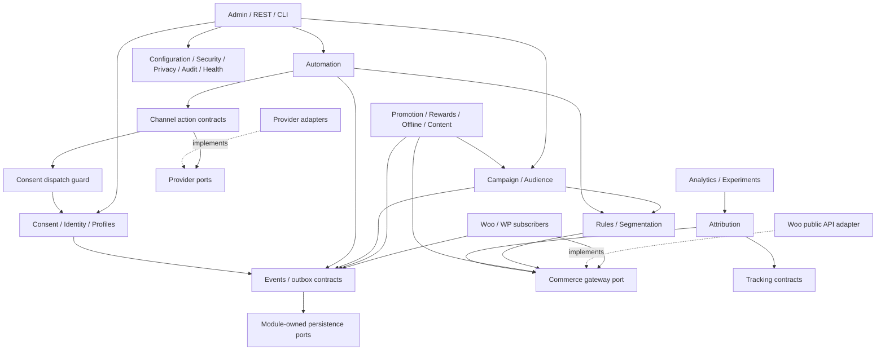

## Phase 3 — Domain architecture

### Dependency rules

Use a modular monolith with explicit constructors and a composition root. Each bounded context has `Domain`, `Application`, `Infrastructure` and, only if necessary, `Presentation`. Domain depends on its own types and the small SharedKernel. Application depends on domain and declared ports. Infrastructure implements ports using `$wpdb`, WordPress, WooCommerce, Action Scheduler and provider APIs. Presentation maps validated requests to application commands/queries. Module dependency direction refers to imports/contracts; asynchronous event flow can travel in either business direction without a circular PHP dependency.

Only the module owning a table can mutate it. Read models may join documented plugin-owned projections through their query interfaces; no cross-module arbitrary writes. Cross-context commands go through a narrow versioned application contract, or an event handler with its own inbox key. Do not build a generic service locator, global event-history replay system, or universal “Manager” class. Repositories exist where aggregates need transactions, locking or multiple query shapes; a simple option reader remains a simple adapter.

The SharedKernel contains IDs, Money, Clock, timezone intent, typed pagination, correlation context, safe error envelopes and no marketing policy. A module manifest declares module ID, required contract versions, lazy routes/subscribers, migrations, owned tables, assets, capabilities and health probes. Dependency sorting fails closed with an admin error if a cycle or unavailable prerequisite exists. Migrations and history readers remain available for installed optional modules even when their execution hooks are disabled.

| Module / bounded owner | Load class | Responsibility and explicit boundary |
|---|---|---|
| Core | Required | Composition root, manifests, contract registry and lifecycle; no campaign/consent/provider logic |
| Configuration | Required | Typed per-site settings and revisioned policy; credentials belong to Security |
| Security | Required | Capabilities, secret store, request guards, signature/SSRF primitives; does not decide lawful marketing eligibility |
| Privacy | Required | Data inventory, retention/export/erasure orchestration and external disclosures; invokes module-owned data handlers |
| Audit | Required | Safe privileged-action record; separate from raw events and diagnostic logs |
| Logging | Required | Redacted structured operational diagnostics, levels and correlation; not marketing analytics |
| Health | Required | Aggregates registered probes; never makes storefront requests run probes |
| Migration | Required | Version/checkpoint/lease/expand-contract orchestration; table owners supply steps |
| Feature Flags | Required | Local module enablement and staged-release flags, revisioned/audited; no mandatory remote flag service |
| Customer Profile / CDP | Required | Profile attributes/tags, lifecycle and read projections; no replacement WC customer or order |
| Identity Resolution | Required | Verified links, provenance, merge/unmerge mapping; does not infer consent |
| Consent | Required | Purpose/channel/legal-basis evidence, suppression and dispatch decision; only authorization path for marketing effects |
| Event Tracking | Required | Schema registry, capture, event store/outbox/inboxes; browser collector loads only when eligible |
| Campaign | Required | Campaign aggregate, versions, goals, assets/offer references and launch fan-out; no provider SDK |
| Audience | Required | Include/exclude sources, snapshots, frequency/contact eligibility; not channel transport |
| Segmentation | Required | Rule compilation, indexed read projections, membership generations and entry/exit; no synchronous full-store scan |
| Automation | Required | Versioned graph, durable run/step state and transition orchestration; actions resolved through registered ports |
| Rules | Required | Typed criterion AST, validation, deterministic evaluation/query compilation; no merchant PHP execution |
| Personalization | Optional | Eligible surface decisions and variants; cache-safe response, no private HTML in shared page cache |
| Recommendation | Optional | Deterministic strategies, available product filtering and fallback; no independent catalog |
| Promotion | Optional | Offers/coupon references, eligibility/rule adapter; WooCommerce owns price/tax totals |
| Attribution | Required | Touchpoint eligibility, model versions and credit allocations; no delivery status or causal lift calculation |
| Experimentation | Optional | Eligibility, stable assignments, exposures and fixed protocol; publication requires capability checks |
| Analytics | Required | Incremental projections, definitions, currency-separated reports and drill-down; dashboard reads aggregates |
| Email Channel | Optional | Email address/rendering/unsubscribe/sender policy and send action; providers transport |
| SMS Channel | Optional | Phone/template/quiet-hours/region preparation; provider owns carrier delivery |
| Push Channel | Optional | Browser/mobile endpoint types, service-worker integration and permission lifecycle; consent separate |
| WhatsApp Channel | Optional | Approved-template variables and messaging-window constraints; actual provider API permission remains external |
| Telegram Channel | Optional | Bot/channel destination permissions and format constraints; no unsolicited contact discovery |
| Social Channel | Optional | Public post variants, media and calendar; personal outbound messages need separate consent contract |
| Advertising Integration | Optional | Consented audience exports, account campaigns/costs/report imports; no background data transfer when disabled |
| Webhook Channel | Optional | Allowlisted outbound integration actions and signed inbound trigger normalization; no arbitrary destination execution |
| Affiliate | Optional | Programs, affiliates, commission rules/hold/approval/reversals/payout references; no second payment ledger for Woo orders |
| Referral | Optional | Referrer/referee binding, qualification/fraud review and reward requests; Rewards supplies settlement primitives |
| Loyalty | Optional | Points ledger, reservation/redemption/expiry/tier rules; balances derivable, coupons through Promotion |
| Influencer | Optional | Creator assignments, deliverables, costs/links and performance; shared commission contract where payable |
| Offline Campaigns | Optional | Placement/location/creative/schedule/cost and tracked identifiers; no claim of physical execution |
| Guerrilla / Experiential Campaigns | Optional | Offline planning templates and experience-specific deliverables; reuses Offline, Campaign and Event Marketing |
| Event Marketing | Optional | Marketing event/registration/attendance references, QR and follow-up; does not own ticket fulfillment |
| QR | Optional | Deterministic QRAsset for a public tracking URL; no personal tokens embedded in downloadable artwork |
| Short Links | Optional | TrackingLink routing, immutable destination history and abuse-safe redirects; Attribution owns measured touchpoint policy |
| Content Marketing | Optional | Editorial calendar/asset briefs, WordPress post/media references and campaign relation; WordPress owns content |
| SEO Integration | Optional | Capability contracts for installed SEO/search providers and briefs; no duplicate SEO metadata authority |
| Growth | Optional | Hypothesis/templates/funnel goals using Experiments, Campaign and Analytics; no separate automation engine |
| Provider Integrations | Optional adapters | Provider connection registry/capability discovery, normalized results and credential references; channels own message policy |
| WordPress Integration | Required | Dedicated platform subscribers, menu/privacy/Site Health hooks and content adapter; no domain state inside hooks |
| WooCommerce Integration | Required | Canonical commerce gateway, order/customer/product/cart/checkout subscribers and reconciliation; all supported public APIs |
| REST API | Required | Versioned schema/validation/authorization/pagination, commands and queries; no direct table writes from routes |
| Admin UI | Required | Woo submenu application; assets only on plugin screens, modules show permitted enabled areas |
| WooCommerce Blocks | Conditional core adapter | Loads only on applicable editor/cart/checkout surfaces, registered supported extensions and server validation; no duplicated core cart store |
| CLI | Conditional operator adapter | Registers only under WP-CLI; bounded operations invoke same application services and capability/site checks |
| Import / Export | Conditional required tooling | Versioned JSON definitions/mapping/preflight and privacy export jobs; no secrets/arbitrary PHP objects |

“Required” means shipped and available to preserve core invariants, not that every subsystem runs on every request. Frontend bootstrap registers only cheap relevant capture/consent integration. Automations with no published triggers register no fan-out subscriptions. Disabled channels/providers attach no send hooks, webhooks, cron probes, SDK autoloads or screen assets. Provider callback routes for unresolved deliveries remain explicitly in restricted drain mode until resolution or documented termination; a settings toggle must not lose in-flight status updates.

### Module graph

Dashed arrows mean adapter implementation, not reversed domain dependencies. Events subscribe through handlers registered at the composition root. Campaign accepts generic typed contribution references from optional modules instead of importing every optional owner. Offline/Rewards therefore depend on Campaign's stable association port; Campaign does not depend on Offline/Rewards classes. Rules asks a narrow CommerceFacts query port; a Woo adapter answers through WC APIs or documented plugin projections.

### Explicit prohibited dependencies

Domain → WordPress/Woo globals, `$wpdb`, Action Scheduler, SDKs, REST request objects or React is prohibited. Required core → optional concrete implementation is prohibited. Provider → Campaign aggregate mutations is prohibited; callbacks emit normalized events. Analytics → writes to canonical commerce is prohibited. Identity → automatic consent grants is prohibited. UI → credential values and raw provider diagnostics is prohibited. Module → another module's table write is prohibited. No order queries against `posts`, `postmeta`, `wc_orders` or HPOS metadata tables, including seemingly convenient segmentation optimizations. No Woo `Internal` namespace or marked `@internal` symbol is imported. [Official public/internal boundary](https://developer.woocommerce.com/docs/extensions/getting-started-extensions/).

### Contract and extension ownership

Public PHP contracts live under `src/Contracts/V1`, while internal ports live with their owning application. Registration hooks are `wmos_register_trigger_types`, `wmos_register_condition_types`, `wmos_register_action_types`, `wmos_register_channels`, `wmos_register_providers`, `wmos_register_segment_criteria`, `wmos_register_attribution_models`, `wmos_register_recommendation_strategies`, `wmos_register_metrics` and `wmos_register_campaign_templates`. Each receives a registration interface, not a container. Definitions declare stable namespaced ID, schema version, dependencies/capabilities, admin presentation schema, evaluation side-effect class, query support and privacy purposes. Duplicate IDs fail with a visible registration error. Untrusted imported JSON can reference installed registrations but cannot load code or arbitrary classes.

Actions `wmos_event_recorded` and `wmos_campaign_state_changed` expose safe immutable DTOs after durable commit, with no provider secret/complete profile. Filter `wmos_allowed_tracking_destination` may further restrict a safe destination; it cannot bypass baseline SSRF/open-redirect validation. Extenders cannot receive a switch to bypass consent, idempotency, audit or credential guards. Breaking public contract changes require a V2 namespace, migration guidance and deprecation period; internal classes are explicitly unsupported extension surfaces.
